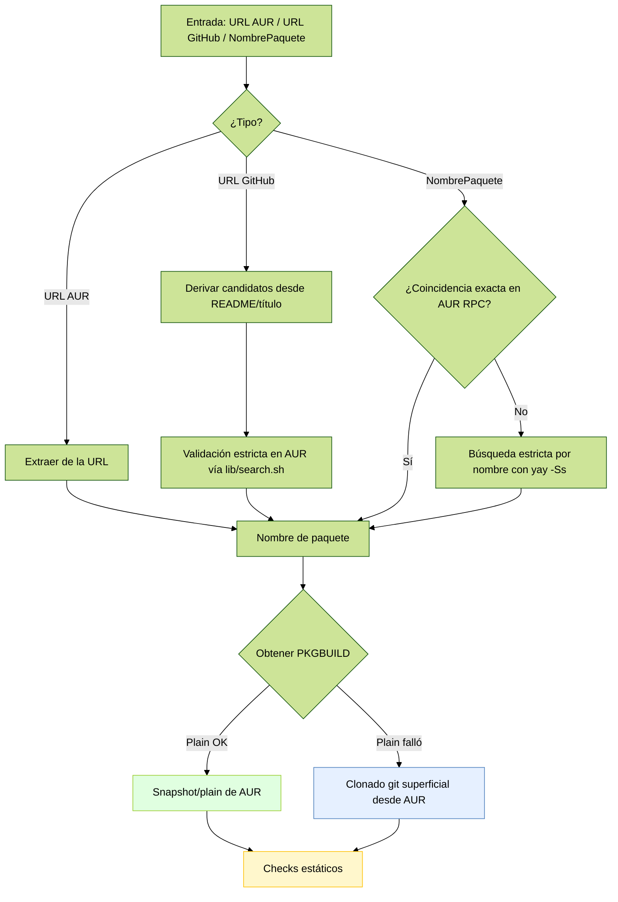

# Verificador AUR (Bash)

> **Verifica primero, instala después** — Verificador de seguridad para paquetes de AUR (y envolturas de GitHub) con instalación automática vía `yay` sólo si todo pasa.

<p align="left">
  <code>Arch</code> · <code>AUR</code> · <code>makepkg --verifysource</code> · <code>PGP</code> · <code>sha256</code> · <code>yay</code>
</p>

---

🌐 Read this in [English](README.md)

---

## 🧭 ¿Qué hace esta herramienta?

Esta herramienta en Bash toma un nombre de paquete AUR **o** una URL de GitHub y:

1) **Obtiene directamente desde AUR** usando los endpoints oficiales de snapshot/plain (sin `git clone`), o **detecta** el paquete AUR que envuelve una URL de GitHub. Si los endpoints snapshot/plain no están disponibles, cae a un `git clone` superficial.  
2) **Audita** el `PKGBUILD` con controles estáticos (banderas rojas comunes).  
3) **Verifica la integridad** de las fuentes con `makepkg --verifysource`.  
4) **Corrige** sumas débiles (p. ej. `sha1sums`/`SKIP`) reemplazándolas por `sha256sums` (sólo en modo normal).  
5) **(Opcional)** **Refuerza** la política en **modo estricto**: dominios permitidos, sin sumas débiles, y verificación PGP cuando hay `.sig`.  
6) Si todo está limpio, **instala** automáticamente con `yay -S` (salvo que uses `--verify-only`).

> Pensado para quienes no confían a ciegas en AUR: valida primero, instala después.

---

## 🚀 Uso rápido

Puedes ejecutarlo mediante el wrapper legado o el nuevo punto de entrada modular:

- Wrapper (compatibilidad hacia atrás):
  - `sh ./aur_verify_then_yay.sh <paquete|URL_de_GitHub>`
- Punto de entrada modular:
  - `bash bin/aur-verify <paquete|URL_de_GitHub>`

Instalar tras verificar un paquete AUR:

```bash
sh ./aur_verify_then_yay.sh oreo-nord-cursors-git
```

Sólo verificar (no instalar):

```bash
sh ./aur_verify_then_yay.sh --verify-only oreo-nord-cursors-git
```

Modo estricto (políticas más duras):

```bash
STRICT=1 sh ./aur_verify_then_yay.sh oreo-nord-cursors-git
```

Verificación rápida (metadatos, sin descargas de `makepkg`):

```bash
FAST=1 sh ./aur_verify_then_yay.sh <paquete-AUR>
```

Detectar y verificar a partir de un repositorio GitHub (busca el envoltorio AUR):

```bash
sh ./aur_verify_then_yay.sh https://github.com/OWNER/REPO
```

---

## 📦 Requisitos

- Arch Linux o derivado con acceso a AUR.
- Herramientas: `git`, `curl`, `makepkg` (parte de `pacman`), y un ayudante AUR compatible: `yay` (por defecto).  
  - Puedes cambiar el binario de yay con `YAY_BIN=/ruta/a/yay`.

```bash
# Dar permisos de ejecución
chmod +x ./aur_verify_then_yay.sh
```

---

## 🔧 Opciones y variables

**Flags**:

- `--verify-only` — Ejecuta verificaciones estáticas y sale sin instalar (**sin descargas**); usa `DEEP=1` para incluir `makepkg --verifysource`.
- `--fast` — Verificaciones **sólo de metadatos** (omite `makepkg --verifysource`). ⚠️ En `STRICT=1` reduce garantías.
- `--verbose` — Muestra todos los detalles para usuarios avanzados (incluye resúmenes de funciones y más contexto en incidencias).
 - `--quiet` — Logs mínimos (solo errores y el resumen final de verificación).
- `-h`/`--help` — Ayuda.

**Variables de entorno**:

- `STRICT=1` — Activa **modo estricto**:
  - **Prohíbe** `sha1`, `SKIP` o ausencia de sumas fuertes.
  - **Lista blanca de dominios** (por defecto): `github.com`, `codeload.github.com`, `objects.githubusercontent.com`, `gitlab.com`.
  - Si hay archivos `.sig` en `source=()`, **debe** pasar `makepkg --verifysource` (PGP).
  - Muestra un **resumen** de funciones `prepare()`, `build()`, `package()`.
- `YAY_BIN=/ruta/yay` — Cambia el binario de yay.

Reporte e idioma:

- El resumen final se imprime en el idioma de tu terminal (inglés por defecto; español si `LANG`/`LC_*` comienza con `es`).
- Puedes forzar el idioma con `REPORT_LANG=es` o `REPORT_LANG=en`.
 - `SHOW_FUNCS=1` — Mostrar resúmenes de `prepare()/build()/package()`; implícito con `--verbose`.
 - `QUIET=1` — Equivalente a `--quiet`.

---

## 🧩 CLI Node: pkgb-parse (opcional)

El proyecto incluye un CLI modular en Node.js para parsear PKGBUILD con rapidez y aportar señales adicionales al reporte en Bash. Es opcional: si no hay Node, Bash usa heurísticas con grep/awk.

- Punto de entrada: `bin/pkgb-parse`
- Módulos: `lib/js_node/{analysis,utils,outputs,patterns,colors}.js`

Ejemplos:

```bash
# Parsear desde archivo
node bin/pkgb-parse --file ./PKGBUILD --summary

# Parsear directo desde la URL plain de AUR
node bin/pkgb-parse --url "https://aur.archlinux.org/cgit/aur.git/plain/PKGBUILD?h=zotero"

# JSON para integraciones
node bin/pkgb-parse --file ./PKGBUILD --json
```

<details>
<summary><strong>Opciones del CLI (detalles)</strong></summary>

- `--file PATH`: Parsear PKGBUILD desde archivo local
- `--url URL`: Descargar y parsear PKGBUILD desde URL
- `--summary`: Resumen en una línea (nombre, versión, conteos)
- `--json`: Salida JSON estructurada
- `--signals`: Pares clave=valor para Bash
- `--redflags-lines`: Banderas rojas como `linea<TAB>contenido`
- `--sources-compact [--limit N]`: Lista compacta de fuentes, opcionalmente limitada

Tip: Si pasas un enlace de AUR que no es el endpoint “plain”, el CLI sugerirá la forma correcta `.../plain/PKGBUILD?h=<pkg>` y mostrará “Fetching from AUR (respectfully)...”.

</details>

---

## ✅ Qué comprueba

### 1) Banderas rojas en `PKGBUILD` (estático)

Busca patrones peligrosos o poco confiables, por ejemplo:

- **Descargas autoejecutadas**: `curl|wget ... (sh|bash)`
- **Sockets TCP en shell**: `/dev/tcp`
- **Ejecución dinámica**: `eval`, `$(...)`, `` `...` ``, `exec(`
- **Decodificación/descifrado** en línea: `base64 -d`, `openssl enc -d`
- **Privilegios/permiso sospechoso**: `chmod +s`, `setcap`, escritura sobre `/etc`
- **Trampas en rutas**: uso indebido de `pkgdir` apuntando a `/etc`
- **(STRICT)** one-liners con `python -c`, `perl -e`, `ruby -e`, `node -e`

> Si detecta algo, **falla** con explicación.

### 2) Dominios permitidos para `source=()`

- Acepta (por defecto): `github.com`, `codeload.github.com`, `objects.githubusercontent.com`, `gitlab.com`.
- En `STRICT=1`, **rechaza** cualquier otro dominio.

### 3) Políticas de checksums

- **Modo normal**: si hay `sha1sums` o `SKIP`, el script **descarga las fuentes**, calcula `sha256` y **reescribe** a `sha256sums` → vuelve a verificar.
- **STRICT=1**: **prohíbe** sumas débiles; no aplica autocorrección → **falla**.

### 4) Verificación PGP (si hay `.sig`)

- Si el `PKGBUILD` declara firmas `.sig`, **debe** pasar `makepkg --verifysource`.
- Si **no** hay `.sig`, se advierte (no se bloquea) — en `STRICT=1` el aviso es explícito.

### 5) `makepkg --verifysource`

- Se ejecuta **sin construir** (sólo integra/PGP).  
- Se omite cuando usas `--verify-only` (verificación estática), salvo que definas `DEEP=1`.  
- En `--fast`, se omite deliberadamente (revisión superficial con metadatos de `yay -Si`).

### 6) Resumen de `prepare()/build()/package()` (STRICT)

- Muestra las **primeras líneas** de cada función para visibilidad rápida antes de instalar.

### 7) Fijación de VCS (fuentes git+)

- Advierte cuando una fuente `git+https://…` no incluye `#commit=` o `#tag=`. En `STRICT=1`, esto hace que falle. Refuerza la reproducibilidad en paquetes VCS.

### 8) Resumen final (amigable para no expertos)

- Imprime un resumen claro (OK/ADVERTENCIA/FALLA/OMITIDO) con veredicto final y acción tomada.
- Localizado a español/inglés según la terminal.

<details>
<summary><strong>Campos del reporte y significado</strong></summary>

- Origen del PKGBUILD: de dónde se obtuvo (AUR snapshot/plain vs clon git de respaldo)
- Fijación de VCS: si las fuentes `git+…` están fijadas a `#commit=` o `#tag=`
- URLs de origen: valida que todas las fuentes usen HTTPS
- Dominios permitidos: valida contra una lista blanca
- Checksums: aplica y/o corrige política de sumas (sha256)
- Banderas rojas (estático): patrones sospechosos en el PKGBUILD
- makepkg --verifysource: verificación de integridad/PGP (omitido en verify‑only salvo `DEEP=1`)

Estados:

- OK: correcto
- ADVERTENCIA: potencial riesgo o práctica mejorable (no bloquea)
- FALLA: problema bloqueante; se aborta la instalación
- OMITIDO: omitido a propósito por el modo (verify‑only/fast)

Idioma:

- Auto: usa `LANG`/`LC_*` (español si comienza con `es`)
- Forzado: `REPORT_LANG=es` o `REPORT_LANG=en`

</details>

<details>
<summary><strong>Autodetección y obtención (Mermaid)</strong></summary>



</details>

---

## 🧩 Cómo decide instalar

- **Entrada = nombre de paquete AUR**  

  Obtiene `PKGBUILD` desde snapshot/plain de AUR (sin clonar), corre las verificaciones y, si todo pasa, instala con:

  ```bash
  yay -S --noconfirm <pkg>
  ```

- **Entrada = URL de GitHub (`https://github.com/OWNER/REPO`)**  

  Intenta mapear a un envoltorio AUR típico:
  - `owner-repo`
  - `owner-repo-bin`
  - `owner-repo-git`
  - y variantes detectadas

  Sólo acepta si el `PKGBUILD` realmente **apunta a ese repo** (comprobación del `source`/`url`).

- **`--fast`**  

  Si el paquete **está** en repos oficiales: lo instala directamente (sin construir).  

  Si **es AUR** y **requiere compilación**, intenta **alternar** a un sabor rápido (p. ej. `*-bin`). Si no hay, **falla** (para evitar builds largos).

---

## 🔎 Detección de entrada (autodetección)

- **URL de paquete AUR** (`https://aur.archlinux.org/packages/<nombre>`): extrae `<nombre>` y obtiene desde snapshot/plain de AUR.
- **URL de GitHub**: deriva posibles envoltorios AUR (título del repo + nombre del repo, además de `-git`/`-bin`/`-appimage`) y valida contra AUR.
- **Nombre pelado**: consulta primero el AUR RPC v5 oficial para coincidencia exacta; si no existe, recurre a una búsqueda estricta por nombre en `yay -Ss` limitada a resultados de AUR.

Este enfoque minimiza la confianza en heurísticas locales y usa endpoints oficiales de AUR siempre que sea posible.

## 📚 Ejemplos

Verificar e instalar un cursor desde AUR (si existe):

```bash
sh ./aur_verify_then_yay.sh oreo-nord-cursors-git
```

Sólo verificar sin instalar:

```bash
sh ./aur_verify_then_yay.sh --verify-only oreo-nord-cursors-git
```

Verificar un envoltorio AUR partiendo de GitHub:

```bash
sh ./aur_verify_then_yay.sh https://github.com/OWNER/REPO
```

Forzar modo estricto:

```bash
STRICT=1 sh ./aur_verify_then_yay.sh <paquete>
```

Verificación superficial (sin descargas de `makepkg`):

```bash
FAST=1 sh ./aur_verify_then_yay.sh <paquete>
```

---

## 🧠 Arquitectura

### Diseño modular

- `bin/aur-verify`: punto de entrada CLI que carga módulos y orquesta el flujo.
- `lib/common.sh`: seguridad de shell, re‑ejecución en bash, comprobación de herramientas.
- `lib/log.sh`: helpers de logging estructurado.
- `lib/yay.sh`: extracción de metadatos con `yay -Si`, detección de repositorio.
- `lib/github.sh`: parseo de URLs de GitHub, lectura de README/título, fallback robusto del repo.
- `lib/search.sh`: generación de candidatos, búsqueda estricta en AUR sobre `yay -Ss`, resolvedor.
- `lib/pkgb.sh`: parsers de PKGBUILD, políticas de dominios/checksums, escaneo de banderas rojas.
- `lib/verify.sh`: orquesta la verificación, usa reglas atómicas y muestra un resumen localizado.
- `lib/verify_rules.sh`: reglas atómicas (VCS pinning, fuentes, checksums, banderas rojas, verifysource).
- `lib/aur_plain.sh`: fetchers de snapshot/plain y helpers de AUR RPC v5.
- `lib/i18n.sh`: detección de idioma y traducciones (en/es).
- `lib/report.sh`: ensamblado del reporte final (usa i18n).
- `aur_verify_then_yay.sh`: wrapper legado que delega a `bin/aur-verify`.

Mejoras recientes clave

- Parseo robusto del repo de GitHub con fallback seguro incluso en URLs atípicas.
- Búsqueda estricta por nombre en AUR basada en `yay -Ss`, filtrada a entradas `aur/...`.
- Listas de candidatos no vacías para evitar términos de búsqueda vacíos.

<details>
<summary><strong>Refactors para legibilidad y pruebas</strong></summary>

- La autodetección prefiere AUR snapshot/plain; el clonado git es solo respaldo.
- La verificación se dividió en reglas pequeñas y testeables en `lib/verify_rules.sh`.
- El reporte final y las traducciones viven en `lib/report.sh` + `lib/i18n.sh` (no mezcladas con las comprobaciones).
- Es más fácil probar cada regla en aislamiento pasando un `PKGBUILD` y el modo.

```mermaid
%%{init: {"theme": "forest", "handDrawn": true}}%%
sequenceDiagram
    participant Usuario as Usuario
    participant CLI as CLI bin/aur-verify
    participant GitHub as GitHub lib/github.sh
    participant Search as Resolver AUR lib/search.sh
    participant Plain as AUR Plain/RPC lib/aur_plain.sh
    participant Verify as Verificador lib/verify.sh
    participant Rules as Reglas lib/verify_rules.sh
    participant PKGB as PKGB Utils lib/pkgb.sh
    participant Report as Reporte lib/report.sh + lib/i18n.sh
    participant Makepkg as makepkg
    participant Yay as yay

    Usuario->>CLI: Ejecutar bin/aur-verify <input>

    %% Detección de entrada
    rect rgba(200, 200, 255, 0.35)
    CLI->>CLI: Detectar tipo de entrada
    alt URL AUR
        CLI->>Plain: Extraer nombre y consultar RPC v5
        Plain-->>CLI: pkg
    else URL GitHub
        CLI->>GitHub: Derivar candidatos titulo/README
        GitHub-->>CLI: Lista de candidatos
        CLI->>Search: Validar en AUR estricto por nombre
        Search-->>CLI: pkg
    else NombrePaquete
        CLI->>Plain: RPC v5 info busqueda exacta
        alt Existe exacto
            Plain-->>CLI: pkg
        else No exacto
            CLI->>Search: Busqueda estricta yay -Ss solo AUR
            Search-->>CLI: pkg
        end
    end
    end

    %% Obtención de PKGBUILD
    rect rgba(200, 255, 200, 0.35)
    CLI->>Verify: verify_pkgbuild pkg
    Verify->>Plain: Descargar snapshot/plain PKGBUILD y .SRCINFO
    alt Descarga OK
        Plain-->>Verify: Ruta temporal con PKGBUILD
    else Fallback a git
        Verify->>Plain: Intento fallido snapshot/plain
        Verify->>CLI: git clone desde AUR
        CLI-->>Verify: Repo clonado con PKGBUILD
    end
    Note over Verify: Mostrar resumen de funciones PREPARE / BUILD / PACKAGE
    end

    %% Verificación estática reglas atómicas
    rect rgba(255, 255, 200, 0.35)
    Verify->>Rules: rule_vcs_pinning PKGBUILD
    Rules->>PKGB: pkgb_check_vcs_pinning
    PKGB-->>Rules: Resultado
    Rules-->>Report: report_add item_vcs_pinning

    Verify->>Rules: rule_sources PKGBUILD
    Rules->>PKGB: list_sources + validaciones HTTPS y whitelist
    PKGB-->>Rules: Resultado
    Rules-->>Report: report_add item_source_urls / item_allowed_domains

    Verify->>Rules: rule_checksums PKGBUILD checkout
    Rules->>PKGB: has_weak_or_skip / has_strong_sums
    opt Autocorreccion permitida
        Rules->>Verify: rewrite_sums_to_sha256
    end
    Rules-->>Report: report_add item_checksums

    Verify->>Rules: rule_red_flags PKGBUILD
    Rules->>PKGB: scan_red_flags
    PKGB-->>Rules: Coincidencias
    Rules-->>Report: report_add item_red_flags
    end

    %% Verificación profunda opcional
    rect rgba(255, 220, 200, 0.35)
    alt VERIFY-ONLY sin DEEP
        Verify->>Rules: rule_verifysource mode verify-only
        Rules-->>Report: SKIP solo verificacion
    else FAST
        Verify->>Rules: rule_verifysource mode fast
        Rules-->>Report: SKIP --fast
    else FULL
        Verify->>Makepkg: makepkg --verifysource sin compilar
        Makepkg-->>Verify: OK / FALLO
        Verify->>Rules: rule_verifysource mode full
        Rules-->>Report: PASS / WARN / FAIL
    end
    end

    %% Reporte e instalación
    rect rgba(230, 200, 255, 0.35)
    Verify->>Report: report_print mode
    alt OVERALL OK u OK con advertencias y no verify-only
        CLI->>Yay: yay -S pkg
        Yay-->>CLI: Instalacion completada
    else OVERALL FAIL o verify-only
        CLI-->>Usuario: No instalar / Solo verificacion
    end
    end
```

</details>

<details>
<summary><strong>Vista general del flujo (Mermaid)</strong></summary>



</details>

<details>
<summary><strong>Módulos clave (alto nivel)</strong></summary>

- `lib/github.sh`: parseo de URL, título de README, candidatos en kebab-case, fallback seguro de repo.
- `lib/search.sh`: búsqueda estricta basada en `yay -Ss`, filtrada a AUR, orden de candidatos, resolvedor.
- `lib/pkgb.sh`: análisis de fuentes, políticas de checksums, resúmenes de funciones, banderas rojas.
- `lib/verify.sh`: orquesta la verificación, usa reglas atómicas y muestra un resumen localizado.
- `lib/verify_rules.sh`: reglas atómicas (VCS pinning, fuentes, checksums, banderas rojas, verifysource).
- `lib/aur_plain.sh`: fetchers de snapshot/plain y helpers de AUR RPC v5.
- `lib/i18n.sh`: detección de idioma y traducciones (en/es).
- `lib/report.sh`: ensamblado del reporte final (usa i18n).
- `lib/yay.sh`: extracción de campos de `yay -Si`, metadatos de repositorio/origen.
 - `bin/pkgb-parse` + `lib/js_node/*`: Parser estático opcional en Node.js utilizado por Bash si está disponible.

</details>

<details>
<summary><strong>Detalles técnicos (para curiosos)</strong></summary>

- Reescritura de checksums: descarga fuentes declaradas, calcula `sha256` y reescribe `sha256sums=()` reemplazando sumas débiles (cuando se permite).  
- Resumen de funciones: imprime primeras líneas de `prepare()`, `build()`, `package()` para inspección rápida (con `STRICT=1`, salvo `--fast`).  
- Diagnóstico de errores: rutas y modos explícitos en “PKGBUILD not found …” y sugerencia accionable cuando `FAST=1` bloquea el fallback de plain.  
- Mensajes: prefijos `[INFO]`, `[WARN]`, `[ERROR]`; salida con código ≠ 0 ante fallos.

</details>

## 🔐 Notas de seguridad

- Este script **no construye** el paquete durante la verificación (usa `makepkg --verifysource`).  
- **No** elude las políticas de AUR: simplemente automatiza controles habituales (y añade reglas más estrictas si lo pides).
- `--fast` está pensado para **revisión superficial**; úsalo sólo si confías en el paquete/maintainer.
- La lista blanca de dominios y las banderas rojas son **opinadas**; puedes ajustarlas en el script si lo necesitas.

---

## 🛠️ Solución de problemas

- **“AUR clone failed (package may not exist)”**  

  Revisa el nombre del paquete o si realmente existe en AUR.
- **“sha256 verification failed after regeneration”**  

  El upstream cambió o hay un vector de ataque; no instales hasta entender la causa.
- **“source domain not allowed” (STRICT)**  

  Añade el dominio a la lista blanca en el script o instala en modo normal (bajo tu criterio).
- **“FAST: would require a full AUR build”**  

  Intenta un sabor `-bin` o ejecuta sin `--fast` (aceptando compilar).
\- **“PKGBUILD not found at '<path>/PKGBUILD' (mode=..., pkg=...)”**  
  Ejecuta sin `--fast` para permitir el fallback a snapshot/git. Si aún falla, abre un issue incluyendo la ruta mostrada.

---

## 🧪 Comandos de ejemplo (copiar/pegar)

```bash
# Verificar e instalar (normal)
sh ./aur_verify_then_yay.sh <paquete>

# Verificar solamente
sh ./aur_verify_then_yay.sh --verify-only <paquete>

# Modo estricto (dominios whitelisted, sin sumas débiles, PGP cuando haya .sig)
STRICT=1 sh ./aur_verify_then_yay.sh <paquete>

# Verificación rápida basada en metadatos
FAST=1 sh ./aur_verify_then_yay.sh <paquete>

# Desde GitHub: localizar el envoltorio AUR y verificar/instalar
sh ./aur_verify_then_yay.sh https://github.com/OWNER/REPO
```

---

## 📄 Licencia

Este proyecto está licenciado bajo MIT. Ver [LICENSE](LICENSE).

---

### Créditos

Mantenido por las personas colaboradoras del proyecto. Consulta [AUTHORS](AUTHORS) para créditos y agradecimientos.
