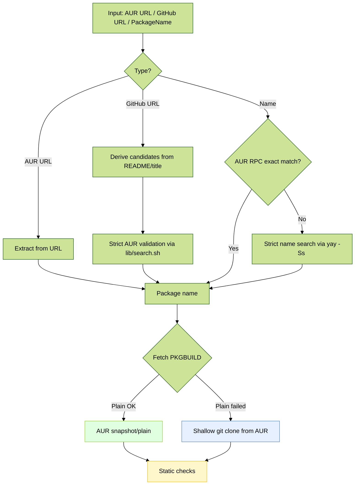

# AUR Verifier (Bash)

> **Verify first, install later** — Security checker for AUR packages (and GitHub wrappers) with automatic installation via `yay` only if everything passes.

<p align="left">
  <code>Arch</code> · <code>AUR</code> · <code>makepkg --verifysource</code> · <code>PGP</code> · <code>sha256</code> · <code>yay</code>
</p>

---

🌐 Lea esto en [Español](README.es.md)

---

## 🧭 What does this tool do?

This Bash tool takes an AUR package name **or** a GitHub URL and:

1) **Fetches from AUR directly** using the official snapshot/plain endpoints (no git clone), or **detects** the AUR package that wraps a GitHub URL. If the snapshot/plain endpoints are unavailable, it falls back to a shallow `git clone`.  
2) **Audits** the `PKGBUILD` with static checks (common red flags).  
3) **Verifies the integrity** of the sources with `makepkg --verifysource`.  
4) **Fixes** weak checksums (e.g., `sha1sums`/`SKIP`) by replacing them with `sha256sums` (only in normal mode).  
5) **(Optional)** **Strengthens** the policy in **strict mode**: allowed domains, no weak checksums, and PGP verification when `.sig` files exist.  
6) If everything is clean, it **installs** automatically with `yay -S` (unless you use `--verify-only`).

> Designed for those who don’t blindly trust AUR: validate first, install later.

---

## 🚀 Quick start

You can run it either via the legacy wrapper or the new modular entrypoint:

- Wrapper (backward compatible):
  - `sh ./aur_verify_then_yay.sh <package|GitHub_URL>`
- Modular entrypoint:
  - `bash bin/aur-verify <package|GitHub_URL>`

Install after verifying an AUR package:

```bash
sh ./aur_verify_then_yay.sh oreo-nord-cursors-git
```

Verify only (no install):

```bash
sh ./aur_verify_then_yay.sh --verify-only oreo-nord-cursors-git
```

Strict mode (tighter policies):

```bash
STRICT=1 sh ./aur_verify_then_yay.sh oreo-nord-cursors-git
```

Fast verification (metadata only, no `makepkg` downloads):

```bash
FAST=1 sh ./aur_verify_then_yay.sh <AUR-package>
```

Detect and verify from a GitHub repository (finds the AUR wrapper):

```bash
sh ./aur_verify_then_yay.sh https://github.com/OWNER/REPO
```

---

## 📦 Requirements

- Arch Linux or derivative with AUR access.  
- Tools: `git`, `curl`, `makepkg` (part of `pacman`), and an AUR helper: `yay` (default).  
  - You can override the yay binary with `YAY_BIN=/path/to/yay`.

```bash
# Make it executable
chmod +x ./aur_verify_then_yay.sh
```

---

## 🔧 Options and variables

**Flags**:

- `--verify-only` — Run static checks and exit without installing (no downloads); set `DEEP=1` to include `makepkg --verifysource`.  
- `--fast` — **Metadata-only** verification (skips `makepkg --verifysource`). ⚠️ With `STRICT=1` it reduces guarantees.  
- `--verbose` — Print full details for advanced users (show function summaries, expand incident snippets with full context).
- `--quiet` — Minimal logs (only errors and the final verification summary).
- `-h`/`--help` — Help.

**Environment variables**:

- `STRICT=1` — Enables **strict mode**:
  - **Forbids** `sha1`, `SKIP` or absence of strong checksums.  
  - **Allowlist of domains** (default): `github.com`, `codeload.github.com`, `objects.githubusercontent.com`, `gitlab.com`.  
  - If `.sig` files exist in `source=()`, it **must** pass `makepkg --verifysource` (PGP).  
  - Shows a **summary** of the functions `prepare()`, `build()`, `package()`.  
- `YAY_BIN=/path/to/yay` — Change the yay binary.

Reporting and language:

- The final summary report appears in your terminal language (English by default, Spanish when `LANG`/`LC_*` starts with `es`).
- You can force a language with `REPORT_LANG=en` or `REPORT_LANG=es`.
 - `SHOW_FUNCS=1` — Also show `prepare()/build()/package()` summaries; implied by `--verbose`.
 - `QUIET=1` — Same effect as `--quiet`.

---

## 🧪 Verification modes and depth

Use these knobs to control how deep the verification goes and how much is shown:

- `--verify-only`: Static checks only by default (no downloads, no install).  
  - Add `DEEP=1` to also run `makepkg --verifysource` (downloads sources and verifies checksums/PGP).  
  - Good for CI or when you want integrity checks without installing.
- `--fast`: Metadata-only mode; skips `makepkg --verifysource` and any downloads.  
  - Takes precedence over `DEEP=1` (i.e., `FAST=1` disables deep verification).
- `STRICT=1`: Tightens policies (HTTPS-only, allowed domains, strong checksums, pinning) and upgrades certain WARN into FAIL.  
- `--verbose` / `--quiet`: Increase details (full context, function summaries) or minimize logs (only errors + final summary).

When to use which

- Quick triage (no downloads): `sh ./aur_verify_then_yay.sh <pkg> --verify-only --fast`
- Integrity without install: `DEEP=1 sh ./aur_verify_then_yay.sh <pkg> --verify-only`
- Strict gate for security‑sensitive systems: `STRICT=1 DEEP=1 sh ./aur_verify_then_yay.sh <pkg> --verify-only`
- Detailed auditing: `STRICT=1 sh ./aur_verify_then_yay.sh <pkg> --verify-only --verbose`
- Minimal noise: `sh ./aur_verify_then_yay.sh <pkg> --verify-only --quiet`

Notes

- Deep verification (`DEEP=1`) requires network to fetch sources; it is skipped if `--fast` is set.
- Installation path still depends on the overall summary; if it’s FAIL and you’re not in verify‑only, installation is aborted.

---

## 🧩 Node CLI: pkgb-parse (optional)

The project ships a modular Node.js CLI to parse PKGBUILD files quickly and feed extra signals into the Bash reports. It is optional: if Node is unavailable, Bash uses grep/awk heuristics.

- Entry point: `bin/pkgb-parse`
- Modules: `lib/js_node/{analysis,utils,outputs,patterns,colors}.js`

Examples:

```bash
# Parse from file
node bin/pkgb-parse --file ./PKGBUILD --summary

# Parse directly from AUR plain URL
node bin/pkgb-parse --url "https://aur.archlinux.org/cgit/aur.git/plain/PKGBUILD?h=zotero"

# JSON for tooling
node bin/pkgb-parse --file ./PKGBUILD --json
```

<details>
<summary><strong>CLI options (details)</strong></summary>

- `--file PATH`: Parse PKGBUILD from a local file
- `--url URL`: Fetch and parse PKGBUILD from URL
- `--summary`: One‑line summary (name, version, counts)
- `--json`: Structured JSON output
- `--signals`: Key=value pairs for Bash integration
- `--redflags-lines`: Red flags as `line<TAB>content`
- `--sources-compact [--limit N]`: Compact sources list, optionally limited

Tip: If you pass an AUR link that is not the plain endpoint, the CLI will suggest the correct `.../plain/PKGBUILD?h=<pkg>` form and prints “Fetching from AUR (respectfully)...”.

</details>

---

## ✅ What it checks

### 1) Red flags in `PKGBUILD` (static)

Looks for dangerous or untrustworthy patterns, for example:

- **Self-executing downloads**: `curl|wget ... (sh|bash)`  
- **TCP sockets in shell**: `/dev/tcp`  
- **Dynamic execution**: `eval`, `$(...)`, `` `...` ``, `exec(`  
- **Inline decoding/decryption**: `base64 -d`, `openssl enc -d`  
- **Suspicious privileges/permissions**: `chmod +s`, `setcap`, writing into `/etc`  
- **Path traps**: misuse of `pkgdir` pointing to `/etc`  
- **(STRICT)** one-liners with `python -c`, `perl -e`, `ruby -e`, `node -e`  

> If something is detected, it **fails** with an explanation.

### 2) Allowed domains for `source=()`

- Accepts (by default): `github.com`, `codeload.github.com`, `objects.githubusercontent.com`, `gitlab.com`.  
- In `STRICT=1`, **rejects** any other domain.

### 3) Checksum policies

- **Normal mode**: if `sha1sums` or `SKIP` are found, the script **downloads sources**, computes `sha256`, and **rewrites** `sha256sums` → re-verifies.  
- **STRICT=1**: **forbids** weak checksums; no autocorrection → **fails**.

### 4) PGP verification (if `.sig` exists)

- If the `PKGBUILD` declares `.sig` files, it **must** pass `makepkg --verifysource`.  
- If **no** `.sig` exists, it warns (not blocked) — in `STRICT=1` the warning is explicit.

### 5) `makepkg --verifysource`

- Runs **without building** (integrity/PGP only).  
- Skipped when using `--verify-only` (static checks) unless you set `DEEP=1`.  
- Skipped with `--fast` (superficial review using `yay -Si` metadata).

### 6) Summary of `prepare()/build()/package()` (STRICT)

- Displays the **first lines** of each function for quick visibility before installing.

### 7) VCS pinning (git+ sources)

- Warns when a `git+https://…` source lacks `#commit=` or `#tag=`. In `STRICT=1`, this causes a failure. This enforces reproducibility for VCS packages.

### 8) Final summary report (non‑experts)

- Prints a concise, human‑readable summary (PASS/WARN/FAIL/SKIP) with a final “Overall” verdict and the action taken.
- Localized to English/Spanish based on your terminal.

<details>
<summary><strong>Report fields and meanings</strong></summary>

- PKGBUILD Source: where the PKGBUILD came from (AUR snapshot/plain vs git clone fallback)
- VCS pinning: whether `git+…` sources are pinned to `#commit=` or `#tag=`
- Source URLs: checks that all sources use HTTPS
- Allowed domains: validates domains against an allowlist
- Checksums: enforces/remediates checksum policy (sha256)
- Static red flags: highlights suspicious patterns in the PKGBUILD
- makepkg --verifysource: integrity/PGP verification (skipped in verify‑only unless `DEEP=1`)

Status values:

- PASS: everything is fine
- WARN: potentially risky or non‑ideal, but not blocked
- FAIL: blocking issue; installation is aborted
- SKIP: deliberately not run due to mode (verify‑only/fast)

Language control:

- Auto: uses `LANG`/`LC_*` (Spanish when starting with `es`)
- Force: set `REPORT_LANG=es` or `REPORT_LANG=en`

</details>

---

## 🧩 How it decides to install

- **Input = AUR package name**  

  Fetches `PKGBUILD` from AUR snapshot/plain (no clone), runs checks and, if everything passes, installs with:

  ```bash
  yay -S --noconfirm <pkg>
  ```

- **Input = GitHub URL (`https://github.com/OWNER/REPO`)**  

  Attempts to map to a typical AUR wrapper:
  - `owner-repo`  
  - `owner-repo-bin`  
  - `owner-repo-git`  
  - and detected variants  

  Only accepts if the `PKGBUILD` actually **points to that repo** (check `source`/`url`).

- **`--fast`**  

  If the package is in official repos: installs directly (no build).  

  If it’s AUR and requires compilation, it attempts to **switch** to a fast variant (e.g. `*-bin`). If none exist, it **fails** (to avoid long builds).

---

## 🔎 Input detection (autodetect)

- AUR package URL (`https://aur.archlinux.org/packages/<name>`): extracts `<name>` and fetches from AUR snapshot/plain.
- GitHub URL: derives likely AUR wrapper names (repo title + repo name, plus `-git`/`-bin`/`-appimage`), validates against AUR.
- Bare name: queries the official AUR RPC v5 for an exact hit first; if none, falls back to name‑strict search on `yay -Ss` limited to AUR results.

This approach minimizes trust on local heuristics and uses AUR’s official endpoints wherever possible.

## 📚 Examples

Verify and install a cursor from AUR (if it exists):

```bash
sh ./aur_verify_then_yay.sh oreo-nord-cursors-git
```

Verify only (no install):

```bash
sh ./aur_verify_then_yay.sh --verify-only oreo-nord-cursors-git
```

Verify an AUR wrapper starting from GitHub:

```bash
sh ./aur_verify_then_yay.sh https://github.com/OWNER/REPO
```

Force strict mode:

```bash
STRICT=1 sh ./aur_verify_then_yay.sh <package>
```

Superficial verification (no `makepkg` downloads):

```bash
FAST=1 sh ./aur_verify_then_yay.sh <package>
```

---

## 🧠 Architecture

### Modular layout

- `bin/aur-verify`: CLI entrypoint that loads modules and orchestrates the flow.
- `lib/common.sh`: shell safety, bash re-exec, tool discovery.
- `lib/log.sh`: structured logging helpers.
- `lib/yay.sh`: metadata extraction from `yay -Si`, repo detection.
- `lib/github.sh`: GitHub URL parsing, README/title scraping, robust repo fallback.
- `lib/search.sh`: candidate generation, strict AUR name search via `yay -Ss` parsing, resolver.
- `lib/pkgb.sh`: PKGBUILD parsers, domain and checksum policies, red-flag scanning.
- `lib/verify.sh`: orchestrates verification, uses atomic rules, prints a localized summary.
- `lib/verify_rules.sh`: atomic verification rules (VCS pinning, sources, checksums, red flags, verifysource).
- `lib/aur_plain.sh`: AUR snapshot/plain fetchers and AUR RPC v5 helpers.
- `lib/i18n.sh`: language detection and translations (en/es).
- `lib/report.sh`: final summary report assembly (uses i18n).
- `aur_verify_then_yay.sh`: legacy wrapper that delegates to `bin/aur-verify`.

Key recent improvements

- Robust GitHub repo parsing with a safe fallback even for edge URLs.
- Name-strict AUR search implemented on top of `yay -Ss` output, filtered to `aur/…` entries.
- Guaranteed non-empty candidate lists to avoid empty search terms.

<details>
<summary><strong>Refactors for readability and testing</strong></summary>

- Autodetection prefers AUR snapshot/plain; shallow git clone is only a fallback.
- Verification logic split into small, testable rules in `lib/verify_rules.sh`.
- Final report and translations live in `lib/report.sh` + `lib/i18n.sh` (not interleaved with checks).
- Easier to unit‑test each rule in isolation by providing a `PKGBUILD` path and mode.

</details>

<details>
<summary><strong>Overview of the flow (Mermaid)</strong></summary>

```mermaid
%%{init: {"theme": "forest", "handDrawn": true}}%%
sequenceDiagram
    participant User as User
    participant CLI as CLI bin/aur-verify
    participant GitHub as GitHub lib/github.sh
    participant Search as AUR Resolver lib/search.sh
    participant Plain as AUR Plain/RPC lib/aur_plain.sh
    participant Verify as Verifier lib/verify.sh
    participant Rules as Rules lib/verify_rules.sh
    participant PKGB as PKGB Utils lib/pkgb.sh
    participant Report as Report lib/report.sh + lib/i18n.sh
    participant Makepkg as makepkg
    participant Yay as yay

    User->>CLI: Run bin/aur-verify <input>

    %% Input detection
    rect rgba(200, 200, 255, 0.35)
    CLI->>CLI: Detect input type
    alt AUR URL
        CLI->>Plain: Extract name and query RPC v5
        Plain-->>CLI: pkg
    else GitHub URL
        CLI->>GitHub: Derive candidates title/README
        GitHub-->>CLI: Candidate list
        CLI->>Search: Validate on AUR name‑strict
        Search-->>CLI: pkg
    else PackageName
        CLI->>Plain: RPC v5 info exact match
        alt Exact match
            Plain-->>CLI: pkg
        else No exact match
            CLI->>Search: Strict search yay -Ss AUR only
            Search-->>CLI: pkg
        end
    end
    end

    %% Fetch PKGBUILD
    rect rgba(200, 255, 200, 0.35)
    CLI->>Verify: verify_pkgbuild pkg
    Verify->>Plain: Download snapshot/plain PKGBUILD and .SRCINFO
    alt Plain OK
        Plain-->>Verify: Temp path with PKGBUILD
    else Fallback to git
        Verify->>Plain: Plain snapshot failed
        Verify->>CLI: git clone from AUR
        CLI-->>Verify: Cloned repo with PKGBUILD
    end
    Note over Verify: Show PREPARE/BUILD/PACKAGE summaries (Verbose or SHOW_FUNCS)
    end

    %% Static verification atomic rules
    rect rgba(255, 255, 200, 0.35)
    Verify->>Rules: rule_vcs_pinning PKGBUILD
    Rules->>PKGB: pkgb_check_vcs_pinning
    PKGB-->>Rules: Result
    Rules-->>Report: report_add item_vcs_pinning

    Verify->>Rules: rule_sources PKGBUILD
    Rules->>PKGB: list_sources + HTTPS and whitelist checks
    PKGB-->>Rules: Result
    Rules-->>Report: report_add item_source_urls / item_allowed_domains
    Note over Rules,Report: Default → only offending lines; Verbose → show all sources and mark offenders

    Verify->>Rules: rule_checksums PKGBUILD checkout
    Rules->>PKGB: has_weak_or_skip / has_strong_sums
    opt Auto‑fix allowed
        Rules->>Verify: rewrite_sums_to_sha256
    end
    Rules-->>Report: report_add item_checksums
    Note over Rules,Report: Default → only weak/SKIP lines; Verbose → show all checksum arrays and mark weak/SKIP

    Verify->>Rules: rule_red_flags PKGBUILD
    Rules->>PKGB: scan_red_flags
    PKGB-->>Rules: Matches
    Rules-->>Report: report_add item_red_flags
    end

    %% Deep verification optional
    rect rgba(255, 220, 200, 0.35)
    alt VERIFY-ONLY without DEEP
        Verify->>Rules: rule_verifysource mode verify-only
        Rules-->>Report: SKIP verify‑only
    else FAST
        Verify->>Rules: rule_verifysource mode fast
        Rules-->>Report: SKIP --fast
    else FULL
        Verify->>Makepkg: makepkg --verifysource no build
        Makepkg-->>Verify: OK / FAIL
        Verify->>Rules: rule_verifysource mode full
        Rules-->>Report: PASS / WARN / FAIL
    end
    end

    %% Report and install
    rect rgba(230, 200, 255, 0.35)
    Verify->>Report: report_print mode
    alt OVERALL OK or OK with warnings and not verify-only
        CLI->>Yay: yay -S pkg
        Yay-->>CLI: Installation completed
    else OVERALL FAIL or verify-only
        CLI-->>User: Do not install / Verification only
    end
    Note over CLI,Report: Quiet → suppress info/warn logs; summary remains visible
    end
```

</details>

<details>
<summary><strong>Autodetection and Fetch (Mermaid)</strong></summary>



</details>

<details>
<summary><strong>Key modules (high level)</strong></summary>

- `lib/github.sh`: URL parsing, README title, kebab-case candidates, safe repo fallback.
- `lib/search.sh`: strict `yay -Ss` name search filtered to AUR, candidate ordering, resolver.
- `lib/pkgb.sh`: source scanning, checksum policy helpers, function summaries, red flags.
- `lib/verify.sh`: orchestrates verification, uses atomic rules, prints a localized summary.
- `lib/verify_rules.sh`: atomic rules (VCS pinning, sources, checksums, red flags, verifysource).
- `lib/aur_plain.sh`: AUR snapshot/plain fetchers and AUR RPC v5 helpers.
- `lib/i18n.sh`: language detection and translations (en/es).
- `lib/report.sh`: final summary report assembly (uses i18n).
- `lib/yay.sh`: `yay -Si` field extraction, repo/source metadata.
 - `bin/pkgb-parse` + `lib/js_node/*`: Optional Node.js static parser used by Bash when available.

</details>

<details>
<summary><strong>Technical details (for the curious)</strong></summary>

- Checksum rewriting: downloads declared sources, computes `sha256`, and rewrites `sha256sums=()` replacing weak sums (when allowed).  
- Function summaries: prints first lines of `prepare()`, `build()`, `package()` for quick inspection (with `STRICT=1`, unless `--fast`).  
- Error diagnostics: explicit paths/modes in “PKGBUILD not found …” and actionable hint when `FAST=1` blocks plain fetch fallback.  
- Messages: `[INFO]`, `[WARN]`, `[ERROR]` prefixes for clarity; non‑zero exit on failures.

</details>

---

## 🔐 Security notes

- This script **does not build** the package during verification (uses `makepkg --verifysource`).  
- It does **not** bypass AUR policies: it automates usual controls (and adds stricter rules if you ask).  
- `--fast` is for **superficial review**; use only if you trust the package/maintainer.  
- Domain allowlist and red flags are **opinionated**; you can tweak them in the script if needed.

---

## 🛠️ Troubleshooting

- **“AUR clone failed (package may not exist)”**  

  Check the package name or if it really exists in AUR.
- **“sha256 verification failed after regeneration”**  

  Upstream changed or there may be an attack; don’t install until you understand why.
- **“source domain not allowed” (STRICT)**  

  Add the domain to the allowlist in the script or install in normal mode (at your discretion).
- **“FAST: would require a full AUR build”**  

  Try a `-bin` flavor or run without `--fast` (accepting compilation).
\- **“PKGBUILD not found at '<path>/PKGBUILD' (mode=..., pkg=...)”**  
  Run without `--fast` to allow snapshot/git fallback. If it still fails, please open an issue and include the path shown.

---

## 🧪 Copy‑paste examples

```bash
# Verify and install (normal)
sh ./aur_verify_then_yay.sh <package>

# Verify only
sh ./aur_verify_then_yay.sh --verify-only <package>

# Strict mode (whitelisted domains, no weak sums, PGP when .sig exists)
STRICT=1 sh ./aur_verify_then_yay.sh <package>

# Fast metadata-only verification
FAST=1 sh ./aur_verify_then_yay.sh <package>

# From GitHub: locate AUR wrapper and verify/install
sh ./aur_verify_then_yay.sh https://github.com/OWNER/REPO
```

---

## 📄 License

This project is licensed under the MIT License. See [LICENSE](LICENSE).

---

### Credits

Maintained by the project contributors. See [AUTHORS](AUTHORS) for credits and acknowledgements.
