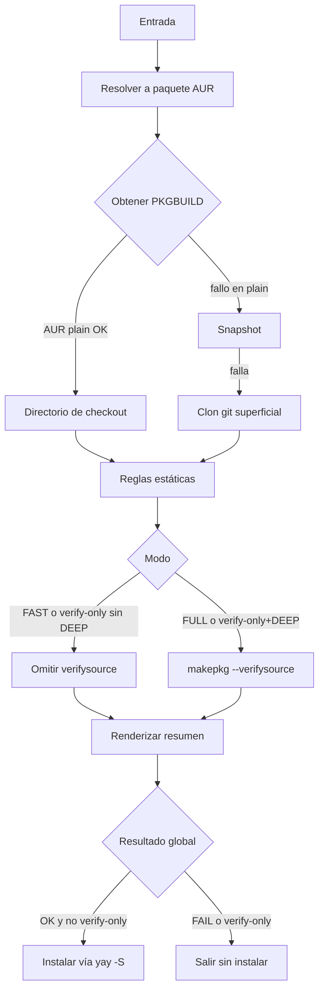
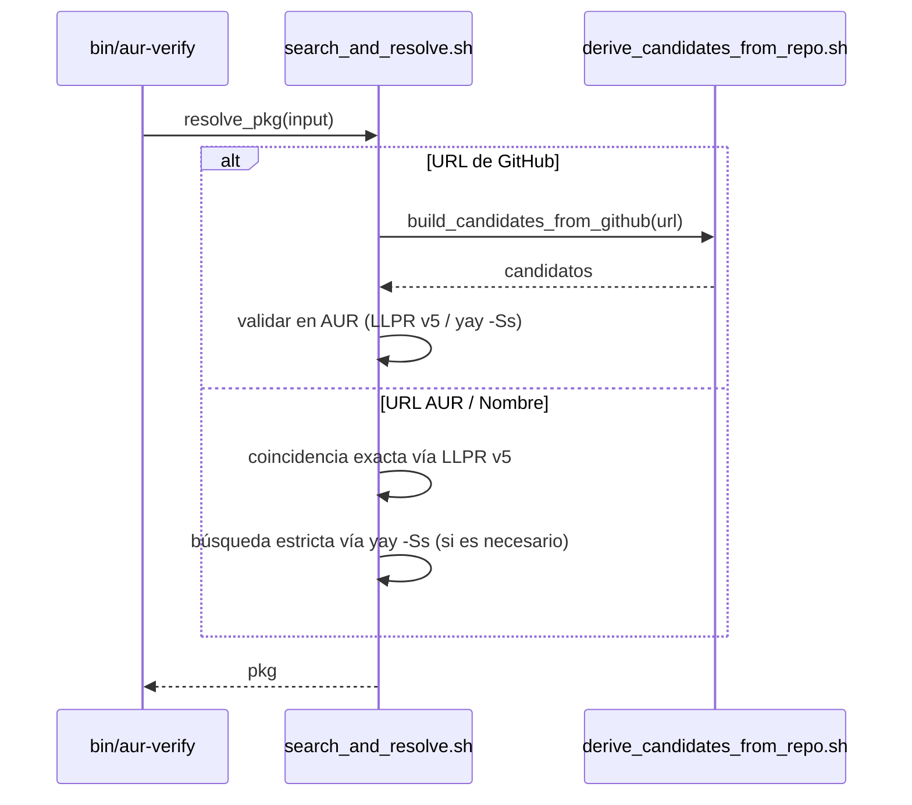
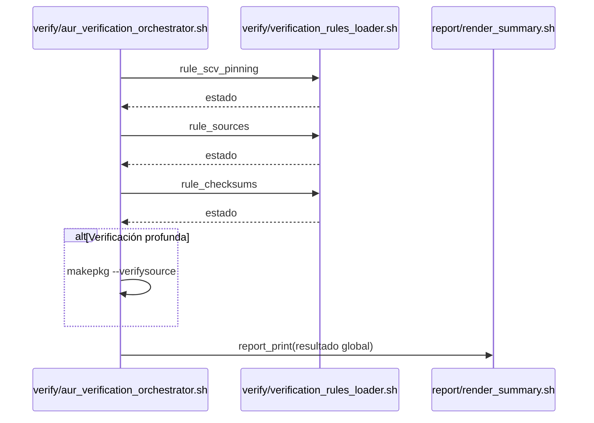
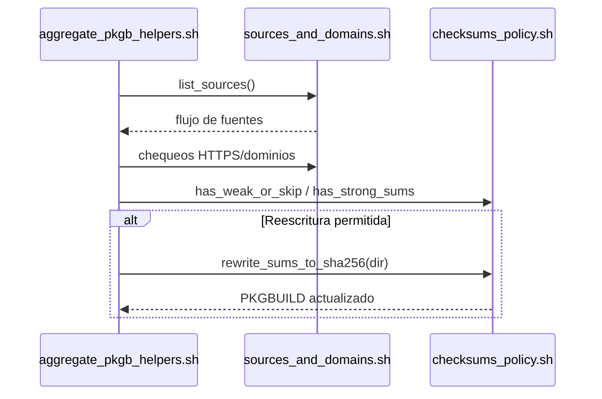
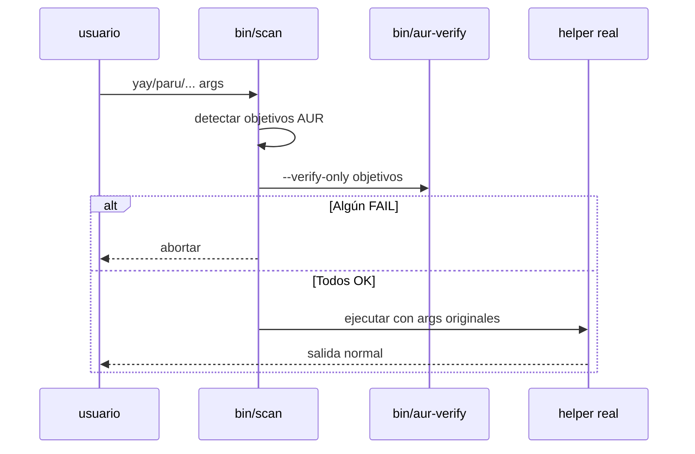
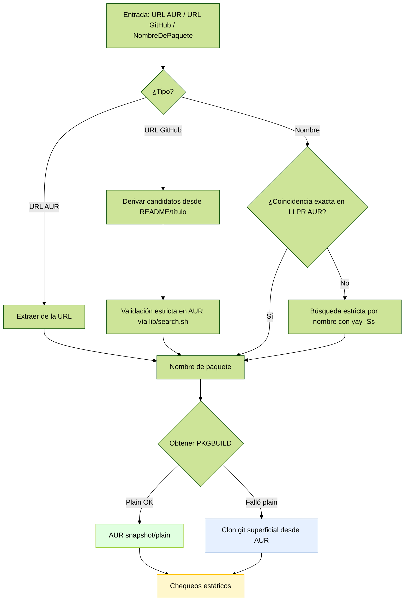
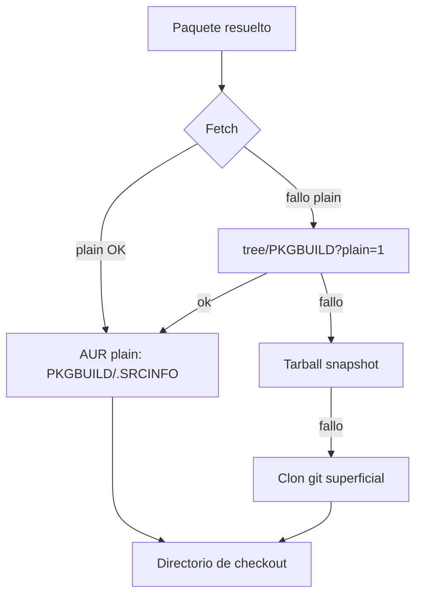
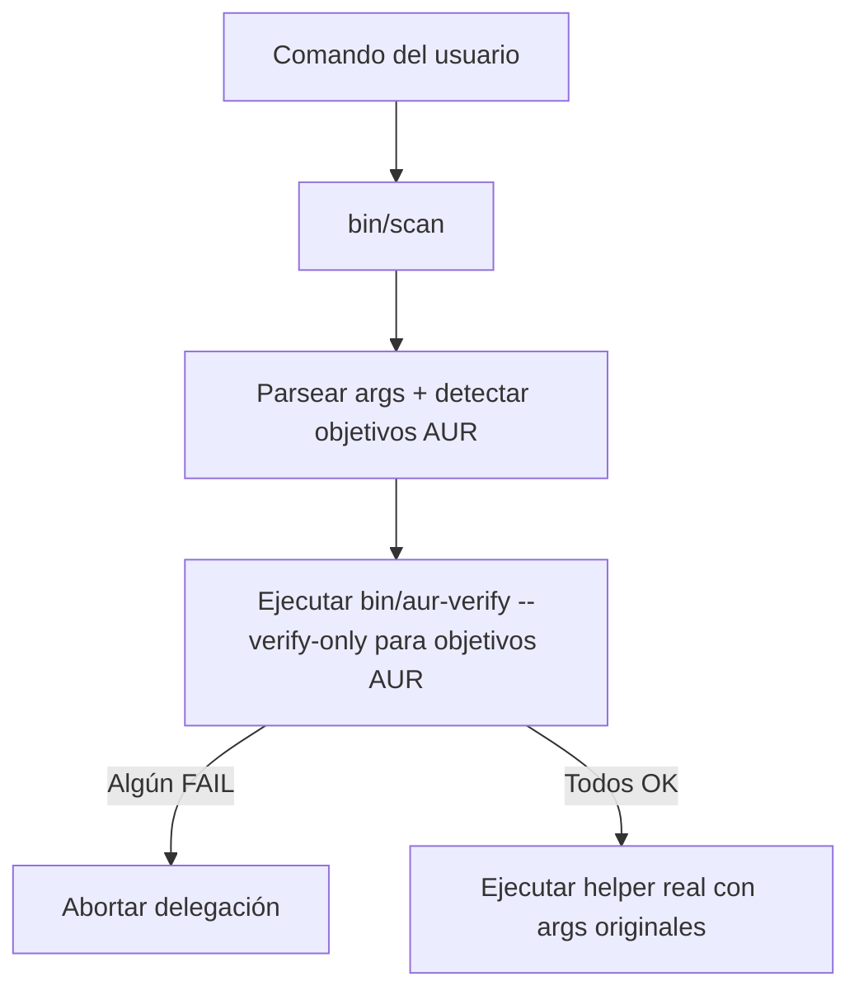
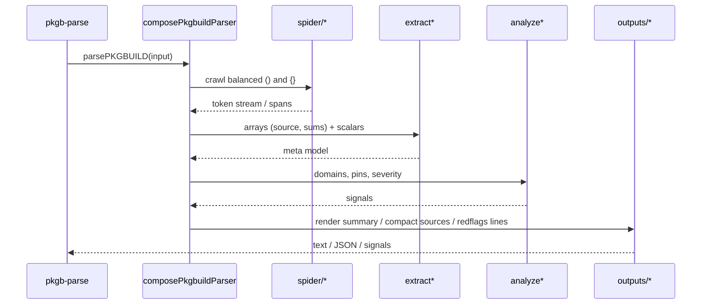

# Notas de Desarrollo (Interno)

Este documento recopila detalles de implementación, palancas de ajuste y notas de mantenimiento que intencionalmente no se muestran en el README principal. Está dirigido a contribuidores y mantenedores.

Read this in [English](https://github.com/LuigiD5555/aur_scanner/blob/development/docs/developer/README.dev.md)

---

Volver al README: [English](Projects/Code/Personal_Projects/Scripts/AUR%20Verifier%20Project/aur_verification/README.md) | [Español](README.es.md)

---

## Diagramas de vista general

<details>
<summary><strong>Flujo general</strong></summary>

</details>

<details>
<summary><strong>Vista general del flujo</strong></summary>

```mermaid
%%{init: {"theme": "forest", "handDrawn": true}}%%
sequenceDiagram
    participant User as Usuario
    participant CLI as CLI bin/aur-verify
    participant GitHub as GitHub lib/github/derive_candidates_from_repo.sh
    participant Search as Resolutor AUR lib/aur/search_and_resolve.sh
    participant Plain as AUR Plain/LLPR lib/aur/fetch_plain_and_snapshot.sh
    participant Verify as Verificador lib/verify/aur_verification_orchestrator.sh
    participant Rules as Reglas lib/verify/verification_rules_loader.sh
    participant PKGB as Utilidades PKGB lib/pkgb/aggregate_pkgb_helpers.sh
    participant Report as Reporte lib/report/render_summary.sh + lib/i18n/messages.sh
    participant Makepkg as makepkg
    participant Yay as yay

    User->>CLI: Ejecutar bin/aur-verify <entrada>

    %% Detección de entrada
    rect rgba(200, 200, 255, 0.35)
    CLI->>CLI: Detectar tipo de entrada
    alt URL AUR
        CLI->>Plain: Extraer nombre y consultar LLPR v5
        Plain-->>CLI: pkg
    else URL de GitHub
        CLI->>GitHub: Derivar candidatos desde título/README
        GitHub-->>CLI: Lista de candidatos
        CLI->>Search: Validar en AUR (nombre estricto)
        Search-->>CLI: pkg
    else NombreDePaquete
        CLI->>Plain: Info LLPR v5 coincidencia exacta
        alt Coincidencia exacta
            Plain-->>CLI: pkg
        else Sin coincidencia exacta
            CLI->>Search: Búsqueda estricta yay -Ss solo AUR
            Search-->>CLI: pkg
        end
    end
    end

    %% Obtener PKGBUILD
    rect rgba(200, 255, 200, 0.35)
    CLI->>Verify: verify_pkgbuild pkg
    Verify->>Plain: Descargar snapshot/plain PKGBUILD y .SRCINFO
    alt Plain OK
        Plain-->>Verify: Ruta temporal con PKGBUILD
    else Fallback a git
        Verify->>Plain: Falló snapshot plain
        Verify->>CLI: git clone desde AUR
        CLI-->>Verify: Repo clonado con PKGBUILD
    end
    Note over Verify: Mostrar resúmenes de PREPARE/BUILD/PACKAGE (Verbose o SHOW_FUNCS)
    end

    %% Reglas atómicas de verificación estática
    rect rgba(255, 255, 200, 0.35)
    Verify->>Rules: rule_scv_pinning PKGBUILD
    Rules->>PKGB: pkgb_check_scv_pinning
    PKGB-->>Rules: Resultado
    Rules-->>Report: report_add item_scv_pinning

    Verify->>Rules: rule_sources PKGBUILD
    Rules->>PKGB: list_sources + chequeos HTTPS y lista permitida
    PKGB-->>Rules: Resultado
    Rules-->>Report: report_add item_source_urls / item_allowed_domains
    Note over Rules,Report: Por defecto → solo líneas problemáticas; Verbose → mostrar todas las fuentes y marcar problemáticas

    Verify->>Rules: rule_checksums PKGBUILD checkout
    Rules->>PKGB: has_weak_or_skip / has_strong_sums
    opt Autocorrección permitida
        Rules->>Verify: rewrite_sums_to_sha256
    end
    Rules-->>Report: report_add item_checksums
    Note over Rules,Report: Por defecto → solo líneas débiles/SKIP; Verbose → mostrar todos los arrays de sumas y marcar débiles/SKIP

    Note over Verify: En --verbose, JS imprime líneas de banderas rojas (solo diagnóstico)
    end

    %% Verificación profunda opcional
    rect rgba(255, 220, 200, 0.35)
    alt VERIFY-ONLY sin DEEP
        Verify->>Rules: rule_verifysource modo verify-only
        Rules-->>Report: SKIP verify-only
    else FAST
        Verify->>Rules: rule_verifysource modo fast
        Rules-->>Report: SKIP --fast
    else FULL
        Verify->>Makepkg: makepkg --verifysource sin compilar
        Makepkg-->>Verify: OK / FAIL
        Verify->>Rules: rule_verifysource modo full
        Rules-->>Report: PASS / WARN / FAIL
    end
    end

    %% Reporte e instalación
    rect rgba(230, 200, 255, 0.35)
    Verify->>Report: report_print modo
    alt OVERALL OK u OK con advertencias y no verify-only
        CLI->>Yay: yay -S pkg
        Yay-->>CLI: Instalación completada
    else OVERALL FAIL o verify-only
        CLI-->>User: No instalar / Solo verificación
    end
    Note over CLI,Report: Quiet → suprime logs info/warn; el resumen permanece visible
    end
```
</details>

---

## Estructura del proyecto

### Visión general de la arquitectura

- Punto de entrada Bash: `bin/aur-verify`
- Orquestador de verificación: `lib/verify/aur_verification_orchestrator.sh` orquesta el flujo de extremo a extremo y la entrega a instalación
- Reglas atómicas: `lib/verify/verification_rules_loader.sh` agrega `lib/verify/rules/*.sh`
  - `scv_pinning_rule.sh`, `sources_rule.sh`, `checksums_rule.sh`, `verifysource_rule.sh` (y `redflags_rule.sh` disponible; ver nota abajo)
- Fetchers de AUR y ayudantes LLPR: `lib/aur/fetch_plain_and_snapshot.sh`
- Utilidades de búsqueda/resolución AUR: `lib/aur/search_and_resolve.sh`
- Derivación de wrapper GitHub: `lib/github/derive_candidates_from_repo.sh`
- Ayudantes de PKGBUILD: `lib/pkgb/aggregate_pkgb_helpers.sh` agrega:
  - `sources_and_domains.sh`, `checksums_policy.sh`, `redflags_scan.sh`, `functions_summary.sh`
- Reporte + i18n: `lib/report/render_summary.sh`, `lib/i18n/messages.sh`
- Parser Node opcional: `bin/pkgb-parse` con `lib/pkgb/parser/{analysis,utils,outputs,patterns,terminalColors}.js`

### Estructura detallada

#### Scripts de nivel superior

- `bin/aur-verify`: CLI principal. Parsea args/env, orquesta resolver → checkout → reglas → reporte → instalación opcional.
- `bin/scan`: Wrapper para pre-chequear paquetes AUR antes de delegar a `yay/paru/pikaur/trizen/pamac`.
- `bin/scan-shim`: Front ligero instalado con los nombres de los helpers; reenvía a `bin/scan` cuando detecta banderas del wrapper y, si no, delega directo al helper real.
- `bin/pkgb-parse`: CLI de Node opcional para parsear PKGBUILD (diagnósticos/salidas compactas).
- `scripts/install-scanner.sh`: Instala symlinks para scan en el PATH de usuario/sistema.
- `scripts/uninstall-scanner.sh`: Elimina symlinks del wrapper scan (usuario/sistema).
- `scripts/run-tests.sh`: Ejecuta pruebas bats + parser Node (requiere `bats` y Node ≥ 18).
- `scripts/validate-sources.sh`: Verifica que las importaciones `source "..."` sean válidas tras refactors.

#### Librerías núcleo

- `lib/core/shell_safety.sh`: Configuraciones estrictas de bash, `have_cmd`, `require_tools`, configuración de traps.
- `lib/utils/logging.sh`: Logs uniformes `[INFO]`, `[WARN]`, `[ERROR]`, `die`, ayudantes de color.

#### AUR + resolutor

- `lib/aur/search_and_resolve.sh`: `resolve_pkg`, búsqueda estricta por nombre vía AUR LLPR v5 y `yay -Ss` (solo AUR), candidatos de URL de GitHub.
- `lib/aur/fetch_plain_and_snapshot.sh`: Obtiene `PKGBUILD`/`.SRCINFO` vía AUR plain/snapshot; fallback a clon git superficial; caché TTL para plain.
- `lib/github/derive_candidates_from_repo.sh`: Parsear URL GitHub, leer README/título, derivar nombres candidatos de wrapper AUR.

<details>
<summary><strong>Secuencia — Resolución de entrada</strong></summary>

</details>

#### Reglas de verificación

- `lib/verify/rules/*.sh`: Reglas atómicas
  - `scv_pinning_rule.sh`: Exigir fijación para `git+…` mediante `#commit=`/`#tag=`.
  - `sources_rule.sh`: Exigir HTTPS + dominios permitidos.
  - `checksums_rule.sh`: Exigir sumas fuertes; reescritura opcional a sha256 (no estricto/no rápido).
  - `verifysource_rule.sh`: Ejecutar `makepkg --verifysource` según el modo; interpretar resultado (se omite automáticamente si reglas previas ya fallaron para evitar descargas innecesarias).
  - `redflags_rule.sh`: Disponible; desactivada por defecto en el resumen (diagnósticos siguen disponibles).
- `lib/verify/verification_rules_loader.sh`: Agregador que expone llamadas `rule_*`.
- `lib/verify/aur_verification_orchestrator.sh`: `verify_pkgbuild`, `install_or_verify`, `aur_checkout_to` y orquestación general.

<details>
<summary><strong>Secuencia — Reglas y reporte</strong></summary>

</details>

#### Ayudantes PKGBUILD

- `lib/pkgb/sources_and_domains.sh`: `list_sources`, enforcement HTTPS, validación de lista de dominios.
- `lib/pkgb/checksums_policy.sh`: `has_strong_sums`, `has_weak_or_skip`, `rewrite_sums_to_sha256` (usa `makepkg -g`).
- `lib/pkgb/redflags_scan.sh`: `scan_red_flags` usando `lib/rules/redflags.list` (líneas diagnósticas con números).
- `lib/pkgb/functions_summary.sh`: `print_func_summaries` para `prepare()/build()/package()`.
- `lib/pkgb/aggregate_pkgb_helpers.sh`: Fachada que compone helpers y `pkgb_check_scv_pinning`.

<details>
<summary><strong>Secuencia — Fuentes y checksums</strong></summary>

</details>

#### Internacionalización (i18n) + reporte

- `lib/i18n/messages.sh`: Catálogo de mensajes (en/es) para claves de reporte.
- `lib/report/render_summary.sh`: Componer e imprimir el resumen final localizado.

#### Wrapper de guardia

- `lib/guard/helpers.list`: Declara nombres de helpers conocidos y tipos (helpers de pacman/pamac) para `bin/scan`.
- `lib/rules/redflags.list`: Patrones compartidos de código riesgoso (usados por Bash + parser de Node).

<details>
<summary><strong>Secuencia — Delegación de scan</strong></summary>

</details>

#### Parser de PKGB en Node (opcional)

- `lib/pkgb/parser/analysis.js`: Fachada del parser; punto de entrada para el CLI.
- `lib/pkgb/parser/parser/*.js`: Pipeline central de parseo
  - `composePkgbuildParser.js`: Compone fases; exporta `parsePKGBUILD`.
  - `spider/*`: Escaneos balanceados de paréntesis/llaves.
  - `extract*`: Extrae arrays y escalares (`source`, checksums, metadatos) → modelo meta.
  - `analyze*`: Chequeos de dominios, detección de pin; calcula señales/severidad.
- `lib/pkgb/parser/outputs/modules/*.js`: Renderizadores para resumen, análisis detallado, señales, líneas de banderas rojas, fuentes compactas.
- `lib/pkgb/parser/patterns/*`: Composición de regex y loader para patrones compartidos.
- `lib/pkgb/parser/utils/modules/*`: Fetch de red, lectura de stdin, tokenización estilo shell.

#### Propósito por archivo (mapa rápido)

- `bin/aur-verify`: Args CLI → llama `install_or_verify` → dentro: `resolve_pkg` → `aur_checkout_to` → reglas → resumen → quizá instalar.
- `lib/verify/aur_verification_orchestrator.sh`: Implementa la secuencia anterior, provee directorio temporal de trabajo y manejo de modos.
- `lib/verify/rules/*.sh`: Chequeos de única responsabilidad (estado + clave de mensaje + fix opcional).
- `lib/pkgb/*.sh`: Helpers puros; sin red excepto reescritura de checksum vía `makepkg -g`.
- `lib/aur/*.sh`: Único lugar que toca la red (AUR plain/snapshot/git).
- `bin/scan`: Orquesta helpers; llama `bin/aur-verify --verify-only` para objetivos AUR; delega sin cambios.

#### Invariantes clave (para auditoría)

- No ocurre build durante la verificación; los chequeos profundos usan solo `makepkg --verifysource`.
- Acceso de red limitado a endpoints AUR y fuentes declaradas (para verificación profunda); el modo estricto restringe aún más los dominios permitidos.
- La reescritura automática de checksums solo ocurre en modos no estrictos y no rápidos, y se re-verifica luego.
- Si alguna regla falla, no se intenta la instalación.

---

## Integración con wrapper (scan): comportamiento y variables

**Propósito:** `bin/scan` intercepta comandos del helper AUR y ejecuta un pre-chequeo con `bin/aur-verify --verify-only` antes de delegar al helper real.

### Flujo

1. Parsear helper + args (yay/paru/pikaur/trizen/pamac).
2. Detectar objetivos AUR.
3. Verificación: con objetivos explícitos se invoca una vez `bin/aur-verify --verify-only`; en barridos de actualización (`-Syu` sin nombres) se llama al helper con `-Qum`, se verifica cada actualización AUR y se agregan las fallidas a `SCAN_IGNORE_PKGS`.
4. Si un objetivo explícito falla → abortar; en barridos las fallidas se anexan a `--ignore` antes de delegar para que el resto continúe.

### Transparencia

- Para `pamac`, los pre-chequeos solo en `pamac build` (sin cambios en `pamac install|upgrade`).
- El wrapper sigue delegando al helper real; la única mutación es añadir `--ignore <pkg1,pkg2>` en actualizaciones completas para saltar las AUR problemáticas automáticamente.
- Los shims instalados como helpers (`scan-shim`) inspeccionan los argumentos: cuando detectan banderas del wrapper, ejecutan `bin/scan`; de lo contrario delegan directamente al binario real.
- Las banderas propias del wrapper (`--verify-only`, `--strict`, `--fast`, `--metadata`, etc.) se consumen antes de delegar. Para exponerlas bajo el nombre habitual del helper, instala un shim en el `$PATH` (ej. `ln -sf …/scan ~/.local/bin/yay`) o un alias/función de shell, de modo que cualquier `yay …` pase primero por el wrapper.
- `FAST=1 --verify-only` (o los env vars equivalentes) deja la ejecución en modo parser/heurística y termina antes de lanzar `makepkg --verifysource` o descargar artefactos grandes.
- Chequeo rápido: `command -v yay` + `readlink -f "$(command -v yay)"`. Si ambos resuelven al wrapper puedes documentar ejemplos como `yay -Syu pkg --verify-only`; de lo contrario usa y comunica la forma explícita `scan yay -Syu --verify-only pkg`.

### Variables de entorno

- `SCAN_BYPASS=1` — Omitir el pre-chequeo una vez (no recomendado).
- `SCAN_REAL_YAY=/usr/bin/yay` — Forzar ruta del binario real (análogo para `paru`, `pamac`, etc.).
- `STRICT=1 | FAST=1 | VERBOSE=1 | QUIET=1` — Se pasan al verificador e influyen en la compuerta.

### Flags de conveniencia (se eliminan antes de delegar)

- `--strict` (= `STRICT=1`)
- `--fast` (= `FAST=1`)
- `--verify-only`
- `--verbose` / `--quiet`
- `--metadata` (= `SHOW_METADATA=1`)

**Catálogo de helpers:** Extiende `lib/guard/helpers.list` para añadir helpers o ajustar tipos. Los barridos usan `lib/guard/upgrades.sh` (soporta yay/paru/pikaur/trizen vía `-Qum`).

### Compatibilidad de helpers (scan)

| Helper | Ruta de pre-chequeo AUR | Notas |
| --- | --- | --- |
| yay | `aur-verify --verify-only` | Por defecto; override con `YAY_BIN`. |
| paru | `aur-verify --verify-only` | Mismo passthrough de flags que yay. |
| pikaur | `aur-verify --verify-only` |  |
| trizen | `aur-verify --verify-only` |  |
| pamac | `aur-verify --verify-only` | Solo en `pamac build` (flujo AUR). |
| pacman | delegado | No AUR; el wrapper delega transparente |

---

## Requisitos de ejecución y overrides locales

### Toolchain mínima

- Arch/derivado con acceso a AUR
- `git`, `curl`, `makepkg`
- Helper AUR (por defecto `yay`)

### Overrides

- `YAY_BIN=/ruta/absoluta/a/yay` — Usar un binario de helper no predeterminado.
- `AUR_FORCE_IPV4=1` — Forzar IPv4 para todas las llamadas AUR (casos de red).

### Versiones en ejecución

- Bash ≥ 4.4 (arrays y semántica `set -o pipefail`).
- Node.js ≥ 18 (opcional; habilita `pkgb-parse` y diagnósticos JS).
- `makepkg` de pacman (Arch/derivados).

---

## Guía Flags ↔ Variables de entorno (canónica)

| Modo/Log | Flag | Env var |
| --- | --- | --- |
| Solo verificar | `--verify-only` | `VERIFY_ONLY=1` |
| Verificación profunda | `--deep` | `DEEP=1` |
| Rápido (metadata) | `--fast` | `FAST=1` |
| Políticas estrictas | `--strict` | `STRICT=1` |
| Verboso | `--verbose` | `VERBOSE=1` |
| Silencioso | `--quiet` | `QUIET=1` |
| Mostrar metadata | `--metadata` | `SHOW_METADATA=1` |
| Mostrar cabeceras de funciones | *(implícito en verbose)* | `SHOW_FUNCS=1` |

> **Precedencia** — `FAST=1` deshabilita la verificación profunda incluso si `--deep` / `DEEP=1` están activos.

---

## i18n (reportes)

- Auto-locale vía `LANG`/`LC_*` (Español cuando comienza con `es`).
- Forzar idioma: `REPORT_LANG=en` | `REPORT_LANG=es`.
- `SHOW_FUNCS=1` — imprime resúmenes de `prepare()/build()/package()` (implicado por `--verbose`).
- `SHOW_METADATA=1` — añade `yay -Si` en verify-only (también implicado por `--metadata` o `--verbose`).
- `QUIET=1` — reduce la salida a errores + resumen final.

---

## Empaquetado para AUR (beta)

- Existe una plantilla lista en `packaging/aur-scanner-git/` (PKGBUILD + .install) para publicar el wrapper como paquete `aur-scanner-git`.
- El paquete instala el runtime en `/usr/lib/aur-scanner` y expone `scan`; luego el usuario debe ejecutar `install-scanner.sh` para enlazar los helpers.
- `pkgver()` usa `git describe`, así que recuerda regenerar `.SRCINFO` con `makepkg --printsrcinfo` antes de subir cambios a AUR.
- El script `.install` muestra al usuario cómo ejecutar `sudo /usr/lib/aur-scanner/scripts/install-scanner.sh --system` tras instalar.
- Mantén la etiqueta **beta** en `pkgdesc` mientras la CLI sea inestable.

---

## Profundidad de verificación y precedencia

- `--verify-only`: solo chequeos estáticos (sin instalar). Con `DEEP=1` también ejecuta `makepkg --verifysource`.
- `--fast`: solo metadata; omite verificación profunda incluso si `DEEP=1` está activo (FAST prevalece sobre DEEP).
- `--strict`: endurece políticas (solo HTTPS, lista de dominios, checksums fuertes, fijación SCV) y puede elevar WARN a FAIL.

---

## Códigos de salida

- `0` — Verificación aprobada (y, si no es `--verify-only`, instalación completada).
- `1` — Verificación fallida (problema bloqueante).
- `2` — Error de entrada/resolución (paquete AUR no encontrado, mapeo de GitHub inválido).
- `3` — Fallo de red/checkout (AUR plain/tree/snapshot/git no disponible).
- `4` — Falta de herramienta/runtime (p. ej., `git`, `curl`, `makepkg`).
- `5` — Error interno (inesperado).

---

## Notas de seguridad (orientadas a devs)

- **Sin build durante la verificación.** Los chequeos profundos usan `makepkg --verifysource` (integridad/PGP) sin compilar.
- **`--fast` es superficial.** Usarlo solo para triage/vista previa.
- **Checksums**
  - Normal: si `sha1`/`SKIP`, reescribir a `sha256` y re-verificar.
  - Estricto: **prohibido**; resulta en FAIL (sin reescritura automática).
- **Lista de dominios permitidos** y **fijación SCV** (`#commit=`/`#tag=`) son estrictos con `STRICT=1`.
- **Banderas rojas.** Diagnóstico (JS cuando hay Node); en política estricta se escalan para patrones de alto riesgo.

---

## Modelo de amenazas (conciso)

### Objetivos

- Detectar temprano patrones inseguros en PKGBUILD.
- Hacer cumplir reproducibilidad en fuentes SCV.
- Validar integridad/PGP con `makepkg --verifysource`.
- Mantener una vía de triage rápida con trade-offs explícitos.

### No objetivos

- Sandbox completo/detección de malware.
- Reemplazar la confianza de la distro o la revisión del empaquetador.
- Compilar paquetes durante la verificación.
- Confiar por defecto en dominios fuera de AUR en modo estricto.

### Implicaciones

- Las banderas rojas son diagnósticas por defecto; en `STRICT=1` algunas escalan a FAIL.
- `--fast` cambia profundidad por velocidad.

---

## Modos de logging

- `--verbose` (o `VERBOSE=1`):
  - Implica `SHOW_FUNCS=1`
  - Imprime lista compacta de fuentes del parser JS, línea de resumen y líneas de banderas rojas (solo diagnóstico).
- `--quiet` (o `QUIET=1`):
  - Suprime logs info/warn globalmente; el resumen y los errores permanecen.
  - Sobrescribe `--verbose` y desactiva `SHOW_FUNCS`/metadata.
- Los resúmenes de funciones también pueden mostrarse explícitamente con `SHOW_FUNCS=1` independientemente de `--verbose`.

---

## Ajustes de rendimiento (internos)

- Parser JS de una sola ejecución: `rule_js_signals` invoca el parser de Node una vez y exporta contadores; `rule_red_flags` los reutiliza y solo renderiza líneas en `--verbose` (sin lanzamientos extra de Node).
- Obtener plain primero: siempre intentar AUR `plain/PKGBUILD?h=<pkg>`, luego fallback a `tree/PKGBUILD?plain=1`, finalmente snapshot o clon git superficial.
- Ruta de red robusta: los helpers de curl prueban el stack por defecto y caen a IPv4 automáticamente; respeta `AUR_FORCE_IPV4=1` para forzar IPv4.
- Chequeo de disponibilidad plain: incluso si el checkout cae a snapshot/git, `aur_plain_exists` usa HEAD para marcar disponibilidad con precisión en el reporte.
- Omitir descargas pesadas en verify-only: la reescritura de checksum vía `makepkg -g` se deshabilita cuando `VERIFY_ONLY=1` (sigue activa en modo completo salvo `FAST=1`).
- `.SRCINFO` se obtiene solo en VERBOSE o STRICT.
- Caché de PKGBUILD plain vía `/tmp` con TTL (env: `AUR_CACHE_DIR`, `AUR_CACHE_TTL_SEC`).

> `?plain=1`: Es un parámetro de petición que se añade al final de la URL Github (https://github.com/user/proyecto/blob/main/archivo.sh?plain=1
)

### Caché de PKGBUILD plain

- Directorio: `${AUR_CACHE_DIR:-/tmp}/aur-plain-cache/`
- Archivos: `<pkg>.PKGBUILD` (+ metadata)
- TTL: `AUR_CACHE_TTL_SEC` (valor por defecto en código; aumentar para CI si es necesario)
- Purgar uno: `rm -f /tmp/aur-plain-cache/<pkg>.PKGBUILD`
- Purgar todos: `rm -rf /tmp/aur-plain-cache/`

---

## Solución de problemas (mensajes canónicos)

- **“Package may not exist”** → confirma el nombre o existencia en AUR.
- **“sha256 verification failed after regeneration”** → el upstream cambió o hay riesgo; no instales hasta entenderlo.
- **“source domain not allowed” (STRICT)** → amplía la lista permitida o usa modo normal conscientemente.
- **“Plain PKGBUILD unavailable while FAST=1”** → vuelve a ejecutar sin `--fast` para habilitar snapshot/git.
- **“PKGBUILD not found at ‘…/PKGBUILD’ (mode=…, pkg=…)”** → desactiva `--fast`; si persiste, abre un issue con la ruta mostrada.

---

## Sinopsis de CLI (consulta rápida)

```bash
bin/aur-verify [--verify-only] [--deep] [--fast] [--verbose|--quiet] [--metadata] <AUR_NAME|AUR_URL|GITHUB_URL>

Environment:
  STRICT=1           Tighten policies (allowlist, pinning, strong sums, PGP).
  REPORT_LANG=en|es  Force report language.
  SHOW_FUNCS=1       Print prepare/build/package summaries (implied by --verbose).
  SHOW_METADATA=1    Print yay -Si metadata in verify-only (implied by --verbose).
  YAY_BIN=/path/yay  Override yay binary path.
  AUR_FORCE_IPV4=1   Force IPv4 for AUR endpoints.
```

---

## Manejo de banderas rojas (Red Flags)

- La regla atómica `rule_red_flags()` prefiere el parser de Node cuando está presente. Usa el conteo exportado por JS para evitar un parse adicional y solo imprime líneas detalladas en `--verbose`.
- La política trata el patrón `eval` de selección de arquitectura como de bajo riesgo (WARN normal / FAIL estricto); otros patrones son WARN/FAIL según corresponda.

### Política de banderas rojas (alineación)

- **Normal**: “sospechoso pero explicable” (p. ej., `eval` para indirección de variables por arquitectura) → **WARN**, no bloqueante.
- **STRICT**: descargas autoejecutables, cambios de privilegios, decodificación opaca, etc. → **FAIL** (aparece en el resumen).
- Con `--verbose` y Node presente, se imprimen las **líneas** de banderas rojas; fuera de STRICT permanecen como diagnóstico.

---

## Integración del parser de Node (`bin/pkgb-parse`)

- Opcional: se usa de forma oportunista cuando hay Node; si no, se cargan stubs seguros.
- Salidas provistas usadas por el CLI en Bash:
  - `--summary`, `--sources-compact` y `--redflags-lines` (solo diagnósticos)
- Los módulos ESM viven bajo `lib/pkgb/parser`; se separan las preocupaciones de parseo y formateo.

### Referencia rápida del CLI de Node

```
# Desde archivo local
node bin/pkgb-parse --file ./PKGBUILD --summary
node bin/pkgb-parse --file ./PKGBUILD --json

# Desde URL plain de AUR
node bin/pkgb-parse --url "https://aur.archlinux.org/cgit/aur.git/plain/PKGBUILD?h=zotero"

# Diagnósticos para devs
node bin/pkgb-parse --file ./PKGBUILD --signals
node bin/pkgb-parse --file ./PKGBUILD --redflags-lines
node bin/pkgb-parse --file ./PKGBUILD --sources-compact --limit 10
```

> **Notas:**
> 
> - Preferible como auxiliar **de diagnóstico**; la aplicación de reglas permanece en Bash.
> - Si la URL no es `…/plain/PKGBUILD?h=<pkg>`, el CLI sugiere la forma correcta.

---

## Añadir/Ajustar reglas

- Prefiere funciones pequeñas y componibles en `lib/verify/rules/*.sh` que:
  - Logueen solo fragmentos (el contexto completo en VERBOSE)
  - Actualicen el reporte vía `report_add <item> <STATUS> <message_key>`
  - Devuelvan non-zero solo cuando la regla deba contribuir a fallo
- Añade mensajes de cara al usuario en `lib/i18n/messages.sh` (EN y ES).

---

## Tests y tips locales

- Ejecutar tests (requiere bats + Node ≥ 18):
  - `scripts/run-tests.sh`
  - O directamente: `bats tests` + `node --test tests/js`
- Bucle rápido sobre un paquete objetivo:
  - `STRICT=1 sh ./bin/aur-verify <pkg> --verify-only --verbose`
  - `FAST=1 sh ./bin/aur-verify <pkg> --verify-only`
  - `DEEP=1 sh ./bin/aur-verify <pkg> --verify-only`
- Pre-chequeo antes de instalar (scan):
  - Explícito: `bin/scan yay -S <pkg>` (igual con `paru/pikaur/trizen`, `pamac build <pkg>`)
  - Drop-in: `scripts/install-scanner.sh` enlaza `scan` para uso directo e instala shims (`scan-shim`) que detectan automáticamente las banderas del wrapper antes de delegar.
- Limpiar caché para re-obtener un PKGBUILD:
  - `rm -f /tmp/aur-plain-cache/<pkg>.PKGBUILD`

---

## Recetas de CI (GitHub Actions)

```
name: aur-scanner-ci

on: [push, pull_request]

jobs:
  verify:
    runs-on: ubuntu-latest
    container: archlinux:latest
    steps:
      - uses: actions/checkout@v4

      - name: Install deps
        run: |
          pacman -Sy --noconfirm --needed git base-devel curl nodejs npm
          # optional: yay if testing --metadata
          # pacman -S --noconfirm yay
      - name: Run tests
        run: bash scripts/run-tests.sh
      - name: Verify (strict, no install)
        env:
          VERIFY_ONLY: "1"
          STRICT: "1"
          VERBOSE: "1"
        run: bash bin/aur-verify <aur-package>
      - name: Deep verify (no build)
        env:
          VERIFY_ONLY: "1"
          DEEP: "1"
        run: bash bin/aur-verify <aur-package>
```

### Expectativas de CI

- Usa `VERIFY_ONLY=1` + `STRICT=1` como compuerta de PR.
- Trata códigos de salida **no cero** (1..5) como fallos.
- Usa `QUIET=1` para logs cortos; vuelve a ejecutar con `--verbose` al fallar para capturar contexto.

---

## Notas de lanzamientos/documentación

- Mantén el README enfocado en uso y flags estables. Coloca aquí el ajuste interno y la justificación.
- No enlaces este archivo desde el README a menos que quieras exponerlo deliberadamente a usuarios.

---

## DRY y propiedad de las reglas

- Lista de banderas rojas: `lib/rules/redflags.list`
  - Bash: `lib/pkgb/redflags_scan.sh` -> `scan_red_flags()` (`grep -E -f`)
  - JS: `lib/pkgb/parser/patterns/compileRegexPatterns.js` carga la misma lista
- La aplicación (PASS/WARN/FAIL) está en las reglas Bash. El parser JS es solo para diagnósticos.

---

## Disposición en Bash (modular)

- Núcleo: `lib/core/shell_safety.sh`
- Logging: `lib/utils/logging.sh`
- Fetchers AUR: `lib/aur/fetch_plain_and_snapshot.sh`
- Búsqueda/resolución AUR: `lib/aur/search_and_resolve.sh`
- Candidatos de GitHub: `lib/github/derive_candidates_from_repo.sh`
  - Metadatos del repo (opcional): obtenidos vía `$YAY_BIN -Si` cuando el helper está presente
- Ayudantes PKGBUILD: `lib/pkgb/{sources_and_domains,checksums_policy,redflags_scan,functions_summary}.sh` (agregados por `aggregate_pkgb_helpers.sh`)
- Reglas de verificación: `lib/verify/rules/*.sh` (agregadas por `lib/verify/verification_rules_loader.sh`)
- Orquestador de verificación: `lib/verify/aur_verification_orchestrator.sh`
- i18n: `lib/i18n/messages.sh`
- Reporte: `lib/report/render_summary.sh`

### Sanidad de imports tras refactors

Ejecuta `bash scripts/validate-sources.sh` para validar que todas las referencias `source "..."` apuntan a archivos existentes.  
Opcionalmente, añade un hook de `.git/hooks/pre-commit` para invocar ese script.

---

## Referencia de funciones (concisa)

<details>
<summary><strong>Runner del verificador y reglas</strong></summary>

- `verify_pkgbuild(pkg)`: Orquesta checkout, reglas, reporte e instalación opcional.
- `install_or_verify(pkg)`: Muestra metadata en verify-only (cuando está habilitado) y llama `verify_pkgbuild`.
- `aur_checkout_to(pkg, workdir)`: Obtiene PKGBUILD vía AUR plain → snapshot → fallback git.
- `rule_scv_pinning(pkgb, strict)`: Exigir fijación para fuentes `git+` (`#commit=`/`#tag=`).
- `rule_sources(pkgb, strict)`: Exigir solo HTTPS y dominios permitidos.
- `rule_checksums(pkgb, checkout, strict, fast)`: Exigir sumas fuertes; auto-reescritura a sha256 salvo en estricto/rápido.
- `rule_verifysource(checkout, mode, strict)`: Ejecutar `makepkg --verifysource` según modo; WARN vs FAIL en estricto.
- `rule_red_flags(pkgb, strict)`: Regla disponible; no incluida actualmente en el resumen por defecto.
</details>

---

## Pasos de ejecución (extremo a extremo)

1. Resolución de entrada: detectar si el token es nombre AUR, URL AUR o URL de GitHub; resolver a nombre de paquete AUR (búsqueda estricta por nombre).
2. Checkout: obtener `PKGBUILD` y opcionalmente `.SRCINFO` desde AUR plain; fallback a snapshot; último recurso clon git superficial.
3. Reglas estáticas: fijación SCV → fuentes (HTTPS/dominios) → checksums (y reescritura opcional) → diagnóstico opcional de banderas rojas.
4. Verificación profunda (condicional): ejecutar `makepkg --verifysource` según modo (`DEEP`, `FAST`, `verify-only`).
5. Reporte: producir resumen localizado legible con items PASS/WARN/FAIL/SKIP y veredicto global.
6. Decisión de instalación: si global OK y no verify-only, instalar vía `yay -S` (o helper configurado).

Conmutadores de modo y precedencia

- `FAST=1` deshabilita verificación profunda incluso si `DEEP=1` está activo.
- `STRICT=1` eleva ciertos WARN a FAIL y prohíbe checksums débiles y dominios no permitidos.
- `--verify-only` evita instalar; chequeos profundos solo si `DEEP=1` y no `FAST=1`.

---

## Checklist de auditoría

- Entradas: confirma que el resolutor mapea solo a paquetes AUR existentes; el mapeo de URL de GitHub se valida contra `source/url`.
- Red: confirma que solo se acceden endpoints AUR y `source=()` declarados; sin ejecución arbitraria de curl/wget.
- Checksums: confirma política sha256; en no estricto, confirma logs de reescritura y re-verificación.
- PGP: cuando existe `.sig`, confirma que el resultado de `makepkg --verifysource` gobierna la instalación.
- Dominios: confirma solo HTTPS y aplicación de lista permitida en modo estricto.
- Fijación SCV: confirma que todas las fuentes `git+` están fijadas (en estricto es FAIL si no).
- Logging: confirma que el resumen refleja con precisión estados de reglas y modos.

## Oportunidades de optimización

- Caché: ajusta `AUR_CACHE_TTL_SEC` para reutilizar PKGBUILD plain; persiste entre ejecuciones cuando sea apropiado.
- Paralelismo: pre-computa fuentes compactas vía parser de Node (si está disponible) mientras se obtiene plain.
- I/O: minimiza `yay -Si` repetidos condicionándolo a `--metadata` o cacheando.
- Banderas rojas: usa señales del parser para decidir qué reglas expandir en modo verbose.
- Resolución: sesga la resolución de nombre según contexto (`-bin`/`-appimage`) en modo rápido para evitar descargas profundas.

## Diagramas

<details>
<summary><strong>Visión general del flujo (Mermaid)</strong></summary>
```mermaid
%%{init: {"theme": "forest", "handDrawn": true}}%%
sequenceDiagram
    participant User as Usuario
    participant CLI as CLI bin/aur-verify
    participant GitHub as GitHub lib/github/derive_candidates_from_repo.sh
    participant Search as Resolutor AUR lib/aur/search_and_resolve.sh
    participant Plain as AUR Plain/LLPR lib/aur/fetch_plain_and_snapshot.sh
    participant Verify as Verificador lib/verify/aur_verification_orchestrator.sh
    participant Rules as Reglas lib/verify/verification_rules_loader.sh
    participant PKGB as Utilidades PKGB lib/pkgb/aggregate_pkgb_helpers.sh
    participant Report as Reporte lib/report/render_summary.sh + lib/i18n/messages.sh
    participant Makepkg as makepkg
    participant Yay as yay

    User->>CLI: Ejecutar bin/aur-verify <entrada>

    %% Detección de entrada
    rect rgba(200, 200, 255, 0.35)
    CLI->>CLI: Detectar tipo de entrada
    alt URL AUR
        CLI->>Plain: Extraer nombre y consultar LLPR v5
        Plain-->>CLI: pkg
    else URL de GitHub
        CLI->>GitHub: Derivar candidatos desde título/README
        GitHub-->>CLI: Lista de candidatos
        CLI->>Search: Validar en AUR (nombre estricto)
        Search-->>CLI: pkg
    else NombreDePaquete
        CLI->>Plain: Info LLPR v5 coincidencia exacta
        alt Coincidencia exacta
            Plain-->>CLI: pkg
        else Sin coincidencia exacta
            CLI->>Search: Búsqueda estricta yay -Ss (solo AUR)
            Search-->>CLI: pkg
        end
    end
    end

    %% Obtener PKGBUILD
    rect rgba(200, 255, 200, 0.35)
    CLI->>Verify: verify_pkgbuild pkg
    Verify->>Plain: Descargar AUR plain PKGBUILD y .SRCINFO
    alt Plain OK
        Plain-->>Verify: Ruta temporal con PKGBUILD
    else Fallback a git
        Verify->>Plain: Falló snapshot plain
        Verify->>CLI: git clone desde AUR
        CLI-->>Verify: Repo clonado con PKGBUILD
    end
    Note over Verify: Mostrar resúmenes de PREPARE/BUILD/PACKAGE (VERBOSE o SHOW_FUNCS)
    end

    %% Reglas atómicas de verificación estática
    rect rgba(255, 255, 200, 0.35)
    Verify->>Rules: rule_scv_pinning PKGBUILD
    Rules->>PKGB: pkgb_check_scv_pinning
    PKGB-->>Rules: Resultado
    Rules-->>Report: report_add item_scv_pinning

    Verify->>Rules: rule_sources PKGBUILD
    Rules->>PKGB: list_sources + chequeos HTTPS y lista permitida
    PKGB-->>Rules: Resultado
    Rules-->>Report: report_add item_source_urls / item_allowed_domains
    Note over Rules,Report: Por defecto → solo problemáticas; VERBOSE → listar todas y marcar problemáticas

    Verify->>Rules: rule_checksums PKGBUILD checkout
    Rules->>PKGB: has_weak_or_skip / has_strong_sums
    opt Autocorrección permitida
        Rules->>Verify: rewrite_sums_to_sha256
    end
    Rules-->>Report: report_add item_checksums
    Note over Rules,Report: Por defecto → solo débiles/SKIP; VERBOSE → mostrar todos los arrays y marcar débiles/SKIP

    Note over Verify: En --verbose, JS imprime líneas de banderas rojas (diagnóstico)
    end

    %% Verificación profunda opcional
    rect rgba(255, 220, 200, 0.35)
    alt VERIFY-ONLY sin DEEP
        Verify->>Rules: rule_verifysource modo verify-only
        Rules-->>Report: SKIP verify-only
    else FAST
        Verify->>Rules: rule_verifysource modo fast
        Rules-->>Report: SKIP --fast
    else FULL
        Verify->>Makepkg: makepkg --verifysource (sin compilar)
        Makepkg-->>Verify: OK / FAIL
        Verify->>Rules: rule_verifysource modo full
        Rules-->>Report: PASS / WARN / FAIL
    end
    end

    %% Reporte e instalación
    rect rgba(230, 200, 255, 0.35)
    Verify->>Report: report_print modo
    alt OVERALL OK y no verify-only
        CLI->>Yay: yay -S pkg
        Yay-->>CLI: Instalación completada
    else OVERALL FAIL o verify-only
        CLI-->>User: No instalar / Solo verificación
    end
    Note over CLI,Report: QUIET → suprime info/warn; el resumen permanece visible
    end
```
</details>

<details>
<summary><strong>Autodetección y fetch (Mermaid)</strong></summary>

</details>

<!-- Diagramas enfocados y navegables para cada fase del flujo general -->

<details>
<summary>strong>Detección de entrada — zoom</strong></summary>
```mermaid
flowchart TD
    IN[Token de entrada] --> T{Tipo}
    T -->|URL AUR| A[Extraer <nombre>]
    T -->|URL GitHub| G[Construir candidatos AUR]
    T -->|Nombre| N[Comprobar LLPR AUR exacto]
    G --> V[Validar en AUR (nombre estricto)]
    N -->|Acierto| P[Paquete]
    N -->|Fallo| S[Búsqueda estricta yay -Ss solo AUR]
    V --> P
    S --> P
```
</details>

<details>
<summary><strong>Fetch de PKGBUILD — zoom</strong></summary>

</details>

<details>
<summary><strong>Reglas atómicas de verificación estática — zoom</strong></summary>
```mermaid
flowchart TD
    Start[Ruta de PKGBUILD] --> VCS[Regla de fijación SCV]
    VCS --> SRC[Reglas de SSL/Dominio]
    SRC --> SUMS[Regla de checksums]
    SUMS --> DIAG[Diagnóstico de banderas rojas (opcional)]
    DIAG --> RPT[Items de reporte actualizados]
```
</details>

<details>
<summary><strong>Verificación profunda opcional — zoom</strong></summary>
```mermaid
flowchart TD
    Mode{Modo} -->|FAST| Skip[SKIP verifysource]
    Mode -->|verify-only & !DEEP| Skip
    Mode -->|FULL o (verify-only & DEEP)| MK[makepkg --verifysource]
    MK --> OK[PASS/WARN/FAIL → reporte]
```
</details>

<details>
<summary><strong>Reporte e instalación — zoom</strong></summary>
```mermaid
flowchart TD
    Items[Items de reglas] --> Sum[Renderizar resumen (i18n)]
    Sum --> DEC[Resultado global]
    DEC -->|OK y no verify-only| Install[yay -S <pkg>]
    DEC -->|FAIL o verify-only| Exit[Sin instalación]
```
</details>

<details>
<summary><strong>AUR Guard — Intercepción</strong></summary>

</details>

<details>
<summary><strong>Parser de Node — Pipeline</strong></summary>

</details>

<details>
<summary><strong>Ayudantes de PKGBUILD</strong></summary>
- `list_sources()`: Extraer array de fuentes (normalizado, sin espacios extra).
- `sources_have_only_https()`: Probar flujo para solo HTTPS.
- `sources_domains_allowed()`: Probar flujo contra lista permitida.
- `has_strong_sums()`, `has_weak_or_skip()`: Detectar política de checksums.
- `rewrite_sums_to_sha256(dir)`: Usar `makepkg -g` y reescribir arrays de checksums.
- `scan_red_flags(pkgb)`: Grep contra `lib/rules/redflags.list` con números de línea.
- `print_func_summaries(pkgb)`: Extraer fragmentos de prepare/build/package.
- `pkgb_check_scv_pinning(pkgb)`: Comprobar fuentes SCV no fijadas.
</details>

<details>
<summary><strong>AUR/GitHub y resolutor</strong></summary>

- `aur_plain_fetch_plain_files`, `aur_plain_fetch_repo`: Obtener PKGBUILD/.SRCINFO o tarball snapshot.
- `aur_plain_rpc_info|search|exists`: Ayudantes LLPR y descubrimiento.
- `resolve_pkg(input)`: Resolver un token de entrada o URL de GitHub a un nombre de paquete AUR.
- `aur_search_name_strict_aur_only`, `prefer_fast_variant`: Búsqueda estricta por nombre y sesgo a variantes rápidas.
- `is_github_url`, `build_candidates_from_github`, `github_default_branch`: Derivación de candidatos de wrapper.
</details>

---

## 🤝 Contribuciones

Se agradecen contribuciones de todo tipo: código, documentación, pruebas, triage de issues y testing en distintos entornos Arch.

### **Cómo ayudar rápido**

- 🪳 **Reporta bugs** con un repro mínimo, tu variante de Arch y el comando exacto que ejecutaste.
- 🧪 **Prueba** `STRICT=1`, `FAST=1` y `DEEP=1` en distintos paquetes AUR y comparte resultados.
- 📝 **Mejora la documentación** (aclara flags, añade ejemplos, paridad Español/Inglés).
- 🧩 **Sugiere reglas** (banderas rojas, dominios permitidos, heurísticas de fijación SCV).

### **Entorno de desarrollo**

1. Haz fork + clon del repo.
2. Ejecuta localmente sin instalar:

   ```bash
   sh ./bin/aur-verify --verify-only <aur-package>
   STRICT=1 DEEP=1 sh ./bin/aur-verify <aur-package>
   ```

3. Añade tests o casos de ejemplo según sea necesario (ver `docs/developer/README.dev.md`).
4. Abre un PR con:

   - Descripción clara (qué/por qué/cómo).
   - Comportamiento antes/después (incluye salida de ejemplo).
   - Issue(s) relacionado(s), si aplica.

### **Higiene del proyecto**

- Mantén scripts lo más POSIX-friendly posible; se aceptan features de Bash si están justificadas.
- Prefiere PRs pequeños, commits enfocados y mensajes descriptivos.
- Sigue el modelo de seguridad (nunca relajes silenciosamente checks en `STRICT=1`).
- Sé amable y constructivo.

> Tip: Buenas primeras tareas suelen ser mejoras de documentación, mejores mensajes de error o añadir tests para edge cases.

---

## Versionado y registro de cambios

Este proyecto se entrega como scripts; registramos cambios relevantes aquí para contribuidores. Fechas en UTC.

- 2025-09-04
  - Rendimiento de integración del parser JS: se añadió `lib/pkgb/js_parser_bridge.sh` y `rule_js_signals` para que el parser de Node corra una sola vez por verificación; `rule_red_flags` reutiliza los contadores exportados y solo renderiza líneas en `--verbose`.
  - Robustez en fetch de AUR: el flujo de obtención ahora es `plain` → `tree?plain=1` → `snapshot` → `git` (último recurso). `aur_plain_exists` usa HEAD y el resumen marca la disponibilidad de plain correctamente incluso tras fallbacks.
  - Resiliencia de red: fallback a IPv4 añadido para solicitudes AUR; la env `AUR_FORCE_IPV4=1` fuerza IPv4 para todas las llamadas AUR.
  - Eficiencia en verify-only: la reescritura automática de checksum vía `makepkg -g` se omite cuando `VERIFY_ONLY=1`; `.SRCINFO` solo se obtiene en VERBOSE/STRICT.
  - Resumen/reporte: se añadió PASS explícito para “Disponibilidad de PKGBUILD plain” cuando la URL responde incluso si el checkout usó snapshot/git.
  - Renombrado de archivos: `lib/verify/runner.sh` → `lib/verify/aur_verification_orchestrator.sh`, `lib/verify/rules.sh` → `lib/verify/verification_rules_loader.sh`; docs renombradas a `README.dev.md`, `README.dev.es.md`, `README.md`, `README.es.md` y `docs/INDEX.md`.
  - Diagramas/docs actualizados para reflejar el nuevo paso de fetch (`tree?plain=1`) y nombres de módulos.

Política de versionado

- Cambios disruptivos en flags de CLI o comportamiento se señalarán explícitamente en esta sección. Refactors internos que no cambian flags hacia el usuario se agrupan bajo rendimiento/robustez.
