# Notas de Desarrollador (Interno)

Este documento está destinado a **colaboradores y mantenedores**. Explica cómo funciona la base de código, dónde se encuentran las piezas móviles y cómo extender o probar el sistema.

---

🌐 Lea esto en [Inglés](README.dev.md)

---

🔙 Volver al README: [Inglés](../../README.md) | [Español](../es/README.es.md)

---

## 📑 Tabla de Contenidos

- [Notas de Desarrollador (Interno)](#notas-de-desarrollador-interno)
  - [📑 Tabla de Contenidos](#-tabla-de-contenidos)
  - [Visión General](#visión-general)
    - [Flujo General](#flujo-general)
    - [Autodetección y Descarga](#autodetección-y-descarga)
    - [Resolución de Entrada](#resolución-de-entrada)
      - [Secuencia — Resolución de Entrada](#secuencia--resolución-de-entrada)
    - [Visión General del Flujo (Secuencia Detallada)](#visión-general-del-flujo-secuencia-detallada)
  - [Estructura del Proyecto](#estructura-del-proyecto)
    - [Scripts Principales](#scripts-principales)
    - [Bibliotecas Núcleo](#bibliotecas-núcleo)
    - [Reglas de Verificación](#reglas-de-verificación)
      - [Lista de Dominios Permitidos](#lista-de-dominios-permitidos)
      - [Secuencia — Reglas y Reportes](#secuencia--reglas-y-reportes)
    - [Helpers de PKGBUILD](#helpers-de-pkgbuild)
      - [Secuencia — Fuentes y Checksums](#secuencia--fuentes-y-checksums)
    - [Internacionalización y Reportes](#internacionalización-y-reportes)
    - [Wrapper Guard](#wrapper-guard)
      - [Secuencia — Delegación de scan](#secuencia--delegación-de-scan)
  - [Parser PKGB en Node (Opcional)](#parser-pkgb-en-node-opcional)
    - [Internos del Parser](#internos-del-parser)
  - [Ejecución](#ejecución)
    - [Requisitos](#requisitos)
    - [Métodos de Instalación](#métodos-de-instalación)
  - [Modelo de Seguridad](#modelo-de-seguridad)
    - [Modelo de Amenazas](#modelo-de-amenazas)
    - [Secuencia — Modos de Verificación Profunda](#secuencia--modos-de-verificación-profunda)
  - [Flujo de Desarrollo](#flujo-de-desarrollo)
    - [Inicio Rápido](#inicio-rápido)
    - [Ejecución de Pruebas](#ejecución-de-pruebas)
    - [Sincronización Automatizada de Ramas](#sincronización-automatizada-de-ramas)
    - [Agregar Reglas](#agregar-reglas)
    - [Recetas CI](#recetas-ci)
  - [Integración con Parser Node (`bin/pkgb-parse`)](#integración-con-parser-node-binpkgb-parse)
    - [Referencia Rápida CLI Node](#referencia-rápida-cli-node)
  - [Auditoría y Optimización](#auditoría-y-optimización)
  - [Solución de Problemas](#solución-de-problemas)
  - [🤝 Contribuciones](#-contribuciones)
    - [Formas de contribuir](#formas-de-contribuir)
    - [Lineamientos de contribución](#lineamientos-de-contribución)
    - [Entorno de desarrollo (local)](#entorno-de-desarrollo-local)
    - [Guías](#guías)
  - [Versionado y Changelog](#versionado-y-changelog)

---

## Visión General

### Flujo General

Este diagrama resume el pipeline global: desde la entrada del usuario, a través de la resolución, obtención de PKGBUILD, verificaciones estáticas y profundas, reporte, y la decisión final de instalar o abortar.

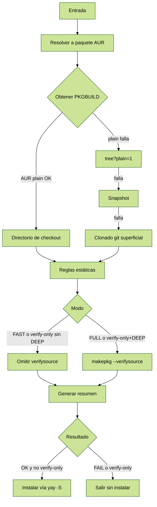

> `?plain=1`: un parámetro de query que puede añadirse a URLs de GitHub (ej. `…/blob/main/file.sh?plain=1`) para forzar renderizado crudo.

### Autodetección y Descarga

Dependiendo del tipo de entrada (URL de AUR, URL de GitHub o nombre de paquete), se activan diferentes rutas de resolución hasta obtener un PKGBUILD válido.

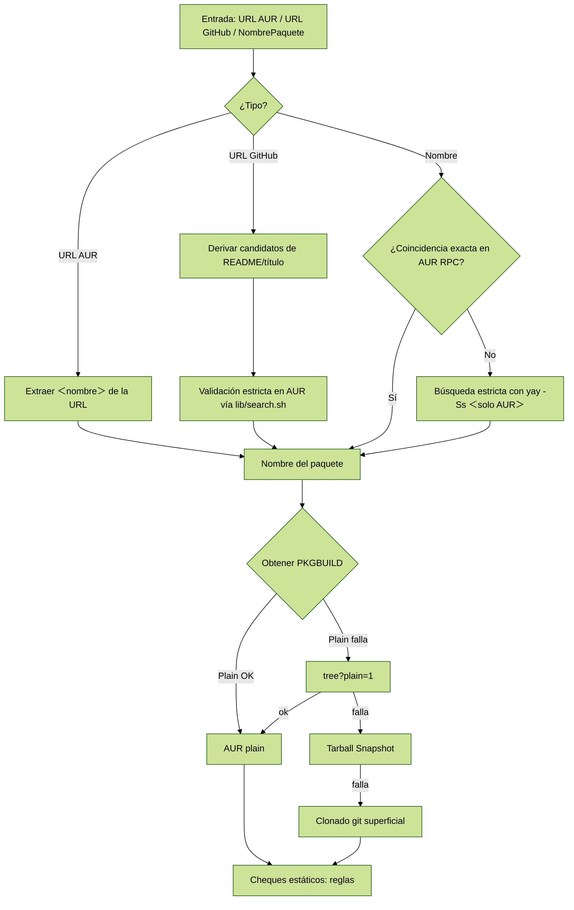

### Resolución de Entrada

Traducción del token de entrada hacia un nombre de paquete en AUR.

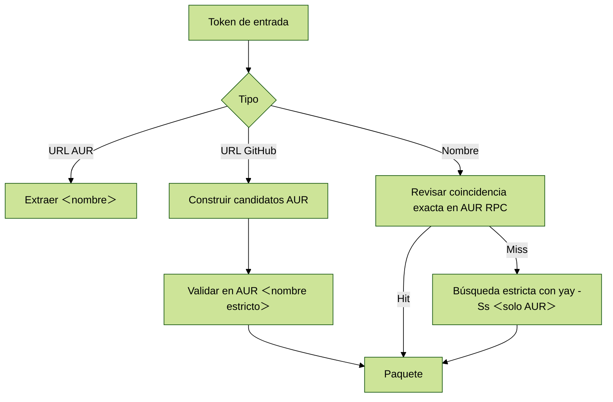

#### Secuencia — Resolución de Entrada

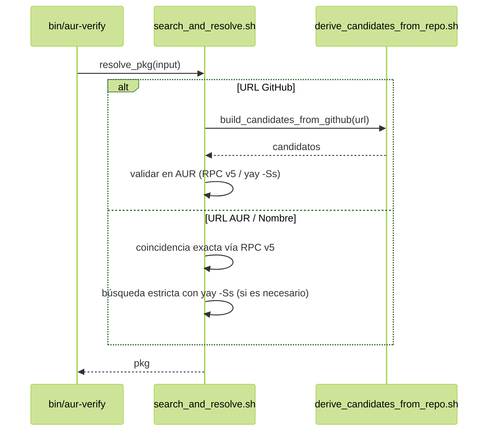

### Visión General del Flujo (Secuencia Detallada)

Aquí expandimos toda la orquestación, incluyendo verificación profunda opcional y la decisión de reporte/instalación. Las explicaciones preceden a los diagramas, y en modo verboso las líneas de red flags se muestran como diagnósticos (no como fallos a menos que se use modo estricto).

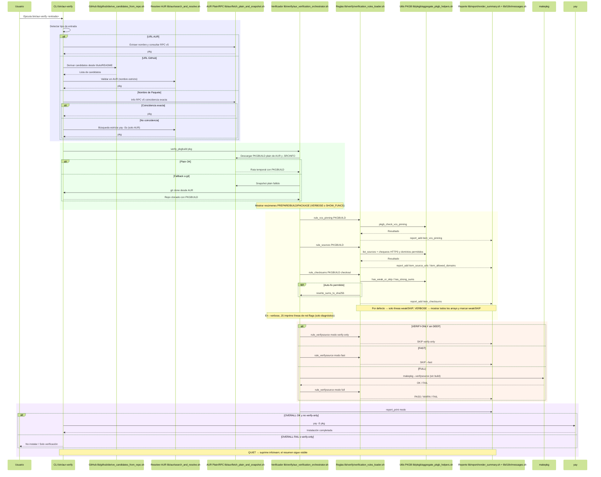

---

## Estructura del Proyecto

### Scripts Principales

- **`bin/aur-verify`**: CLI principal.
- **`bin/scan`**: Wrapper.
- **`bin/scan-shim`**: Symlink auxiliar.
- **`bin/pkgb-parse`**: Parser en Node (opcional).
- **Instalador/Desinstalador**: `scripts/install-scanner.sh` / `scripts/uninstall-scanner.sh`.
- **Ejecutor de pruebas**: `scripts/run-tests.sh`.
- **Validador**: `scripts/validate-sources.sh`.

---

### Bibliotecas Núcleo

- `lib/core/shell_safety.sh`: configuración estricta de bash, traps.
- `lib/utils/logging.sh`: helpers de logging.
- `lib/aur/search_and_resolve.sh`: resuelve entradas.
- `lib/aur/fetch_plain_and_snapshot.sh`: obtiene PKGBUILDs (`plain → tree?plain=1 → snapshot → git`).
- `lib/github/derive_candidates_from_repo.sh`: deriva candidatos desde repos de GitHub.
- `lib/verify/aur_verification_orchestrator.sh`: orquestador principal.
- `lib/verify/verification_rules_loader.sh`: carga reglas atómicas.

---

### Reglas de Verificación

Las reglas de verificación viven en `lib/verify/rules/*.sh`. Cada regla tiene una única responsabilidad: inspeccionar el PKGBUILD, devolver un estado y añadir un ítem al reporte.

- **`vcs_pinning_rule.sh`**: asegura que las fuentes `git+…` estén fijadas con `#commit=` o `#tag=`.
- **`sources_rule.sh`**: fuerza HTTPS y restringe a dominios permitidos.
- **`checksums_rule.sh`**: exige checksums fuertes; en modos no estrictos y no rápidos puede reescribir a `sha256` con `makepkg -g`.
- **`verifysource_rule.sh`**: ejecuta condicionalmente `makepkg --verifysource` según el modo; se omite si reglas anteriores ya fallaron para evitar descargas innecesarias.
- **`redflags_rule.sh`**: escanea patrones de riesgo. Por defecto solo diagnóstico; en modo estricto puede escalar a FAIL.
- **`js_signals_rule.sh`**: integra diagnósticos de red flags adicionales desde el parser Node (si está disponible).

Las reglas son agregadas por `lib/verify/verification_rules_loader.sh`, y orquestadas por `lib/verify/aur_verification_orchestrator.sh`.

> **Nota de seguridad:** `makepkg --verifysource` siempre se ejecuta como usuario sin privilegios (nunca root). Los directorios temporales se crean con `umask 077` vía `mktemp -d` para reducir riesgo de condiciones de carrera.

---

#### Lista de Dominios Permitidos

La regla `sources` fuerza HTTPS y restringe descargas a una lista curada de dominios.

- **Ubicación:** `lib/rules/sources_allowlist.txt`
- **Política:** denegar por defecto. Cualquier dominio no listado se convierte en **FAIL** bajo `--strict`.
- **Agregar dominios (PRs):**
	- Verificar propiedad upstream (sitio oficial o mirrors confiables).
	- HTTPS obligatorio, sin redirecciones opacas.
	- Evitar intermediarios con anuncios o acortadores dudosos.

---

#### Secuencia — Reglas y Reportes

Este diagrama muestra cómo se aplican las reglas en secuencia y cómo se actualiza el reporte.

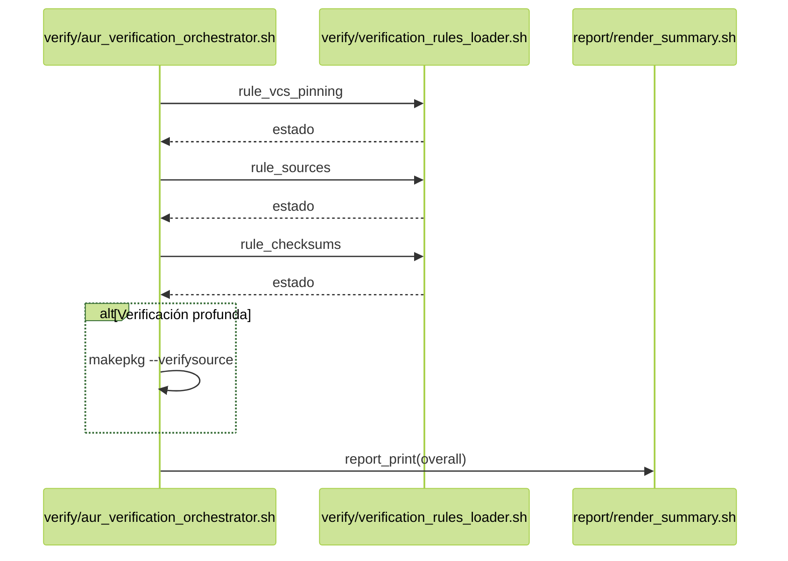

---

### Helpers de PKGBUILD

Los helpers de PKGBUILD viven en `lib/pkgb/*.sh`. Implementan funcionalidad reutilizable para las reglas.

- **`sources_and_domains.sh`**: provee `list_sources`, enforcement de HTTPS y chequeos de dominio permitido.
- **`checksums_policy.sh`**: provee `has_strong_sums`, `has_weak_or_skip` y `rewrite_sums_to_sha256` (usa `makepkg -g`).
- **`redflags_scan.sh`**: escanea líneas de PKGBUILD usando `lib/rules/redflags.list` (retorna líneas sospechosas con números).
- **`functions_summary.sh`**: imprime resúmenes de `prepare()`, `build()` y `package()`.
- **`aggregate_pkgb_helpers.sh`**: fachada que combina helpers y `pkgb_check_vcs_pinning`.

---

#### Secuencia — Fuentes y Checksums

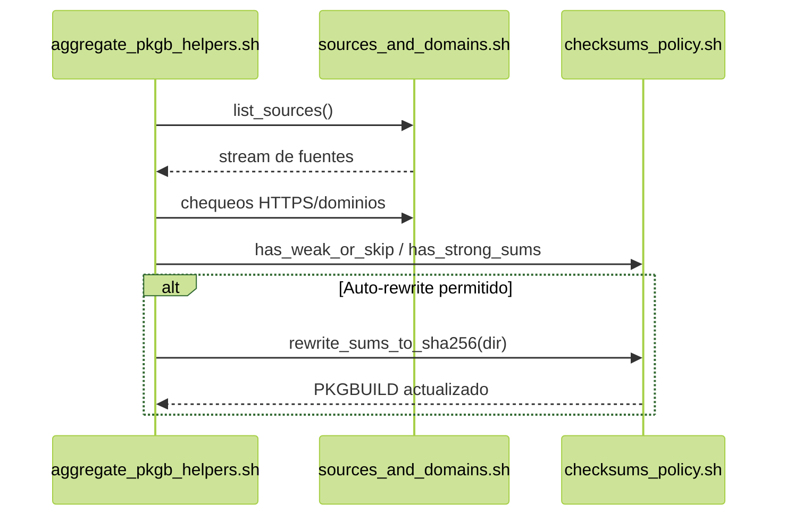

> **Nota de seguridad:** la reescritura de checksums con `makepkg -g` solo está disponible en modos relajados (no `--strict`, no `--fast`). Reescribir **no implica** confianza; trátalo únicamente como conveniencia/diagnóstico.

---

### Internacionalización y Reportes

El reporte está internacionalizado.

- `lib/i18n/messages.sh`: define mensajes en inglés y español.
- `lib/report/render_summary.sh`: ensambla y muestra resúmenes localizados.

Flags y comportamiento:

- `REPORT_LANG=en|es` sobrescribe la detección automática desde `$LANG`.
- Verbose (`--verbose`) imprime arrays completos, listas de fuentes compactas y líneas de red flags diagnósticas.
- Quiet (`--quiet`) suprime logs info/warn pero mantiene resumen y errores.

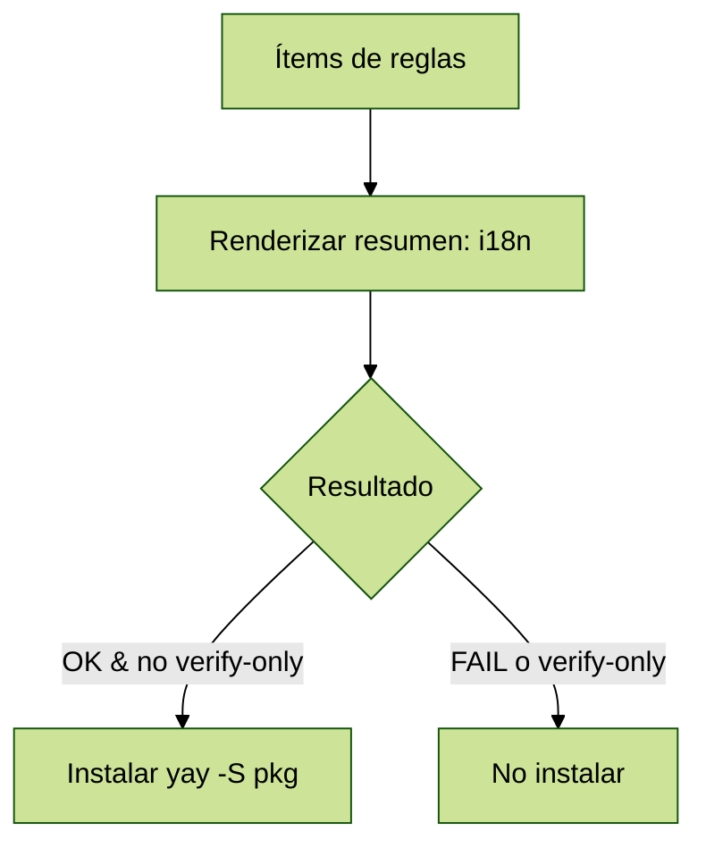

---

### Wrapper Guard

El wrapper guard está implementado en `bin/scan`. Su propósito es interceptar helpers AUR comunes e insertar verificación de forma transparente.

- **`lib/guard/helpers.list`**: enumera nombres de helpers conocidos y tipos (compatibles con pacman vs pamac).
- **Lógica de delegación:**
	- Detectar objetivos AUR en los argumentos.
	- Ejecutar `bin/aur-verify --verify-only` sobre ellos.
	- Si alguno falla: abortar o añadir a `--ignore`.
	- Si todos pasan: delegar al helper real.
- **Bypass knobs:**
	- `SCAN_BYPASS=1`: salta la verificación una vez.
	- `SCAN_REAL_YAY=/usr/bin/yay`: apunta al binario real del helper.
- **Flujo de upgrade:** para upgrades completos, los paquetes AUR fallidos se pasan en `--ignore`.

#### Secuencia — Delegación de scan

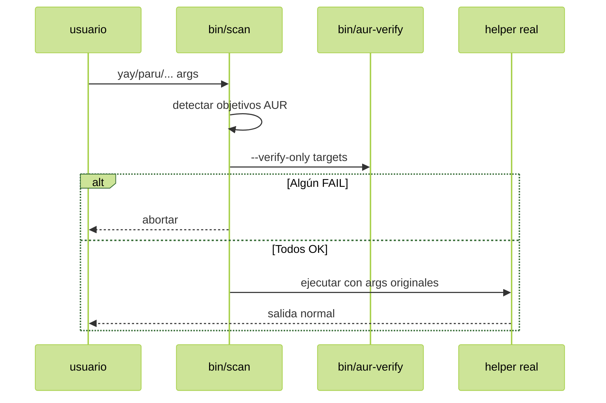

---

## Parser PKGB en Node (Opcional)

El parser PKGB basado en Node vive en `lib/pkgb/parser/`. Es opcional y solo se usa cuando Node.js ≥ 18 está presente. De lo contrario, se utilizan stubs en Bash.

- **`analysis.js`**: fachada principal, usada por el CLI.
- **`parser/composePkgbuildParser.js`**: compone las fases de parseo, exporta `parsePKGBUILD`.
- **`spider/*`**: escaneos balanceados de paréntesis/llaves.
- **`extract*`**: extrae arrays y escalares (`source`, sums, metadata) hacia un modelo meta.
- **`analyze*`**: chequea dominios, pinning, calcula señales y severidad.
- **`outputs/*`**: renderiza resúmenes, análisis, señales, líneas de red flags, fuentes compactas.
- **`patterns/*`**: definiciones de regex y cargadores.
- **`utils/*`**: fetch de red, lectura stdin, tokenización estilo shell.

**Propósito:** proveer diagnósticos más ricos (`--summary`, `--sources-compact`, `--redflags-lines`, `--signals`). La aplicación sigue en Bash.

---

### Internos del Parser

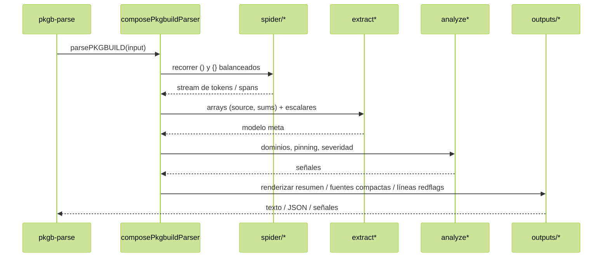

---

## Ejecución

### Requisitos

- **Bash** ≥ 4.4
- **git, curl, makepkg**
- **Helper AUR** (por defecto `yay`, también soportados `paru`, `pikaur`, `trizen`, `pamac` vía wrapper)
- **Node.js** ≥ 18 *(opcional; para integración con parser Node)*

---

### Métodos de Instalación

1. **Desde AUR** (`aur-scanner-git`):

	```bash
	yay -S aur-scanner-git
	```
	
  Instala el runtime en `/usr/lib/aur-scanner` y expone `scan`.

2. **Vía script instalador**:

	```bash
	# Instalación en usuario (por defecto)
	./scripts/install-scanner.sh --user
	# Instalación global
	sudo ./scripts/install-scanner.sh --system
	```

	Crea symlinks para `scan` y helpers (`yay/paru/pikaur/trizen/pamac`).
	**Desinstalar:**

	```bash
	./scripts/uninstall-scanner.sh --user
	sudo ./scripts/uninstall-scanner.sh --system
	```
	
  **Validar fuentes después de refactors:**
	```bash
	./scripts/validate-sources.sh
	```

3. **Build manual con makepkg**:

	```bash
	cd packaging/aur-scanner-git
	makepkg -Ccsf --install
	```

	Override de fuente para pruebas locales:
	
  ```bash
	AUR_SCANNER_SRC_OVERRIDE="git+file://$PWD/../.." makepkg -Ccsf --install
	```

4. **Limpieza tras pruebas**:

	```bash
	rm -rf /tmp/aur-plain-cache/*
	cd packaging/aur-scanner-git
	rm -rf src/ pkg/ *.tar.gz *.tar.zst
	rm -f ~/.local/bin/scan
	rm -f ~/.local/bin/{yay,paru,pikaur,trizen,pamac}
	```
  
	O simplemente ejecutar el script de desinstalación.

---

### Flags y Variables de Entorno

| Modo | Flag | Variable Env | Notas |
| --- | --- | --- | --- |
| Solo verificar | `--verify-only` | `VERIFY_ONLY=1` | Omite instalación. |
| Verificación deep | `--deep` | `DEEP=1` | Ejecuta `makepkg --verifysource`. |
| Rápido (metadata) | `--fast` | `FAST=1` | Omite descargas, solo reglas estáticas. |
| Políticas strict | `--strict` | `STRICT=1` | Escala WARN → FAIL, prohíbe sums débiles. |
| Logs verbosos | `--verbose` | `VERBOSE=1` | Imprime arrays, fuentes compactas, diagnósticos redflags. |
| Logs silenciosos | `--quiet` | `QUIET=1` | Suprime info/warn, mantiene resumen+errores. |
| Mostrar metadata | `--metadata` | `SHOW_METADATA=1` | Imprime metadata del PKGBUILD. |

> **Precedencia:** `FAST=1` desactiva verificación deep incluso si `DEEP=1`.  
> **Nota wrapper:** `VERIFY_ONLY=1` evita delegar a helpers cuando se invoca vía `scan`.

---

#### Matriz de Comportamiento

| Modo / Flag | Ejecuta `verifysource` | Reescritura automática checksums | Detener temprano en FAIL | Instala tras verificar |
| --- | --- | --- | --- | --- |
| Default | Sí (si no `--fast`) | Sí (`makepkg -g`) | Solo críticos | Sí si OK |
| `--fast` | No | No | Sí | Sí si OK |
| `--verify-only` | Sí (salvo `--fast`) | Sí (salvo `--strict`) | Sí | **No** |
| `--strict` | Sí (salvo `--fast`) | **No** (deshabilitado) | Sí (más reglas escalan) | Sí si OK |
| `--strict` + `--verify-only` | Sí (salvo `--fast`) | **No** | Sí (fallo agresivo) | **No** |

> **Razonamiento:** `FAST` prioriza velocidad (sin descargas ni deep). `STRICT` desactiva reescritura de sums y escala advertencias a fallos. `VERIFY_ONLY` nunca instala.

---

### Logs e i18n

- **Verbose** (`--verbose`): imprime resúmenes de funciones (`prepare()`, `build()`, `package()`), listas compactas de fuentes, arrays de checksums, líneas de red flags diagnósticas.
- **Quiet** (`--quiet`): suprime info/warn, mantiene resumen y errores.
- **Internacionalización:**
	- Idioma por defecto detectado desde `$LANG`.
	- Override con `REPORT_LANG=en|es`.

---

### Códigos de Salida

| Código | Significado                             |
| ------ | --------------------------------------- |
| 0      | Verificación OK                         |
| 1      | Fallos de reglas (checksums, VCS, etc.) |
| 2      | Error de uso / argumentos inválidos     |
| 3      | Error de red / fetch                    |
| 4      | `makepkg --verifysource` falló          |
| 5      | Error interno                           |

> Pipelines CI dependen de estos códigos. Cualquier valor distinto de cero significa fallo.

---

### Integración con Wrapper (scan)

El wrapper `bin/scan` se coloca delante de helpers como `yay`, `paru`, etc.

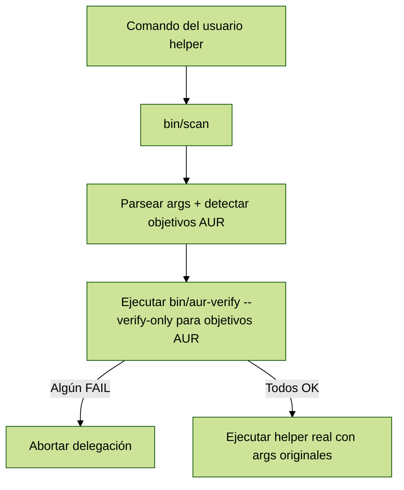

- Intercepta helpers comunes.
- En upgrades, los paquetes AUR fallidos se pasan a `--ignore`.
- `SCAN_BYPASS=1`: omitir verificación una vez.
- `SCAN_REAL_YAY=/usr/bin/yay`: especifica ruta del helper real.

> **⚠️ Depuración toggles:** `SCAN_BYPASS=1` y `SCAN_REAL_YAY` son **solo para soporte/depuración**. No activarlos por defecto en entornos administrados ni CI/CD. Considera bloquearlos o sanitizarlos en shells de producción.

---

## Modelo de Seguridad

Las garantías de seguridad son centrales:

- **No se ejecuta build** durante la verificación.
- Las verificaciones profundas usan solo `makepkg --verifysource`.
- **STRICT** mode:

	- Bloquea checksums débiles.
	- Requiere fuentes HTTPS.
	- Requiere commits de VCS fijados.
- **FAST** mode:
	- Omite descargas.
	- Útil para feedback rápido.
- **Red flags**:
	- Diagnóstico solo por defecto.
	- Escalan a FAIL en modo estricto.

---

### Modelo de Amenazas

**Cubierto:**

- Enforcement HTTPS + lista de dominios permitidos.
- Pinning de VCS (commit/tag obligatorio).
- Política de checksums fuertes; débiles/omitidos se bloquean bajo `--strict`.
- No se ejecuta `build()` durante verificación; solo `makepkg --verifysource`.

**No cubierto (por diseño):**

- Fuentes maliciosas que aún coinciden con checksums (requiere revisión manual del código).
- Bypass intencional vía toggles de depuración o ejecución fuera del wrapper.

**Recomendaciones:**

- En producción/CI, usar `--strict`; en pipelines, combinar con `--verify-only`.
- No considerar las reescrituras de checksums como señales de confianza.
- Mantener la lista de dominios permitidos bajo control de PRs con revisión.

---

### Secuencia — Modos de Verificación Profunda

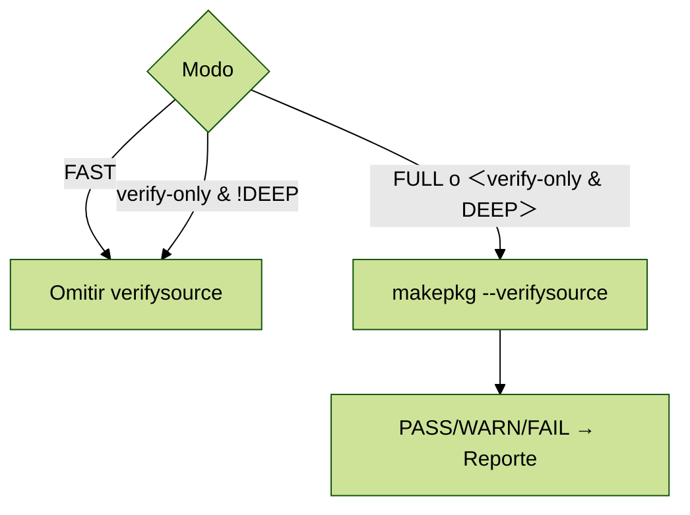

---

## Flujo de Desarrollo

### Inicio Rápido

```bash
# Verificar un paquete localmente
sh ./bin/aur-verify --verify-only <pkg>

# Verificación estricta + profunda
STRICT=1 DEEP=1 sh ./bin/aur-verify <pkg>
```

---

### Ejecución de Pruebas

```bash
./scripts/run-tests.sh        # orquesta todas las pruebas
bats tests                    # pruebas Bash
node --test tests/js          # pruebas Node
```

- **Pruebas Bats**: resolución, guard, instaladores, empaquetado, reglas, scan wrapper, validate\_sources.
- **Pruebas Node**: CLI (`cli.test.mjs`) y parser (`parser.test.mjs`).

---

### Sincronización Automatizada de Ramas

- Cada push a `development` ejecuta `.github/workflows/sync-development.yml`.
- El workflow integra los cambios en `beta-release` y conserva todo el contenido de `packaging/aur-scanner-git/` (configuración AUR en red).
- Si solo cambian los archivos protegidos, la ejecución se cancela sin hacer push; si hay conflictos, el job falla para que puedas resolverlos manualmente.

---

### Agregar Reglas

- Agregar nuevo script en `lib/verify/rules/*.sh`.
- Registrar en `lib/verify/verification_rules_loader.sh`.
- Actualizar mensajes en `lib/i18n/messages.sh`.
- Seguir principio de responsabilidad única.
- Escribir nuevas pruebas.

---

### Recetas CI

Ejemplo de workflow GitHub Actions para CI:

```yaml
name: CI

on:
  push:
    branches: [ development ]
  pull_request:
    branches: [ development ]

jobs:
  lint-and-test:
    runs-on: ubuntu-latest
    timeout-minutes: 25
    container:
      image: archlinux:latest
    env:
      AUR_PACKAGE: hello
    steps:
      - uses: actions/checkout@v4
      - name: Install dependencies
        run: |
          pacman -Syu --noconfirm --needed git base-devel curl nodejs npm
      - name: Run tests
        run: bash scripts/run-tests.sh
      - name: Verify sample package
        run: STRICT=1 VERIFY_ONLY=1 bash bin/aur-verify $AUR_PACKAGE
```

> Para PRs, usar `QUIET=1` para reducir ruido de logs.  
> Para nightly, programar un job con `STRICT=1 DEEP=1` sobre un paquete estable pequeño.

---

## Integración con Parser Node (`bin/pkgb-parse`)

El parser en Node provee diagnósticos extendidos, pero **no es requerido** para la aplicación de reglas.

- **Outputs consumidos por el CLI en Bash**:

	- `--summary`
	- `--sources-compact`
	- `--redflags-lines`
- **Otros flags orientados a desarrolladores**:
	- `--json`
	- `--signals`

---

### Referencia Rápida CLI Node

```bash
# Desde archivo local
node bin/pkgb-parse --file ./PKGBUILD --summary
node bin/pkgb-parse --file ./PKGBUILD --json

# Desde URL plain de AUR
node bin/pkgb-parse --url "https://aur.archlinux.org/cgit/aur.git/plain/PKGBUILD?h=zotero"

# Diagnósticos
node bin/pkgb-parse --file ./PKGBUILD --signals
node bin/pkgb-parse --file ./PKGBUILD --redflags-lines
node bin/pkgb-parse --file ./PKGBUILD --sources-compact --limit 10
```

> Preferirlo como **auxiliar de diagnóstico**. La aplicación de reglas está en Bash.  
> Si la URL no está en formato plain correcto, el CLI sugiere la adecuada.

---

## Auditoría y Optimización

- **Caching**: los PKGBUILDs se cachean bajo `/tmp/aur-plain-cache`.
- **Paralelismo**: el parser Node corre una vez por verificación para evitar parseos repetidos.
- **Red**: fallback a IPv4 si es necesario (`AUR_FORCE_IPV4=1`).
- **Optimización**: se evitan descargas pesadas salvo que se solicite explícitamente `--deep`.
- **Invariantes de auditoría**:

	- No se ejecutan pasos de build, solo verificación.
	- La red solo toca AUR y fuentes declaradas.
	- Reescritura de checksums ocurre solo en modos no estrictos y no rápidos.
	- Si alguna regla falla, la instalación se bloquea.

---

## Solución de Problemas

Problemas comunes y soluciones:

- **`sha256sums no coinciden` tras reescribir**:  
	Asegúrate de no estar en `STRICT=1`. La reescritura automática solo funciona en modos relajados.
- **Errores del parser Node**:  
	Asegúrate de tener Node.js ≥ 18 instalado. Si no, Bash stubs lo reemplazan silenciosamente.
- **Fallas de red**:  
	Usa `AUR_FORCE_IPV4=1` en entornos solo-IPv6.
- **Wrapper falla porque no encuentra helper**:  
	Asegúrate de tener instalado el helper real (`yay`, `paru`, etc.).  
	Sobrescribe la ruta con `SCAN_REAL_YAY=/usr/bin/yay`.

---

## 🤝 Contribuciones

Damos la bienvenida a todo tipo de contribuciones: código, documentación, pruebas, reportes de errores y propuestas de reglas.

### Formas de contribuir

- 🪳 **Reportar problemas** incluyendo un caso mínimo reproducible, la variante de Arch que uses y el comando exacto que ejecutaste.  
- 🧪 **Probar diferentes modos** (`STRICT=1`, `FAST=1`, `DEEP=1`) en una variedad de paquetes AUR y compartir los resultados.  
- 📝 **Mejorar la documentación** (aclarar flags, añadir ejemplos, asegurar paridad entre español/inglés).  
- 🧩 **Sugerir o refinar reglas** (nuevas alertas, entradas de lista blanca de dominios, políticas de checksums).  

### Lineamientos de contribución

- Sigue el estilo de código y las convenciones de commits ya existentes.  
- Asegúrate de que las nuevas funciones o reglas incluyan la cobertura de pruebas correspondiente.  
- Si planeas un cambio mayor, abre primero un *issue* para discutir tu propuesta.  

### Entorno de desarrollo (local)

Puedes desarrollar y probar de forma local de varias maneras:

1. **Ejecutar directamente desde el código fuente** (la forma más rápida para colaboradores):  
  ```bash
   git clone https://github.com/<tu-usuario>/aur_scanner.git
   cd aur_scanner

   # Verificar un paquete directamente
   sh ./bin/aur-verify --verify-only hello
   STRICT=1 DEEP=1 sh ./bin/aur-verify hello
  ```

2. **Instalación mediante script** (solo para desarrollo):

```bash
	./scripts/install-scanner.sh --user
	# desinstalar más tarde con
	./scripts/uninstall-scanner.sh --user
```

3. **Compilar e instalar con makepkg** (simular flujo de trabajo de yay):

	```bash
	cd packaging/aur-scanner-git
	makepkg -Ccsf --install
	```

	Esto permite validar cómo se comporta el empaquetado antes de publicarlo en AUR.

4. **Ejecutar el conjunto de pruebas**:

	```bash
	./scripts/run-tests.sh
	```

⚠️ **Nota:** El mantenimiento activo de este proyecto es limitado. Las contribuciones son bienvenidas, pero la revisión e integración pueden tardar. Se anima a la comunidad a realizar *forks* si desean expandir o continuar el desarrollo.

### Guías

- Mantén los scripts POSIX-friendly cuando sea posible; se permiten features de Bash si están justificadas.
- Prefiere PRs pequeños y enfocados, con commits descriptivos.
- Sigue el modelo de seguridad (nunca relajes silenciosamente `STRICT=1`).
- Añade pruebas y actualiza mensajes i18n para nuevas funciones.
- Sé constructivo y claro en la comunicación.

> 💡 **Buenos primeros issues**: mejorar mensajes de error, añadir nuevos casos de prueba, refinar documentación.

---

## Versionado y Changelog

Este proyecto sigue [Semantic Versioning](https://semver.org/).

La versión de desarrollo actual es **0.8.0**.

Para un historial completo de cambios, revisa [CHANGELOG.md](../CHANGELOG.md).
