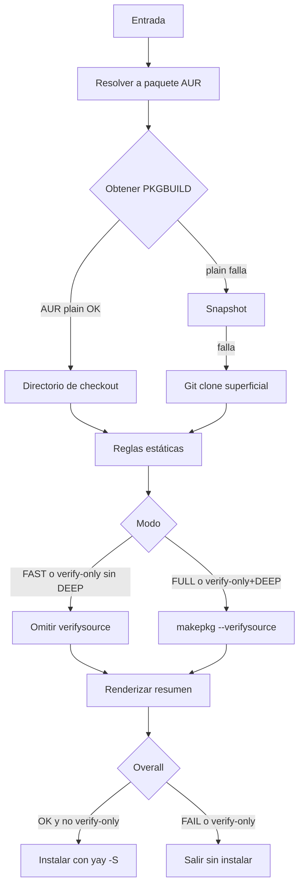
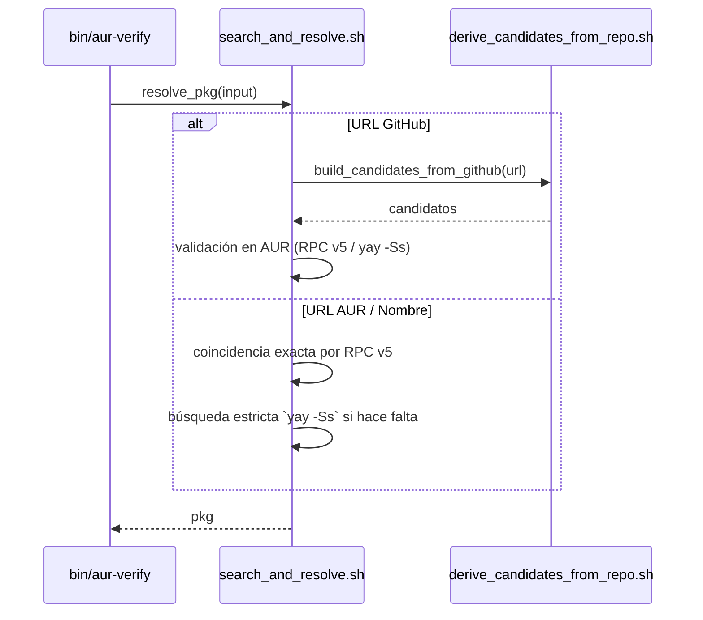
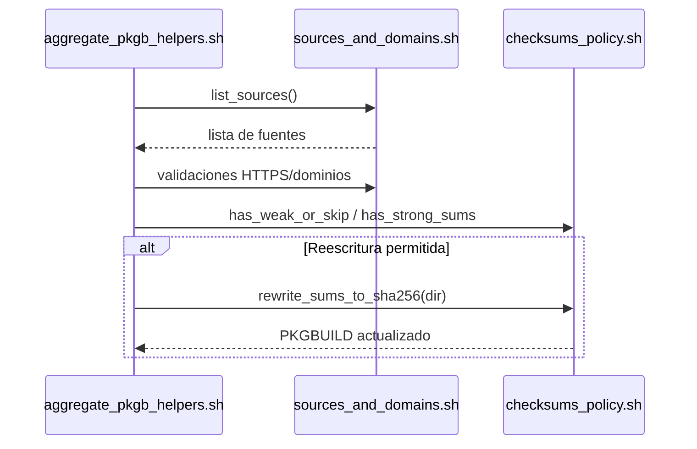
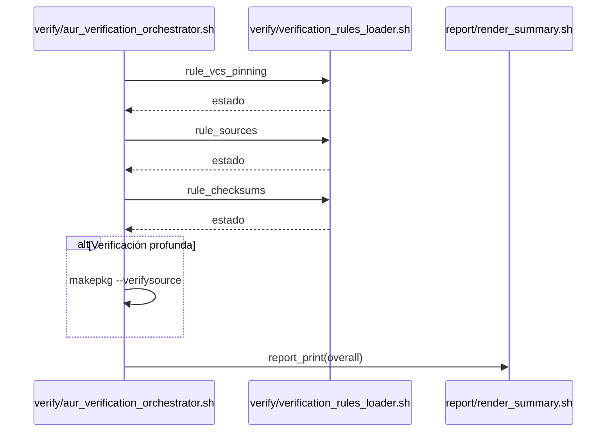
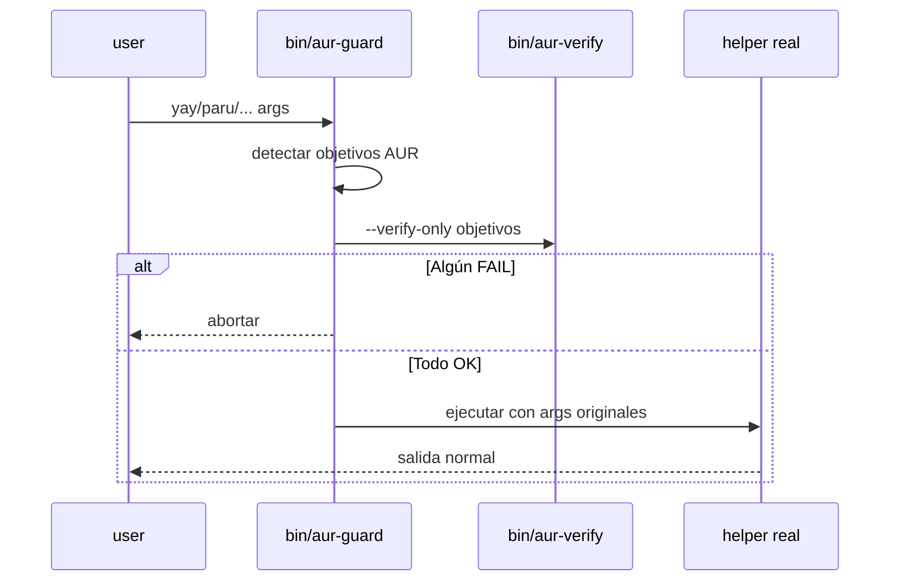
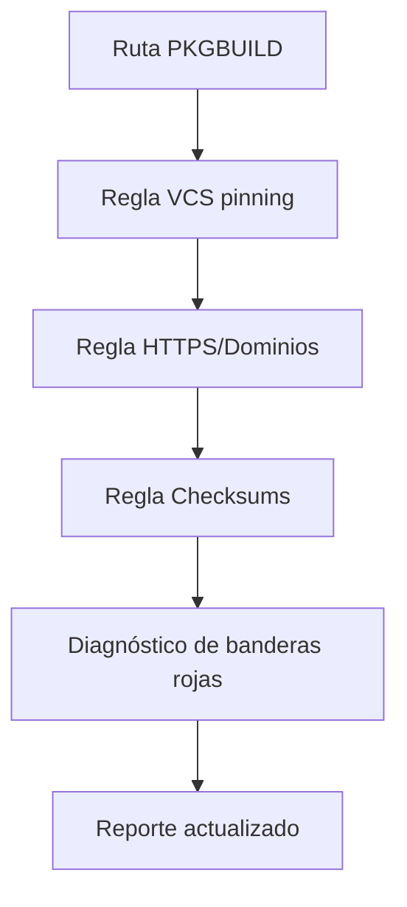
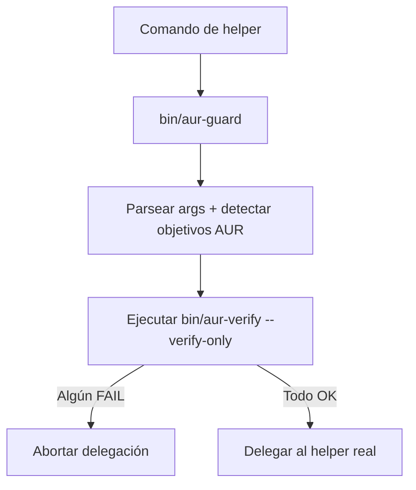
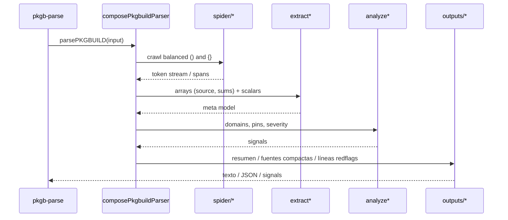

# Notas para Desarrolladores (Interno)

Idioma: Español | English (`README.md`)

Este documento recoge detalles de implementación, perillas de ajuste y notas de mantenimiento orientadas a contribuyentes y mantenedoras. Su objetivo es facilitar auditorías (seguridad, comportamiento) y optimizaciones del algoritmo, sin mezclar con la guía de uso para personas usuarias finales.

## Diagramas generales

<details>
<summary><strong>Flujo General (Mermaid)</strong></summary>



</details>

<details>
<summary><strong>Vista general (secuencia, Mermaid)</strong></summary>

```mermaid
sequenceDiagram
%%{init: {"theme": "forest", "handDrawn": true}}%%
sequenceDiagram
    participant Usuario as Usuario
    participant CLI as CLI bin/aur-verify
    participant GitHub as GitHub lib/github/derive_candidates_from_repo.sh
    participant Search as Resolver AUR lib/aur/search_and_resolve.sh
    participant Plain as AUR Plain/RPC lib/aur/fetch_plain_and_snapshot.sh
    participant Verify as Verificador lib/verify/aur_verification_orchestrator.sh
    participant Rules as Reglas lib/verify/verification_rules_loader.sh
    participant PKGB as PKGB Utils lib/pkgb/aggregate_pkgb_helpers.sh
    participant Report as Reporte lib/report/render_summary.sh + lib/i18n/messages.sh
    participant Makepkg as makepkg
    participant Yay as yay

    Usuario->>CLI: Ejecutar bin/aur-verify <input>

    %% Detección de entrada
    rect rgba(200, 200, 255, 0.35)
    CLI->>CLI: Detectar tipo de entrada
    alt URL AUR
        CLI->>Plain: Extraer nombre y consultar RPC v5
        Plain-->>CLI: pkg
    else URL GitHub
        CLI->>GitHub: Derivar candidatos del título/README
        GitHub-->>CLI: Lista de candidatos
        CLI->>Search: Validación estricta en AUR
        Search-->>CLI: pkg
    else Nombre de paquete
        CLI->>Plain: RPC v5 coincidencia exacta
        alt Coincidencia exacta
            Plain-->>CLI: pkg
        else Sin coincidencia
            CLI->>Search: Búsqueda estricta yay -Ss (solo AUR)
            Search-->>CLI: pkg
        end
    end
    end

    %% Obtener PKGBUILD
    rect rgba(200, 255, 200, 0.35)
    CLI->>Verify: verify_pkgbuild pkg
    Verify->>Plain: Descargar PKGBUILD/.SRCINFO (plain/snapshot)
    alt Plain OK
        Plain-->>Verify: Ruta temporal con PKGBUILD
    else Fallback a git
        Verify->>Plain: Falló snapshot/plain
        Verify->>CLI: git clone desde AUR
        CLI-->>Verify: Repo clonado con PKGBUILD
    end
    Note over Verify: Mostrar PREPARE/BUILD/PACKAGE (Verbose o SHOW_FUNCS)
    end

    %% Reglas estáticas (atómicas)
    rect rgba(255, 255, 200, 0.35)
    Verify->>Rules: rule_vcs_pinning PKGBUILD
    Rules->>PKGB: pkgb_check_vcs_pinning
    PKGB-->>Rules: Resultado
    Rules-->>Report: report_add item_vcs_pinning

    Verify->>Rules: rule_sources PKGBUILD
    Rules->>PKGB: list_sources + HTTPS y whitelist
    PKGB-->>Rules: Resultado
    Rules-->>Report: report_add item_source_urls / item_allowed_domains
    Note over Rules,Report: Por defecto → solo líneas problemáticas; Verbose → todas con marca

    Verify->>Rules: rule_checksums PKGBUILD checkout
    Rules->>PKGB: has_weak_or_skip / has_strong_sums
    opt Autocorrección permitida
        Rules->>Verify: rewrite_sums_to_sha256
    end
    Rules-->>Report: report_add item_checksums
    Note over Rules,Report: Por defecto → solo débiles/SKIP; Verbose → arrays completas

    Note over Verify: En --verbose, el JS imprime red‑flags (solo diagnóstico)
    end

    %% Verificación profunda (opcional)
    rect rgba(255, 220, 200, 0.35)
    alt VERIFY-ONLY sin DEEP
        Verify->>Rules: rule_verifysource modo verify-only
        Rules-->>Report: SKIP verify‑only
    else FAST
        Verify->>Rules: rule_verifysource modo fast
        Rules-->>Report: SKIP --fast
    else FULL
        Verify->>Makepkg: makepkg --verifysource (sin build)
        Makepkg-->>Verify: OK / FAIL
        Verify->>Rules: rule_verifysource modo full
        Rules-->>Report: PASS / WARN / FAIL
    end
    end

    %% Reporte e instalación
    rect rgba(230, 200, 255, 0.35)
    Verify->>Report: report_print modo
    alt OVERALL OK u OK con warnings y no verify-only
        CLI->>Yay: yay -S pkg
        Yay-->>CLI: Instalación completada
    else OVERALL FAIL o verify-only
        CLI-->>Usuario: No instalar / Solo verificación
    end
    Note over CLI,Report: Quiet → suprime info/warn; el resumen sigue visible
    end
```

</details>
## Resumen de Arquitectura

- Punto de entrada Bash: `bin/aur-verify`
- Orquestación de verificación: `lib/verify/aur_verification_orchestrator.sh` (flujo end‑to‑end y handoff a instalación)
- Reglas atómicas: `lib/verify/verification_rules_loader.sh` agrega `lib/verify/rules/*.sh`
  - `vcs_pinning_rule.sh`, `sources_rule.sh`, `checksums_rule.sh`, `verifysource_rule.sh` (y `redflags_rule.sh` disponible; ver nota)
- Fetchers de AUR + RPC: `lib/aur/fetch_plain_and_snapshot.sh`
- Búsqueda/resolve: `lib/aur/search_and_resolve.sh`
- Derivación de wrappers GitHub→AUR: `lib/github/derive_candidates_from_repo.sh`
- Ayudantes PKGBUILD: `lib/pkgb/aggregate_pkgb_helpers.sh` agrega
  - `sources_and_domains.sh`, `checksums_policy.sh`, `redflags_scan.sh`, `functions_summary.sh`
- Reporte + i18n: `lib/report/render_summary.sh`, `lib/i18n/messages.sh`
- Parser Node opcional: `bin/pkgb-parse` con `lib/pkgb/parser/{analysis,utils,outputs,patterns,terminalColors}.js`

## Estructura del Proyecto (detallado)

Top‑level

- `bin/aur-verify`: CLI principal. Parsea args/entorno y orquesta resolver → checkout → reglas → reporte → instalación opcional.
- `bin/aur-guard`: Wrapper universal para pre‑chequear paquetes AUR antes de delegar a `yay/paru/pikaur/trizen/pamac`.
- `bin/pkgb-parse`: CLI Node opcional para parseo PKGBUILD y diagnósticos.
- `scripts/install-aur-guard.sh`: Instala symlinks de aur‑guard en PATH usuario/sistema.
- `scripts/uninstall-aur-guard.sh`: Elimina esos symlinks (modo usuario o sistema).
- `scripts/run-tests.sh`: Ejecuta pruebas (bats) y validaciones básicas.
- `scripts/validate-sources.sh`: Verifica que los `source "..."` apunten a archivos válidos tras refactors.

Núcleo

- `lib/core/shell_safety.sh`: Bash estricto, `have_cmd`, `require_tools`, traps.
- `lib/utils/logging.sh`: `[INFO]`, `[WARN]`, `[ERROR]`, `die`, helpers de color.

AUR + Resolver

- `lib/aur/search_and_resolve.sh`: `resolve_pkg`, búsqueda estricta por nombre con AUR RPC v5 y `yay -Ss` (solo AUR), candidatos desde GitHub.
- `lib/aur/fetch_plain_and_snapshot.sh`: Descarga `PKGBUILD`/`.SRCINFO` vía AUR plain/snapshot; fallback a git clone superficial; caché TTL para plain.
- `lib/github/derive_candidates_from_repo.sh`: Parsea URL de GitHub, lee título/README y deriva nombres candidatos en AUR.

<details>
<summary><strong>Secuencia — Resolución de entrada</strong></summary>



</details>

Ayudantes PKGBUILD

- `lib/pkgb/sources_and_domains.sh`: `list_sources`, HTTPS‑only, allowlist de dominios.
- `lib/pkgb/checksums_policy.sh`: `has_strong_sums`, `has_weak_or_skip`, `rewrite_sums_to_sha256` (con `makepkg -g`).
- `lib/pkgb/redflags_scan.sh`: `scan_red_flags` con `lib/rules/redflags.list` (diagnóstico con números de línea).
- `lib/pkgb/functions_summary.sh`: `print_func_summaries` para `prepare()/build()/package()`.
- `lib/pkgb/aggregate_pkgb_helpers.sh`: Fachada que compone helpers y `pkgb_check_vcs_pinning`.

<details>
<summary><strong>Secuencia — Fuentes y Checksums</strong></summary>



</details>

Verificación

- `lib/verify/rules/*.sh`: Reglas atómicas
  - `vcs_pinning_rule.sh`: exige `git+…` fijado con `#commit=`/`#tag=`.
  - `sources_rule.sh`: HTTPS‑only + dominios permitidos.
  - `checksums_rule.sh`: Sumatorias fuertes; reescritura a sha256 opcional (no strict/no fast).
  - `verifysource_rule.sh`: Ejecuta `makepkg --verifysource` según modo; interpreta resultado.
  - `redflags_rule.sh`: Disponible; no aparece en el resumen por defecto (sí como diagnóstico).
- `lib/verify/verification_rules_loader.sh`: Agregador que expone `rule_*`.
- `lib/verify/aur_verification_orchestrator.sh`: `verify_pkgbuild`, `install_or_verify`, `aur_checkout_to` y orquestación general.

<details>
<summary><strong>Secuencia — Reglas y Reporte</strong></summary>



</details>

Internacionalización + reporte

- `lib/i18n/messages.sh`: Catálogo en/es para claves del reporte.
- `lib/report/render_summary.sh`: Ensambla e imprime el resumen localizado.

Guard wrapper

- `lib/guard/helpers.list`: Helpers conocidos y tipos para `bin/aur-guard`.
- `lib/rules/redflags.list`: Patrones compartidos para código riesgoso (Bash + Node parser).

<details>
<summary><strong>Secuencia — Delegación aur-guard</strong></summary>



</details>

Parser PKGB (Node, opcional)

- `lib/pkgb/parser/analysis.js`: Fachada del parser; entrada del CLI.
- `lib/pkgb/parser/parser/*.js`: Pipeline de parseo
  - `composePkgbuildParser.js`: compone pases; exporta `parsePKGBUILD`.
  - `spider/*`: escaneos balanceados de paréntesis/llaves.
  - `extract*`: extrae arrays y escalares (`source`, sums, metadata) → meta modelo.
  - `analyze*`: dominios, pines; señales/severidad.
- `lib/pkgb/parser/outputs/modules/*.js`: Renderers para resumen, análisis detallado, signals, red‑flags, fuentes compactas.
- `lib/pkgb/parser/patterns/*`: Regex y carga de patrones compartidos.
- `lib/pkgb/parser/utils/modules/*`: Fetch de red, stdin, tokenización estilo shell.

Propósito por archivo (mapa rápido)

- `bin/aur-verify`: args CLI → `install_or_verify` → dentro: `resolve_pkg` → `aur_checkout_to` → reglas → resumen → posible instalación.
- `lib/verify/aur_verification_orchestrator.sh`: Implementa la secuencia, workdir temporal y manejo de modos.
- `lib/verify/rules/*.sh`: Chequeos de única responsabilidad (status + clave de mensaje + posible fix).
- `lib/pkgb/*.sh`: Helpers puros; sin red salvo `makepkg -g` para checksums.
- `lib/aur/*.sh`: Único lugar que toca red (AUR plain/snapshot/git).
- `bin/aur-guard`: Pre‑verifica y delega sin alterar argumentos.

Invariantes clave (auditoría)

- No se construye el paquete en verificación; lo profundo usa `makepkg --verifysource`.
- Acceso a red limitado a endpoints AUR y a `source=()` declarados (en verificación profunda); `STRICT=1` restringe dominios.
- Reescritura de checksums solo ocurre en modos no strict y no fast, y se re‑verifica después.
- Si alguna regla falla, no se intenta instalar.

## Profundidad y Precedencia de Verificación

- `--verify-only`: sin instalación. Con `DEEP=1` ejecuta `makepkg --verifysource`.
- `--fast`: solo metadatos; inhibe verificación profunda incluso con `DEEP=1`.
- `STRICT=1`: endurece políticas (HTTPS, allowlist, sumas fuertes, pinning VCS) y sube ciertos WARN a FAIL.

## Modos de Logging

- `--verbose` / `VERBOSE=1`:
  - Implica `SHOW_FUNCS=1`.
  - Muestra fuentes compactas del parser JS, línea resumen y líneas de banderas rojas (diagnóstico).
- `--quiet` / `QUIET=1`:
  - Suprime info/warn; quedan resumen y errores.
  - Anula `--verbose` y desactiva `SHOW_FUNCS`/metadatos.

## Ajustes de Rendimiento (Interno)

- AUR RPC exact‑name primero para evitar búsquedas lentas.
- Caché de plain en `lib/aur/fetch_plain_and_snapshot.sh`:
  - `AUR_CACHE_DIR` (por defecto `/tmp/aur-plain-cache`), `AUR_CACHE_TTL_SEC` (3600).
  - `.SRCINFO` solo en VERBOSE o STRICT.
  - `curl` con compresión, timeouts cortos y follow redirects.
- Reescritura de checksums se omite con `FAST=1`.

## Manejo de Banderas Rojas

- La regla atómica existe (`rule_red_flags`), y el parser JS emite diagnósticos, pero el runner actual no añade un ítem al resumen.
- En `--verbose`, se imprimen líneas marcadas por el parser JS si está disponible.

## Integración del Parser de Node (`bin/pkgb-parse`)

- Opcional: se usa cuando hay Node; si no, se cargan stubs seguros.
- Salidas usadas por el CLI Bash: `--summary`, `--sources-compact`, `--redflags-lines` (diagnóstico).

## Añadir/Ajustar Reglas

- Prefiere funciones pequeñas y composables en `lib/verify/rules/*.sh` que:
  - Solo registren fragmentos (contexto completo en VERBOSE)
  - Actualicen el reporte vía `report_add <item> <STATUS> <message_key>`
  - Retornen ≠0 solo cuando debe contribuir a fallo
- Añade mensajes en `lib/i18n/messages.sh` (EN y ES).

## Pruebas y Consejos Locales

- Ejecutar pruebas (bats): `scripts/run-tests.sh` o `bats tests`
- Bucles rápidos sobre un paquete:
  - `STRICT=1 sh ./bin/aur-verify <pkg> --verify-only --verbose`
  - `FAST=1 sh ./bin/aur-verify <pkg> --verify-only`
  - `DEEP=1 sh ./bin/aur-verify <pkg> --verify-only`
- Pre‑check con aur‑guard:
  - Explícito: `bin/aur-guard yay -S <pkg>` (análogos para paru/pikaur/trizen, `pamac build <pkg>`)
  - Drop‑in: symlink `bin/aur-guard` a `~/.local/bin/{yay,paru,pikaur,trizen,pamac}`
- Limpiar caché para volver a bajar un PKGBUILD: `rm -f /tmp/aur-plain-cache/<pkg>.PKGBUILD`

### Comprobación de imports tras refactors

Ejecuta `bash scripts/validate-sources.sh` para validar que todos los `source "..."` apunten a archivos existentes.
Opcional: añade un hook de `pre-commit` que invoque ese script.

El script resuelve `$SCRIPT_DIR`/`$LIB_DIR` heurísticamente y valida los módulos. Útil tras renombres/movimientos.

## Referencia de Funciones (concisa)

<details>
<summary><strong>Runner y reglas del verificador</strong></summary>

- `verify_pkgbuild(pkg)`: orquesta checkout, reglas, reporte e instalación opcional.
- `install_or_verify(pkg)`: muestra metadatos en verify‑only (cuando aplica) y llama a `verify_pkgbuild`.
- `aur_checkout_to(pkg, workdir)`: AUR plain → snapshot → git (fallbacks).

- `rule_vcs_pinning(pkgb, strict)`: exige pinning para fuentes `git+`.
- `rule_sources(pkgb, strict)`: HTTPS‑only y allowlist de dominios.
- `rule_checksums(pkgb, checkout, strict, fast)`: sumas fuertes; reescritura a sha256 (si procede).
- `rule_verifysource(checkout, mode, strict)`: `makepkg --verifysource` según modo; WARN vs FAIL en strict.
- `rule_red_flags(pkgb, strict)`: regla disponible; no incluida en el resumen por defecto.

</details>

<details>
<summary><strong>Ayudantes PKGBUILD</strong></summary>

- `list_sources()`: extrae `source=()` normalizado.
- `sources_have_only_https()`: comprueba HTTPS‑only.
- `sources_domains_allowed()`: valida allowlist de dominios.
- `has_strong_sums()`, `has_weak_or_skip()`: política de checksums.
- `rewrite_sums_to_sha256(dir)`: `makepkg -g` y reescritura de arrays.
- `scan_red_flags(pkgb)`: grep vs `lib/rules/redflags.list` con números de línea.
- `print_func_summaries(pkgb)`: snippets de `prepare()/build()/package()`.
- `pkgb_check_vcs_pinning(pkgb)`: verifica pinning VCS.

</details>

<details>
<summary><strong>AUR/GitHub y resolvedor</strong></summary>

- `aur_plain_fetch_plain_files`, `aur_plain_fetch_repo`: descarga PKGBUILD/.SRCINFO o snapshot.
- `aur_plain_rpc_info|search|exists`: helpers RPC y descubrimiento.
- `resolve_pkg(input)`: resuelve token/URL GitHub → nombre AUR.
- `aur_search_name_strict_aur_only`, `prefer_fast_variant`: búsqueda estricta y sesgo de variantes rápidas.
- `is_github_url`, `build_candidates_from_github`, `github_default_branch`.

</details>

## Pasos de Ejecución (extremo a extremo)

1) Resolución de input: detectar si es nombre AUR, URL AUR o URL GitHub; resolver a nombre de paquete AUR (búsqueda estricta).
2) Checkout: obtener `PKGBUILD` y `.SRCINFO` vía plain; fallback a snapshot; último recurso: git clone superficial.
3) Reglas estáticas: VCS pinning → fuentes (HTTPS/dominios) → checksums (y posible reescritura) → banderas rojas (diagnóstico).
4) Verificación profunda (condicional): `makepkg --verifysource` según modo (`DEEP`, `FAST`, `verify‑only`).
5) Reporte: resumen localizado con PASS/WARN/FAIL/SKIP por ítem y veredicto global.
6) Instalación: si OK y no verify‑only, instalar con `yay -S` (o helper configurado).

Conmutadores y precedencia

- `FAST=1` desactiva verificación profunda incluso con `DEEP=1`.
- `STRICT=1` sube ciertos WARN→FAIL y prohíbe sumas débiles y dominios no permitidos.
- `--verify-only` evita instalar; lo profundo solo si `DEEP=1` y no `FAST=1`.

## Lista de Auditoría

- Entradas: el resolvedor solo mapea a paquetes existentes en AUR; URLs GitHub validadas contra `source/url`.
- Red: solo endpoints AUR y `source=()` declarados; nada de ejecuciones arbitrarias.
- Checksums: política sha256; en no‑strict, revisar logs de reescritura y re‑verificación.
- PGP: si hay `.sig`, `makepkg --verifysource` debe pasar.
- Dominios: HTTPS‑only y allowlist en modo estricto.
- Pinning VCS: fuentes `git+` fijadas (FAIL en estricto si no).
- Logging: el resumen refleja fielmente estados y modos.

## Oportunidades de Optimización y cambios aplicados (2025-09)

- Parser JS en una sola invocación desde Bash: se exportan señales (unpinnedGit, nonHttps, redFlags) y se reutilizan en reglas; en `--verbose` se imprimen líneas detalladas sin relanzar Node.
- Obtención robusta del PKGBUILD: `plain` → `tree?plain=1` → snapshot → git superficial; la disponibilidad `plain` se comprueba con HEAD para reflejarla en el reporte aunque el checkout use snapshot/git.
- Red más predecible: fallback automático a IPv4 y soporte `AUR_FORCE_IPV4=1` para forzar IPv4 en todas las peticiones a AUR.
- Menos descargas en verificación: en `--verify-only` no se ejecuta `makepkg -g` ni se reescriben checksums.
- `.SRCINFO` solo se descarga en VERBOSE o STRICT.
- Caché: `AUR_CACHE_TTL_SEC` controla caducidad del PKGBUILD plano en `/tmp`.

## Diagramas

<details>
<summary><strong>Vista general del flujo (Mermaid)</strong></summary>

```mermaid
%%{init: {"theme": "forest", "handDrawn": true}}%%
sequenceDiagram
    participant Usuario as Usuario
    participant CLI as CLI bin/aur-verify
    participant GitHub as GitHub lib/github/derive_candidates_from_repo.sh
    participant Search as Resolver AUR lib/aur/search_and_resolve.sh
    participant Plain as AUR Plain/RPC lib/aur/fetch_plain_and_snapshot.sh
    participant Verify as Verificador lib/verify/aur_verification_orchestrator.sh
    participant Rules as Reglas lib/verify/verification_rules_loader.sh
    participant PKGB as PKGB Utils lib/pkgb/aggregate_pkgb_helpers.sh
    participant Report as Reporte lib/report/render_summary.sh + lib/i18n/messages.sh
    participant Makepkg as makepkg
    participant Yay as yay

    Usuario->>CLI: Ejecutar bin/aur-verify <input>

    %% Detección de entrada
    rect rgba(200, 200, 255, 0.35)
    CLI->>CLI: Detectar tipo (URL AUR / URL GitHub / Nombre)
    alt URL AUR
        CLI->>Plain: Extraer nombre y consultar RPC v5
        Plain-->>CLI: pkg
    else URL GitHub
        CLI->>GitHub: Derivar candidatos desde título/README
        GitHub-->>CLI: Lista de candidatos
        CLI->>Search: Validación estricta en AUR
        Search-->>CLI: pkg
    else Nombre
        CLI->>Plain: RPC v5 coincidencia exacta
        alt Coincide
            Plain-->>CLI: pkg
        else No coincide
            CLI->>Search: Búsqueda estricta `yay -Ss` (solo AUR)
            Search-->>CLI: pkg
        end
    end
    end

    %% Obtención de PKGBUILD
    rect rgba(200, 255, 200, 0.35)
    CLI->>Verify: verify_pkgbuild pkg
    Verify->>Plain: Descargar PKGBUILD y .SRCINFO (plain)
    alt Plain OK
        Plain-->>Verify: Ruta temporal con PKGBUILD
    else Fallback a git
        Verify->>Plain: Falló plain/snapshot
        Verify->>CLI: git clone desde AUR
        CLI-->>Verify: Repo clonado con PKGBUILD
    end
    Note over Verify: Mostrar resúmenes PREPARE/BUILD/PACKAGE (VERBOSE o SHOW_FUNCS)
    end

    %% Reglas estáticas
    rect rgba(255, 255, 200, 0.35)
    Verify->>Rules: rule_vcs_pinning
    Rules->>PKGB: pkgb_check_vcs_pinning
    Rules-->>Report: item_vcs_pinning

    Verify->>Rules: rule_sources (HTTPS/allowlist)
    Rules-->>Report: item_source_urls / item_allowed_domains

    Verify->>Rules: rule_checksums (y posible rewrite)
    Rules-->>Report: item_checksums

    Note over Verify: En --verbose, el parser JS imprime líneas de banderas rojas
    end

    %% Verificación profunda opcional
    rect rgba(255, 220, 200, 0.35)
    alt VERIFY-ONLY sin DEEP
        Rules-->>Report: SKIP verify‑only
    else FAST
        Rules-->>Report: SKIP --fast
    else FULL
        Verify->>Makepkg: makepkg --verifysource (sin compilar)
        Makepkg-->>Verify: OK / FAIL
        Rules-->>Report: PASS / WARN / FAIL
    end
    end

    %% Reporte e instalación
    rect rgba(230, 200, 255, 0.35)
    Verify->>Report: report_print
    alt OVERALL OK y no verify‑only
        CLI->>Yay: yay -S pkg
        Yay-->>CLI: Instalación completada
    else OVERALL FAIL o verify‑only
        CLI-->>Usuario: No instalar / Solo verificación
    end
    Note over CLI,Report: QUIET → suprime info/warn; el resumen sigue visible
    end
```

</details>

<details>
<summary><strong>Autodetección y obtención (Mermaid)</strong></summary>

```mermaid
%%{init: {"theme": "forest", "handDrawn": true}}%%
flowchart TD
    A[Entrada: URL AUR / URL GitHub / Nombre] 
    B{¿Tipo?}
    A --> B
    B -->|URL AUR| C[Extraer <nombre> de la URL]
    C --> H[Nombre de paquete]
    B -->|URL GitHub| D[Derivar candidatos desde README/título]
    D --> E[Validación estricta en AUR]
    E --> H
    B -->|Nombre| F{¿Coincidencia exacta AUR RPC?}
    F -->|Sí| H
    F -->|No| G[Búsqueda estricta con yay -Ss (solo AUR)]
    G --> H

    H --> I{Obtener PKGBUILD}
    I -->|Plain OK| J[Snapshot/plain de AUR <sin git>]
    I -->|Plain falló| K[Clonado git superficial]
    J --> L[Checks estáticos <reglas>]
    K --> L

    classDef ok fill:#e0ffe0,stroke:#9acd32,stroke-width:1px;
    classDef alt fill:#e6f0ff,stroke:#4f81bd,stroke-width:1px;
    classDef warn fill:#fff7cc,stroke:#ffc107,stroke-width:1px;
    class J ok;
    class K alt;
    class L warn;
```

</details>

<!-- Diagramas enfocados por fases para navegación cómoda -->

<details>
<summary><strong>Detección de entrada — zoom‑in</strong></summary>

```mermaid
flowchart TD
    IN[Token de entrada] --> T{Tipo}
    T -->|URL AUR| A[Extraer <nombre>]
    T -->|URL GitHub| G[Construir candidatos AUR]
    T -->|Nombre| N[Comprobar AUR RPC exacto]
    G --> V[Validar en AUR (estricto por nombre)]
    N -->|Coindice| P[Paquete]
    N -->|No| S[Búsqueda estricta yay -Ss (solo AUR)]
    V --> P
    S --> P
```

</details>

<details>
<summary><strong>Obtención de PKGBUILD — zoom‑in</strong></summary>


</details>

<details>
<summary><strong>Reglas estáticas atómicas — zoom‑in</strong></summary>



</details>

<details>
<summary><strong>Verificación profunda opcional — zoom‑in</strong></summary>

```mermaid
flowchart TD
    Mode{Modo} -->|FAST| Skip[SKIP verifysource]
    Mode -->|verify‑only & !DEEP| Skip
    Mode -->|FULL o (verify‑only & DEEP)| MK[makepkg --verifysource]
    MK --> OK[PASS/WARN/FAIL → reporte]
```

</details>

<details>
<summary><strong>Reporte e instalación — zoom‑in</strong></summary>

```mermaid
flowchart TD
    Items[Items de reglas] --> Sum[Render resumen (i18n)]
    Sum --> DEC{Overall}
    DEC -->|OK & no verify‑only| Install[yay -S <pkg>]
    DEC -->|FAIL o verify‑only| Exit[Sin instalación]
```

</details>

<details>
<summary><strong>AUR Guard — Intercepción</strong></summary>



</details>

<details>
<summary><strong>Parser de Node — Pipeline</strong></summary>



</details>
## Versionado y Changelog

Este proyecto son scripts; aquí se documentan cambios relevantes para contribuidores. Fechas en UTC.

- 2025-09-04
  - Integración del parser JS (rendimiento): se añadió `lib/pkgb/js_parser_bridge.sh` y la regla `rule_js_signals` para ejecutar Node una sola vez por verificación; `rule_red_flags` reutiliza los contadores exportados e imprime líneas sólo en `--verbose`.
  - Robustez en fetch de AUR: flujo `plain` → `tree?plain=1` → `snapshot` → `git` (último recurso). `aur_plain_exists` usa HEAD y el resumen marca disponibilidad de plain aunque el checkout use snapshot/git.
  - Resiliencia de red: fallback IPv4 en peticiones AUR; `AUR_FORCE_IPV4=1` fuerza IPv4 globalmente.
  - Eficiencia en verify-only: se omite la reescritura de checksums con `makepkg -g` cuando `VERIFY_ONLY=1`; `.SRCINFO` sólo en VERBOSE/STRICT.
  - Resumen/reporte: item explícito de “Disponibilidad de PKGBUILD plano” con PASS cuando la URL responde.
  - Nombres de archivos: `lib/verify/runner.sh` → `lib/verify/aur_verification_orchestrator.sh`, `lib/verify/rules.sh` → `lib/verify/verification_rules_loader.sh`. Docs: `README.dev.md`, `README.dev.es.md`, `README.md`, `README.es.md`, y `docs/INDEX.md`.
  - Diagramas/docs actualizados para reflejar el paso `tree?plain=1` y los nuevos nombres.

Política de versionado

- Cualquier cambio rompedor de flags o comportamiento se destacará aquí. Refactors internos sin cambios cara al usuario se agrupan bajo rendimiento/robustez.
