# Developer Notes (Internal)

This document is intended for **contributors and maintainers**. It explains how the codebase works, where the moving parts live, and how to extend or test the system.

---

🌐 Lea esto en [Español](README.dev.es.md)

---

🔙 Back to README: [English](../../README.md) | [Español](../es/README.es.md)

---

## 📑 Table of Contents

- [Developer Notes (Internal)](#developer-notes-internal)
  - [📑 Table of Contents](#-table-of-contents)
  - [Overview](#overview)
    - [General Flow](#general-flow)
    - [Autodetection and Fetch](#autodetection-and-fetch)
    - [Input Resolution](#input-resolution)
      - [Sequence — Input Resolution](#sequence--input-resolution)
    - [Overview of the Flow (Detailed Sequence)](#overview-of-the-flow-detailed-sequence)
  - [Project Structure](#project-structure)
    - [Top-level Scripts](#top-level-scripts)
    - [Core Libraries](#core-libraries)
    - [Verification Rules](#verification-rules)
      - [Domain Allowlist](#domain-allowlist)
      - [Sequence — Rules \& Reporting](#sequence--rules--reporting)
    - [PKGBUILD Helpers](#pkgbuild-helpers)
      - [Sequence — Sources \& Checksums](#sequence--sources--checksums)
    - [Internationalization and Reporting](#internationalization-and-reporting)
    - [Guard Wrapper](#guard-wrapper)
      - [Sequence — scan Delegation](#sequence--scan-delegation)
  - [Node PKGB Parser (Optional)](#node-pkgb-parser-optional)
    - [Parser internals](#parser-internals)
  - [Runtime](#runtime)
    - [Requirements](#requirements)
    - [Installation Methods](#installation-methods)
    - [Flags and Environment Variables](#flags-and-environment-variables)
      - [Behavior Matrix](#behavior-matrix)
    - [Logging and i18n](#logging-and-i18n)
    - [Exit Codes](#exit-codes)
    - [Wrapper Integration (scan)](#wrapper-integration-scan)
  - [Security Model](#security-model)
    - [Threat Model (Summary)](#threat-model-summary)
    - [Sequence — Deep Verification Modes](#sequence--deep-verification-modes)
  - [Development Workflow](#development-workflow)
    - [Quick Start](#quick-start)
    - [Running Tests](#running-tests)
    - [Automated Branch Sync](#automated-branch-sync)
    - [Adding Rules](#adding-rules)
    - [CI Recipes](#ci-recipes)
  - [Node Parser Integration (`bin/pkgb-parse`)](#node-parser-integration-binpkgb-parse)
    - [Node CLI Quick Reference](#node-cli-quick-reference)
  - [Auditing and Optimization](#auditing-and-optimization)
  - [Troubleshooting](#troubleshooting)
  - [🤝 Contributing](#-contributing)
    - [Ways to contribute](#ways-to-contribute)
    - [Contribution guidelines](#contribution-guidelines)
    - [Development setup (local)](#development-setup-local)
    - [Guidelines](#guidelines)
  - [Versioning and Changelog](#versioning-and-changelog)

---

## Overview

### General Flow

This diagram summarizes the global pipeline: from user input, through resolution, PKGBUILD fetch, static and deep checks, reporting, and the final decision of installing or aborting.

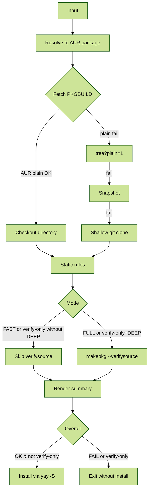

> `?plain=1`: a query parameter that can be added to GitHub URLs (e.g. `…/blob/main/file.sh?plain=1`) to force raw rendering.

### Autodetection and Fetch

Depending on the input type (AUR URL, GitHub URL, or package name), different resolution paths are triggered until a valid PKGBUILD is obtained.

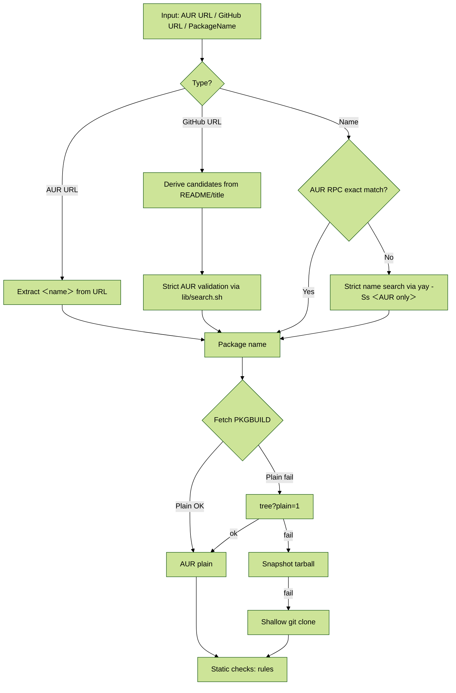

### Input Resolution

Resolution of the input token into an AUR package name.

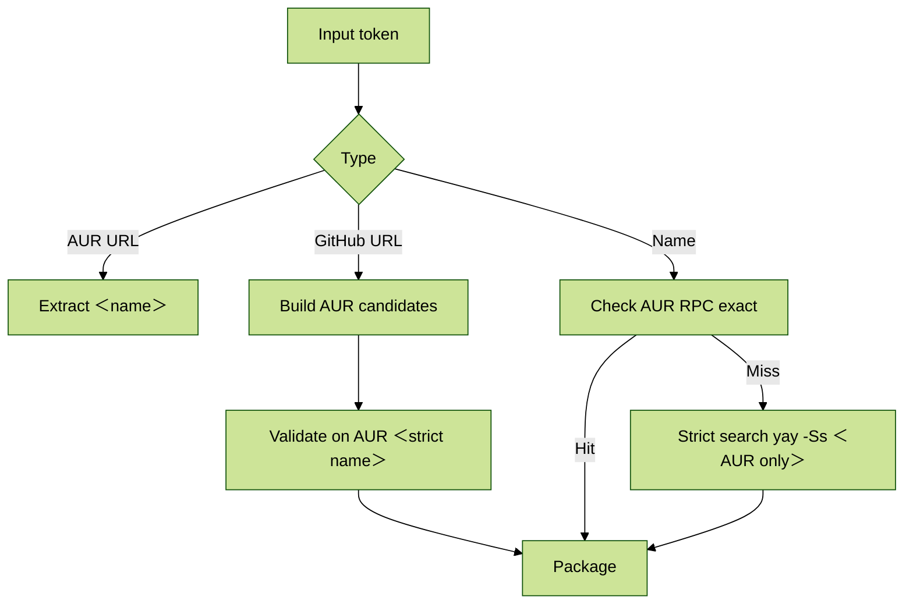

#### Sequence — Input Resolution

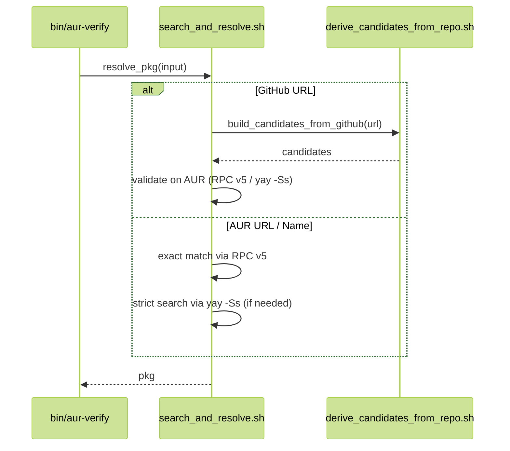

### Overview of the Flow (Detailed Sequence)

Here we expand the entire orchestration, including optional deep verification and the reporting/installation decision. Explanations precede diagrams, and in verbose mode red-flag lines are shown as diagnostics (not enforcement unless in strict mode).

```mermaid
%%{init: {"theme": "forest", "handDrawn": true}}%%
sequenceDiagram
    participant User as User
    participant CLI as CLI bin/aur-verify
    participant GitHub as GitHub lib/github/derive_candidates_from_repo.sh
    participant Search as AUR Resolver lib/aur/search_and_resolve.sh
    participant Plain as AUR Plain/RPC lib/aur/fetch_plain_and_snapshot.sh
    participant Verify as Verifier lib/verify/aur_verification_orchestrator.sh
    participant Rules as Rules lib/verify/verification_rules_loader.sh
    participant PKGB as PKGB Utils lib/pkgb/aggregate_pkgb_helpers.sh
    participant Report as Report lib/report/render_summary.sh + lib/i18n/messages.sh
    participant Makepkg as makepkg
    participant Yay as yay

    User->>CLI: Run bin/aur-verify <input>

    rect rgba(200, 200, 255, 0.35)
    CLI->>CLI: Detect input type
    alt AUR URL
        CLI->>Plain: Extract name and query RPC v5
        Plain-->>CLI: pkg
    else GitHub URL
        CLI->>GitHub: Derive candidates from title/README
        GitHub-->>CLI: Candidate list
        CLI->>Search: Validate on AUR (name-strict)
        Search-->>CLI: pkg
    else PackageName
        CLI->>Plain: RPC v5 info exact match
        alt Exact match
            Plain-->>CLI: pkg
        else No exact match
            CLI->>Search: Strict search yay -Ss (AUR only)
            Search-->>CLI: pkg
        end
    end
    end

    rect rgba(200, 255, 200, 0.35)
    CLI->>Verify: verify_pkgbuild pkg
    Verify->>Plain: Download AUR plain PKGBUILD and .SRCINFO
    alt Plain OK
        Plain-->>Verify: Temp path with PKGBUILD
    else Fallback to git
        Verify->>Plain: Plain snapshot failed
        Verify->>CLI: git clone from AUR
        CLI-->>Verify: Cloned repo with PKGBUILD
    end
    Note over Verify: Show PREPARE/BUILD/PACKAGE summaries (VERBOSE or SHOW_FUNCS)
    end

    rect rgba(255, 255, 200, 0.35)
    Verify->>Rules: rule_vcs_pinning PKGBUILD
    Rules->>PKGB: pkgb_check_vcs_pinning
    PKGB-->>Rules: Result
    Rules-->>Report: report_add item_vcs_pinning

    Verify->>Rules: rule_sources PKGBUILD
    Rules->>PKGB: list_sources + HTTPS and allowlist checks
    PKGB-->>Rules: Result
    Rules-->>Report: report_add item_source_urls / item_allowed_domains

    Verify->>Rules: rule_checksums PKGBUILD checkout
    Rules->>PKGB: has_weak_or_skip / has_strong_sums
    opt Auto-fix allowed
        Rules->>Verify: rewrite_sums_to_sha256
    end
    Rules-->>Report: report_add item_checksums
    Note over Rules,Report: Default → only weak/SKIP#59; VERBOSE → show all arrays and mark weak/SKIP

    Note over Verify: In --verbose, JS prints red-flag lines (diagnostic only)
    end

    rect rgba(255, 220, 200, 0.35)
    alt VERIFY-ONLY without DEEP
        Verify->>Rules: rule_verifysource mode verify-only
        Rules-->>Report: SKIP verify-only
    else FAST
        Verify->>Rules: rule_verifysource mode fast
        Rules-->>Report: SKIP --fast
    else FULL
        Verify->>Makepkg: makepkg --verifysource (no build)
        Makepkg-->>Verify: OK / FAIL
        Verify->>Rules: rule_verifysource mode full
        Rules-->>Report: PASS / WARN / FAIL
    end
    end

    rect rgba(230, 200, 255, 0.35)
    Verify->>Report: report_print mode
    alt OVERALL OK and not verify-only
        CLI->>Yay: yay -S pkg
        Yay-->>CLI: Installation completed
    else OVERALL FAIL or verify-only
        CLI-->>User: Do not install / Verification only
    end
    Note over CLI,Report: QUIET → suppress info/warn#59; summary stays visible
    end
```

---

## Project Structure

### Top-level Scripts

- **`bin/aur-verify`**: Main CLI.
- **`bin/scan`**: Wrapper.
- **`bin/scan-shim`**: Helper symlink.
- **`bin/pkgb-parse`**: Node parser (optional).
- **Installer/Uninstaller**: `scripts/install-scanner.sh` / `scripts/uninstall-scanner.sh`.
- **Tests runner**: `scripts/run-tests.sh`.
- **Validator**: `scripts/validate-sources.sh`.

### Core Libraries

- `lib/core/shell_safety.sh`: strict bash settings, traps.
- `lib/utils/logging.sh`: logging helpers.
- `lib/aur/search_and_resolve.sh`: resolve inputs.
- `lib/aur/fetch_plain_and_snapshot.sh`: fetch PKGBUILDs (`plain → tree?plain=1 → snapshot → git`).
- `lib/github/derive_candidates_from_repo.sh`: candidate derivation from GitHub repos.
- `lib/verify/aur_verification_orchestrator.sh`: main orchestrator.
- `lib/verify/verification_rules_loader.sh`: loads atomic rules.

### Verification Rules

Verification rules live under `lib/verify/rules/*.sh`. Each rule has a single responsibility: inspect the PKGBUILD, return a status, and add a report item.

- **`vcs_pinning_rule.sh`**: ensures `git+…` sources are pinned with `#commit=` or `#tag=`.
- **`sources_rule.sh`**: enforces HTTPS and domain allowlist.
- **`checksums_rule.sh`**: enforces strong checksums; in non-strict, non-fast modes, can auto-rewrite to `sha256` via `makepkg -g`.
- **`verifysource_rule.sh`**: conditionally runs `makepkg --verifysource` depending on mode, but skipped if earlier rules already failed to avoid unnecessary downloads.
- **`redflags_rule.sh`**: scans for risky patterns. Enabled only in diagnostics by default; strict mode may escalate to FAIL.
- **`js_signals_rule.sh`**: integrates additional red-flag diagnostics from the Node parser (if available).

Rules are aggregated by `lib/verify/verification_rules_loader.sh`, and orchestrated by `lib/verify/aur_verification_orchestrator.sh`.

> **Security note:** `makepkg --verifysource` always runs as a non-privileged user (never root). Temporary directories are created with `umask 077` via `mktemp -d` to reduce race-condition risk.

#### Domain Allowlist

The `sources` rule enforces HTTPS and restricts downloads to a curated domain allowlist.

- **Location:** `lib/rules/sources_allowlist.txt`
- **Policy:** deny by default. Any non-listed domain becomes a **FAIL** under `--strict`.
- **Adding domains (PRs):**
  - Verify upstream ownership (official site or trusted mirrors).
  - Enforce HTTPS with no opaque redirects.
  - Avoid ad-injected intermediaries and questionable shorteners.

#### Sequence — Rules & Reporting

This diagram shows how rules are applied in sequence, and how the report is updated.

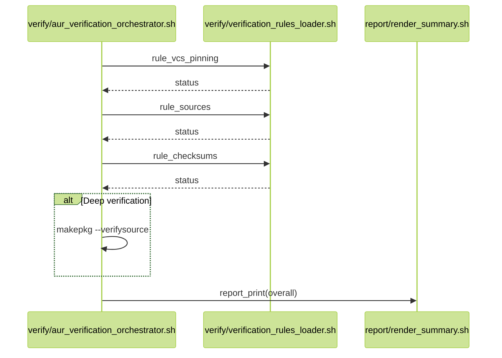

### PKGBUILD Helpers

PKGBUILD helpers live under `lib/pkgb/*.sh`. They implement reusable functionality for rules.

- **`sources_and_domains.sh`**: provides `list_sources`, HTTPS enforcement, and domain allowlist checks.
- **`checksums_policy.sh`**: provides `has_strong_sums`, `has_weak_or_skip`, and `rewrite_sums_to_sha256` (calls `makepkg -g`).
- **`redflags_scan.sh`**: scans PKGBUILD lines using `lib/rules/redflags.list` (returns suspicious lines with numbers).
- **`functions_summary.sh`**: prints summaries of `prepare()`, `build()`, and `package()`.
- **`aggregate_pkgb_helpers.sh`**: a facade combining helpers and `pkgb_check_vcs_pinning`.

#### Sequence — Sources & Checksums

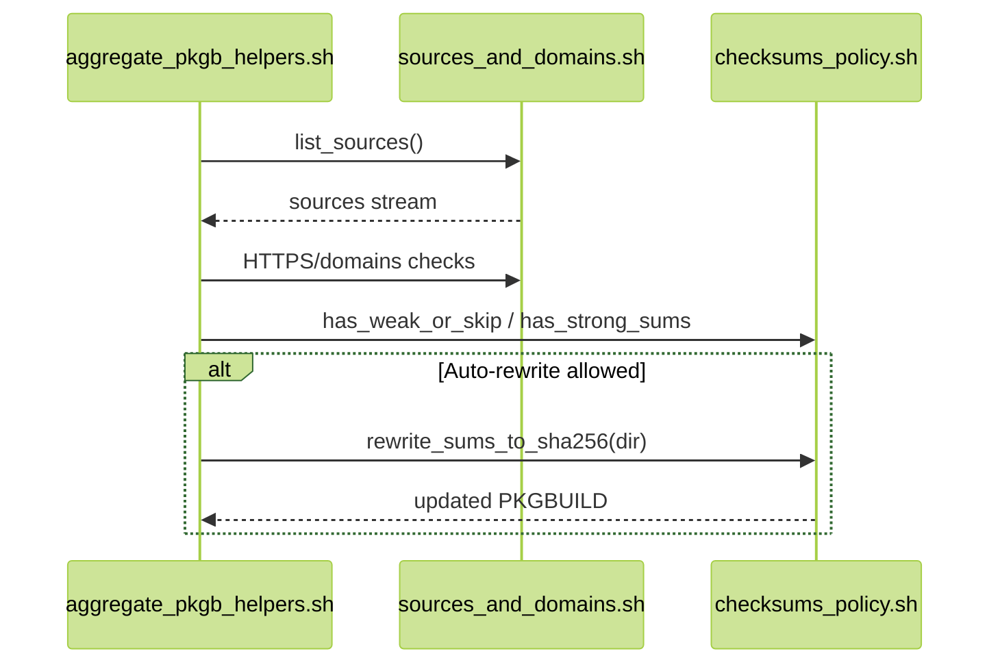

> **Security note:** checksum auto-rewrite with `makepkg -g` is available only in relaxed modes (not `--strict`, not `--fast`). Rewriting **does not imply** trust; treat it purely as a developer convenience/diagnostic step.

---

### Internationalization and Reporting

Reporting is internationalized.

- `lib/i18n/messages.sh`: defines message keys in English and Spanish.
- `lib/report/render_summary.sh`: assembles and prints localized summaries.

Flags and behavior:

- `REPORT_LANG=en|es` overrides auto-detection from `$LANG`.
- Verbose (`--verbose`) prints full arrays, compact source lists, and red-flag diagnostic lines.
- Quiet (`--quiet`) suppresses info/warn logs but still shows the final summary and errors.

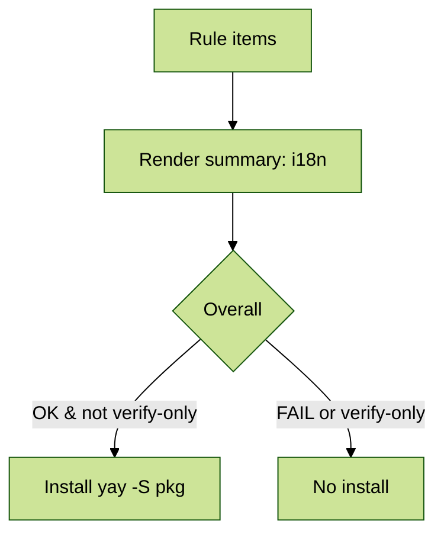

### Guard Wrapper

The guard wrapper is implemented in `bin/scan`. Its purpose is to intercept common AUR helpers and transparently insert verification.

- **`lib/guard/helpers.list`**: enumerates known helper names and types (pacman-compatible vs pamac).
- **Delegation logic**:
	- Detect AUR targets in the arguments.
	- Call `bin/aur-verify --verify-only` on them.
	- If any FAIL: abort or add to `--ignore`.
	- If all OK: delegate to the real helper.
- **Bypass knobs**:
	- `SCAN_BYPASS=1`: skip verification once.
	- `SCAN_REAL_YAY=/usr/bin/yay`: point to real helper binary.
- **Upgrade flow**: for full upgrades, failing AUR packages are passed in `--ignore`.

#### Sequence — scan Delegation

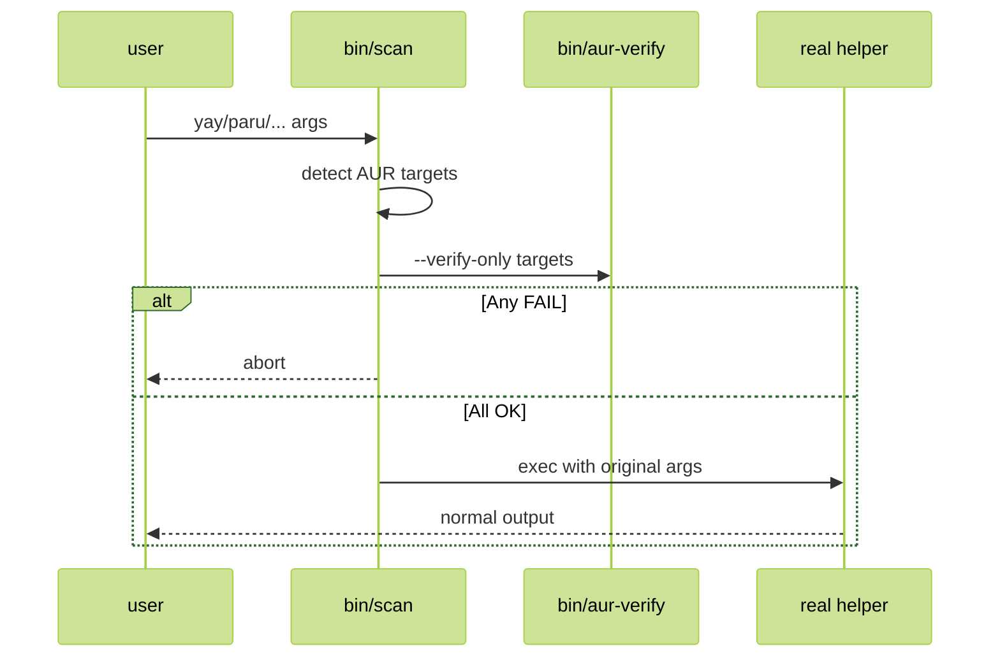

---

## Node PKGB Parser (Optional)

The Node-based PKGB parser lives under `lib/pkgb/parser/`. It is optional and only used when Node.js ≥ 18 is present. Otherwise, Bash stubs are used.

- **`analysis.js`**: main facade, used by CLI.
- **`parser/composePkgbuildParser.js`**: composes parsing passes, exports `parsePKGBUILD`.
- **`spider/*`**: balanced scans for parentheses/braces.
- **`extract*`**: extract arrays and scalars (`source`, sums, metadata) into a meta model.
- **`analyze*`**: check domains, pin detection, compute signals and severity.
- **`outputs/*`**: render summaries, analysis, signals, red-flag lines, compact sources.
- **`patterns/*`**: regex definitions and loaders.
- **`utils/*`**: network fetch, stdin read, shell-style tokenization.

Purpose: provide richer diagnostics (`--summary`, `--sources-compact`, `--redflags-lines`, `--signals`). Enforcement remains in Bash.

### Parser internals

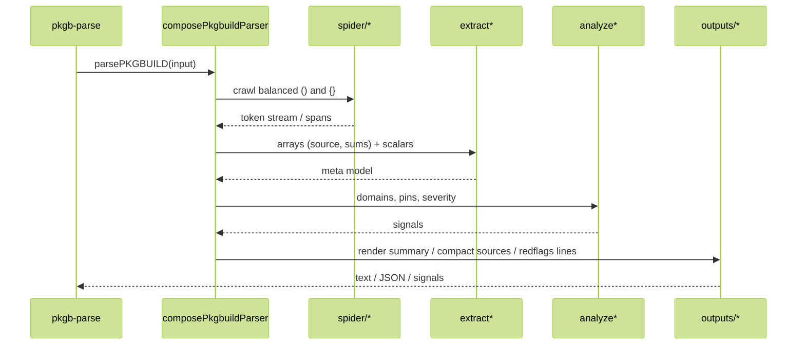

## Runtime

### Requirements

- **Bash** ≥ 4.4
- **git, curl, makepkg**
- **AUR helper** (defaults to `yay`, but `paru`, `pikaur`, `trizen`, `pamac` also supported via wrapper)
- **Node.js** ≥ 18 *(optional; for Node parser integration)*

### Installation Methods

1. **From AUR package** (`aur-scanner-git`):

```bash
yay -S aur-scanner-git
```

Installs runtime in `/usr/lib/aur-scanner` and exposes `scan`.

2. **Via installer script**:

```bash
# User install (default)
./scripts/install-scanner.sh --user

# System-wide install
sudo ./scripts/install-scanner.sh --system
```

Creates symlinks for `scan` and helpers (`yay/paru/pikaur/trizen/pamac`).

**Uninstall:**

```bash
./scripts/uninstall-scanner.sh --user
sudo ./scripts/uninstall-scanner.sh --system
```

**Validate sources after refactors:**

```bash
./scripts/validate-sources.sh
```

3. **Manual makepkg build**:

```bash
cd packaging/aur-scanner-git
makepkg -Ccsf --install
```

Override source for local testing:

```bash
AUR_SCANNER_SRC_OVERRIDE="git+file://$PWD/../.." makepkg -Ccsf --install
```

1. **Cleanup after testing**

When testing locally, clean up to avoid side effects:

```bash
rm -rf /tmp/aur-plain-cache/*
cd packaging/aur-scanner-git
rm -rf src/ pkg/ *.tar.gz *.tar.zst
rm -f ~/.local/bin/scan
rm -f ~/.local/bin/{yay,paru,pikaur,trizen,pamac}
```

Or simply run the uninstall script.

---

### Flags and Environment Variables

| Mode | Flag | Env var | Notes |
| --- | --- | --- | --- |
| Verify only | `--verify-only` | `VERIFY_ONLY=1` | Skip install step. |
| Deep verify | `--deep` | `DEEP=1` | Runs `makepkg --verifysource`. |
| Fast (metadata) | `--fast` | `FAST=1` | Skip downloads, enforce only static rules. |
| Strict policies | `--strict` | `STRICT=1` | Escalates WARN → FAIL, forbids weak sums. |
| Verbose logs | `--verbose` | `VERBOSE=1` | Print arrays, compact sources, red-flag diagnostics. |
| Quiet logs | `--quiet` | `QUIET=1` | Suppress info/warn, keep summary + errors. |
| Show metadata | `--metadata` | `SHOW_METADATA=1` | Print PKGBUILD metadata. |

> **Precedence:** `FAST=1` disables deep verification even if `DEEP=1`.  
> **Wrapper note:** `VERIFY_ONLY=1` prevents delegation to helpers when invoked via `scan`.

#### Behavior Matrix

| Mode / Flag                   | Run `verifysource`        | Auto-rewrite checksums        | Stop early on FAIL        | Install after verify |
|------------------------------|---------------------------|-------------------------------|---------------------------|----------------------|
| Default                      | Yes (if not `--fast`)     | Yes (`makepkg -g`)            | Critical-only             | Yes if OK            |
| `--fast`                     | No                        | No                            | Yes                       | Yes if OK            |
| `--verify-only`              | Yes (unless `--fast`)     | Yes (unless `--strict`)       | Yes                       | **No**               |
| `--strict`                   | Yes (unless `--fast`)     | **No** (disabled)             | Yes (more rules escalate) | Yes if OK            |
| `--strict` + `--verify-only` | Yes (unless `--fast`)     | **No**                        | Yes (aggressive fail)     | **No**               |

> **Rationale:** `FAST` prioritizes speed (no downloads, no deep checks). `STRICT` disables checksum rewrites and escalates warnings to failures. `VERIFY_ONLY` never installs.

---

### Logging and i18n

- **Verbose** mode (`--verbose`): print function summaries (`prepare()`, `build()`, `package()`), compact source lists, all checksum arrays, and red-flag diagnostic lines.
- **Quiet** mode (`--quiet`): suppress info/warn logs, but summary and errors remain visible.
- **Internationalization**:

	- Default language detected from `$LANG`.
	- Override with `REPORT_LANG=en|es`.

---

### Exit Codes

| Code | Meaning |
| --- | --- |
| 0 | Verification OK |
| 1 | Rule failures (checksums, VCS, etc.) |
| 2 | Usage error / invalid arguments |
| 3 | Network / fetch error |
| 4 | `makepkg --verifysource` failed |
| 5 | Internal error |

> CI pipelines rely on these codes. Non-zero means failure.

---

### Wrapper Integration (scan)

The `bin/scan` wrapper sits in front of helpers like `yay`, `paru`, etc.

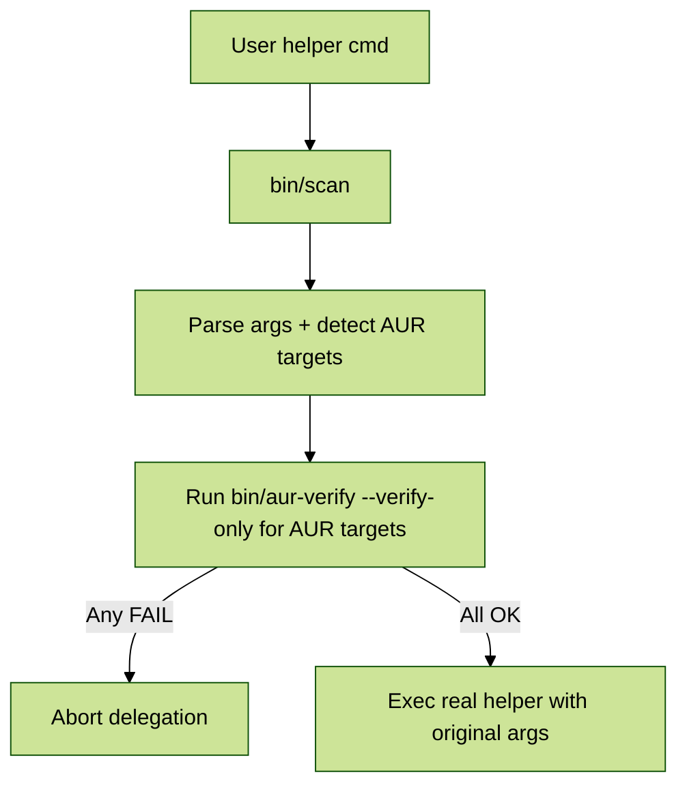

- Intercepts common helpers.
- For upgrades, failing AUR packages are added to `--ignore`.
- `SCAN_BYPASS=1`: bypass verification once.
- `SCAN_REAL_YAY=/usr/bin/yay`: specify underlying helper path.

> **⚠️ Debug toggles:** `SCAN_BYPASS=1` and `SCAN_REAL_YAY` are **support/debug only**. Do not enable them by default in managed environments or CI/CD. Consider blocking or sanitizing them in production shells.

---

## Security Model

Security guarantees are central:

- **No build occurs** during verification.
- Deep checks use only `makepkg --verifysource`.
- **STRICT** mode:

	- Blocks weak checksums.
	- Requires HTTPS sources.
	- Requires pinned VCS commits.
- **FAST** mode:
	- Skips downloads.
	- Useful for quick feedback.
- **Red flags**:
	- Diagnostic only by default.
	- Elevated to FAIL under strict.

### Threat Model (Summary)

**Covered:**

- HTTPS enforcement + domain allowlist.
- VCS pinning (commit/tag required).
- Strong checksum policy; weak/missing sums are blocked under `--strict`.
- No `build()` execution during verification; only `makepkg --verifysource`.

**Not covered (by design):**

- Malicious sources that still match checksums (manual code review required).
- Intentional bypass via debug toggles or executing outside the wrapper.

**Recommendations:**

- In production/CI, use `--strict`; in pipelines, pair with `--verify-only`.
- Do not treat checksum rewrites as trust signals.
- Keep the allowlist change-controlled via PRs and review.

### Sequence — Deep Verification Modes

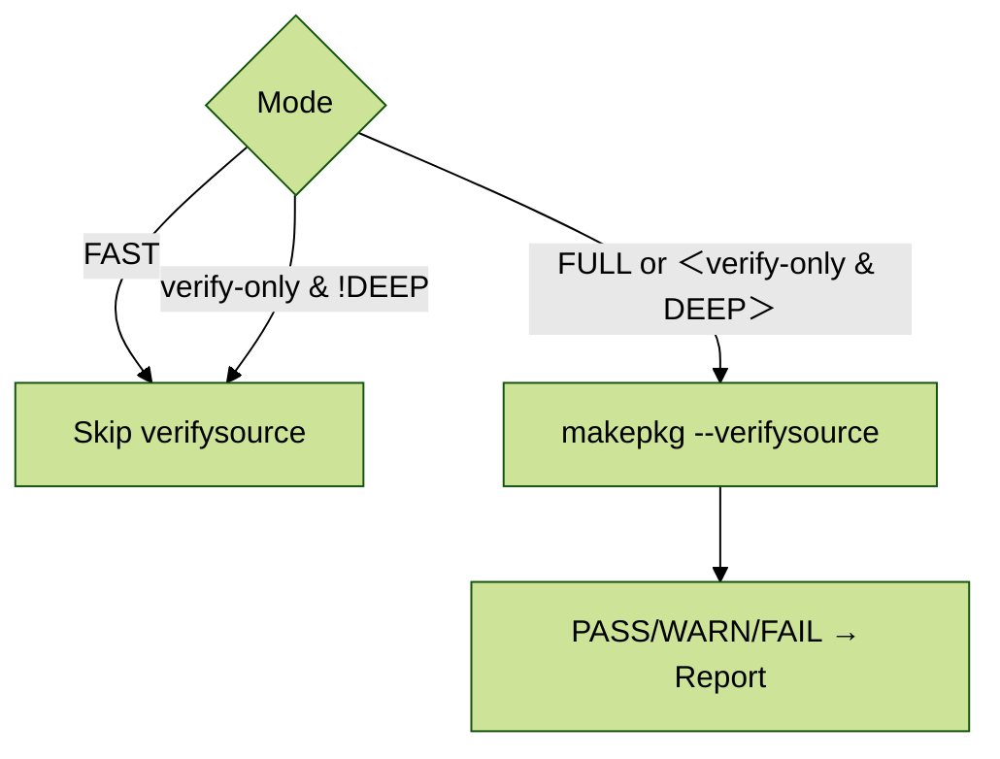

---

## Development Workflow

### Quick Start

```bash
# Verify a package locally
sh ./bin/aur-verify --verify-only <pkg>

# Strict + deep verify
STRICT=1 DEEP=1 sh ./bin/aur-verify <pkg>
```

### Running Tests

```bash
./scripts/run-tests.sh        # orchestrates all tests
bats tests                    # Bash tests
node --test tests/js          # Node tests
```

- **Bats tests**: resolution, guard, installers, packaging, rules, scan wrapper, validate\_sources.
- **Node tests**: CLI (`cli.test.mjs`) and parser (`parser.test.mjs`).

### Automated Branch Sync

- Every push to `development` triggers `.github/workflows/sync-development.yml`.
- The workflow merges those changes into `beta-release` while preserving everything under `packaging/aur-scanner-git/` (AUR packaging configs).
- If protected files are the only differences, the job aborts without pushing; merge conflicts fail fast so they can be resolved manually.

### Adding Rules

- Add new script under `lib/verify/rules/*.sh`.
- Register in `lib/verify/verification_rules_loader.sh`.
- Update messages in `lib/i18n/messages.sh`.
- Follow single-responsibility principle.
- Write new tests.

### CI Recipes

Example GitHub Actions workflow for CI:

```yaml
name: CI

on:
  push:
    branches: [ development ]
  pull_request:
    branches: [ development ]

jobs:
  lint-and-test:
    runs-on: ubuntu-latest
    timeout-minutes: 25
    container:
      image: archlinux:latest
    env:
      AUR_PACKAGE: hello
    steps:
      - uses: actions/checkout@v4
      - name: Install dependencies
        run: |
          pacman -Syu --noconfirm --needed git base-devel curl nodejs npm
      - name: Run tests
        run: bash scripts/run-tests.sh
      - name: Verify sample package
        run: STRICT=1 VERIFY_ONLY=1 bash bin/aur-verify $AUR_PACKAGE
```

> For PRs, use `QUIET=1` to reduce log noise.  
> For nightly, schedule a job with `STRICT=1 DEEP=1` on a small stable package.

---

## Node Parser Integration (`bin/pkgb-parse`)

The Node parser provides extended diagnostics but is not required for enforcement.

- **Outputs consumed by Bash CLI**:

	- `--summary`
	- `--sources-compact`
	- `--redflags-lines`
- **Other developer-oriented flags**:
	- `--json`
	- `--signals`

### Node CLI Quick Reference

```bash
# From local file
node bin/pkgb-parse --file ./PKGBUILD --summary
node bin/pkgb-parse --file ./PKGBUILD --json

# From AUR plain URL
node bin/pkgb-parse --url "https://aur.archlinux.org/cgit/aur.git/plain/PKGBUILD?h=zotero"

# Diagnostics
node bin/pkgb-parse --file ./PKGBUILD --signals
node bin/pkgb-parse --file ./PKGBUILD --redflags-lines
node bin/pkgb-parse --file ./PKGBUILD --sources-compact --limit 10
```

> Prefer as **diagnostic auxiliary**. Enforcement is in Bash.  
> If URL is not in the correct plain format, the CLI suggests the right one.

---

## Auditing and Optimization

- **Caching**: PKGBUILDs cached under `/tmp/aur-plain-cache`.
- **Parallelism**: Node parser runs once per verification to avoid repeated parsing.
- **Network**: Fallbacks to IPv4 if necessary (`AUR_FORCE_IPV4=1`).
- **Optimization**: avoid heavy downloads unless `--deep` is explicitly requested.
- **Auditing invariants**:

	- No build steps, only verification.
	- Network only touches AUR and declared sources.
	- Auto-checksum rewrite happens only in non-strict and non-fast modes.
	- If any rule fails, installation is blocked.

---

## Troubleshooting

Common issues and resolutions:

- **`sha256sums do not match` after rewrite**:  
	Ensure you are not in `STRICT=1`. Auto-rewrite only works in relaxed modes.
- **Node parser errors**:  
	Make sure Node.js ≥ 18 is installed. If not, Bash stubs will silently replace it.
- **Network fetch failures**:  
	Use `AUR_FORCE_IPV4=1` in IPv6-only setups.
- **Wrapper fails with helper not found**:  
	Ensure real helper (`yay`, `paru`, etc.) is installed.  
	Override path with `SCAN_REAL_YAY=/usr/bin/yay`.

---

## 🤝 Contributing

We welcome contributions of all kinds — code, documentation, tests, bug reports, and rule proposals.

### Ways to contribute

- 🪳 **Report issues** with a minimal repro, your Arch variant, and the exact command you ran.
- 🧪 **Test different modes** (`STRICT=1`, `FAST=1`, `DEEP=1`) on a variety of AUR packages and share results.
- 📝 **Improve documentation** (clarify flags, add examples, ensure Spanish/English parity).
- 🧩 **Suggest or refine rules** (new red flags, domain allowlist entries, checksum policies).

### Contribution guidelines

- Follow existing code style and commit message conventions.
- Ensure new features or rules include appropriate test coverage.
- For major changes, please open an issue first to discuss your proposal.

### Development setup (local)

You can develop and test locally in several ways:

1. **Run directly from source** (fastest for contributors):
  
  ```bash
   git clone https://github.com/<your-username>/aur_scanner.git
   cd aur_scanner

   # Verify a package directly
   sh ./bin/aur-verify --verify-only hello
   STRICT=1 DEEP=1 sh ./bin/aur-verify hello
  ```

2. **Installation via script** (developer-only):

  ```bash
	./scripts/install-scanner.sh --user
	# later remove with
	./scripts/uninstall-scanner.sh --user
	```

3. **Build & install with makepkg** (simulate yay workflow):

	```bash
	cd packaging/aur-scanner-git
	makepkg -Ccsf --install
	```

	This lets you validate how packaging behaves before publishing to AUR.

4. **Run the test suite**:
	
  ```bash
	./scripts/run-tests.sh
	```

⚠️ Note: Active maintenance of this project is limited. Contributions are welcome, but review and merge activity may be delayed. Forks are encouraged.


### Guidelines

- Keep scripts POSIX-friendly when possible; Bash features are OK if justified.
- Prefer small, focused PRs with descriptive commits.
- Follow the security model (never silently relax checks in `STRICT=1`).
- Add tests and update i18n messages for new features.
- Be constructive and clear in communication.

> 💡 Good first issues: improving error messages, adding new test cases, or refining documentation.

---

## Versioning and Changelog

This project follows [Semantic Versioning](https://semver.org/).  

The current development version is **0.8.0**.  

For a complete history of changes, see the [CHANGELOG.md](../CHANGELOG.md).
