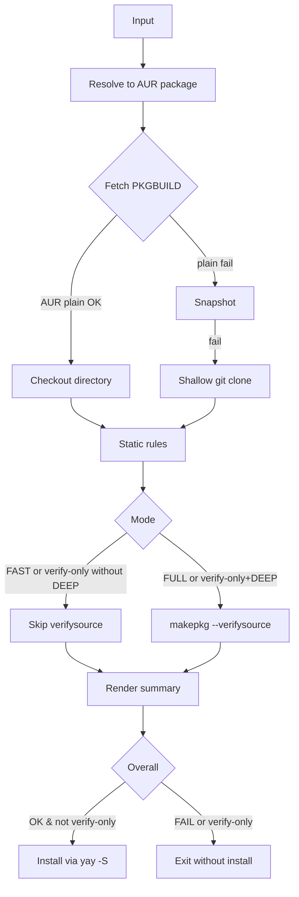
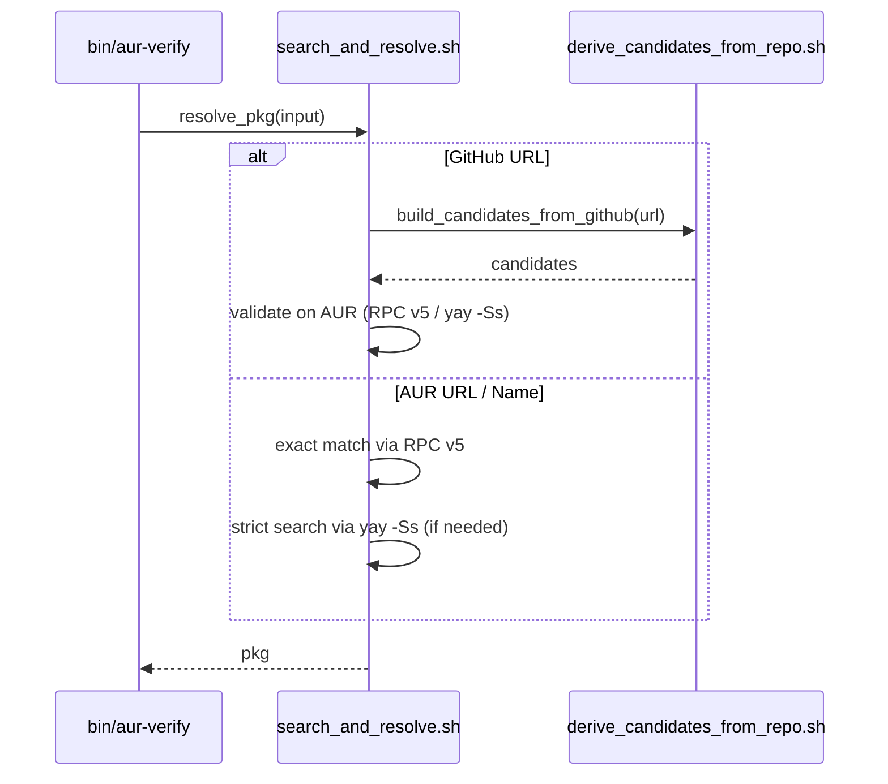
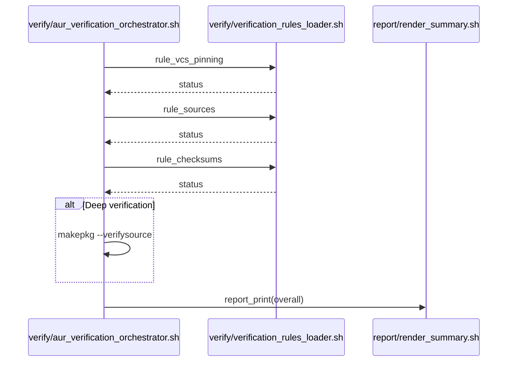
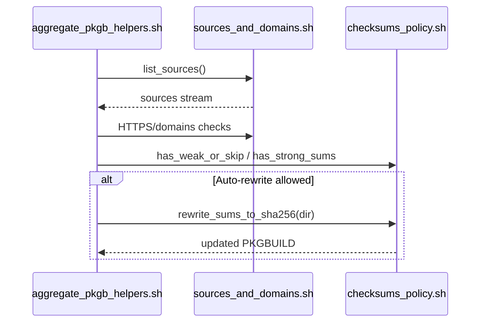
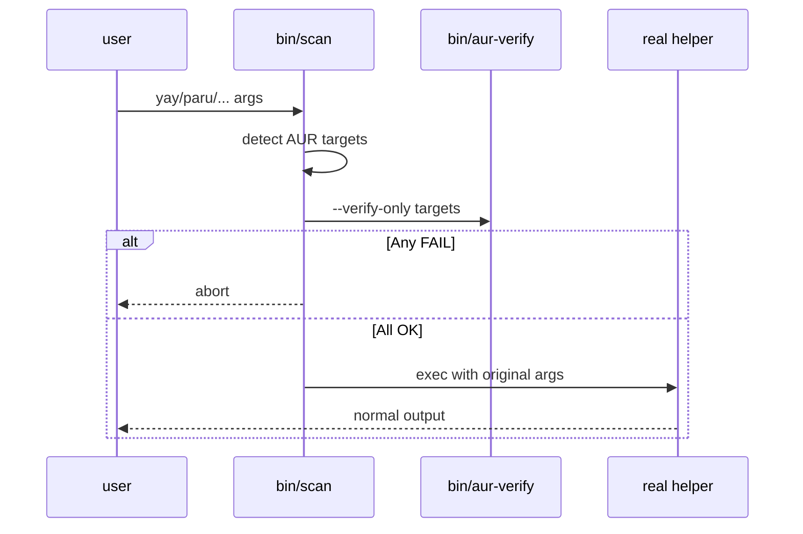
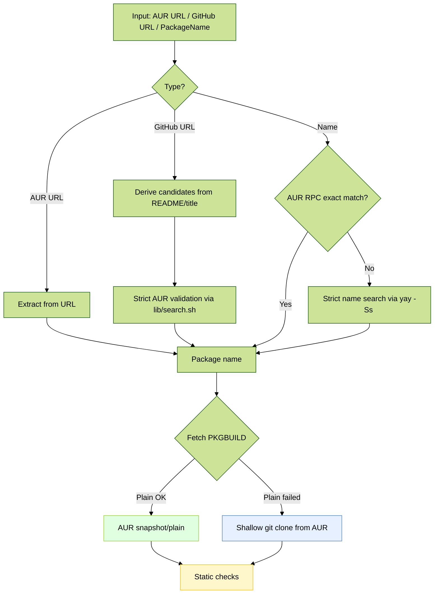
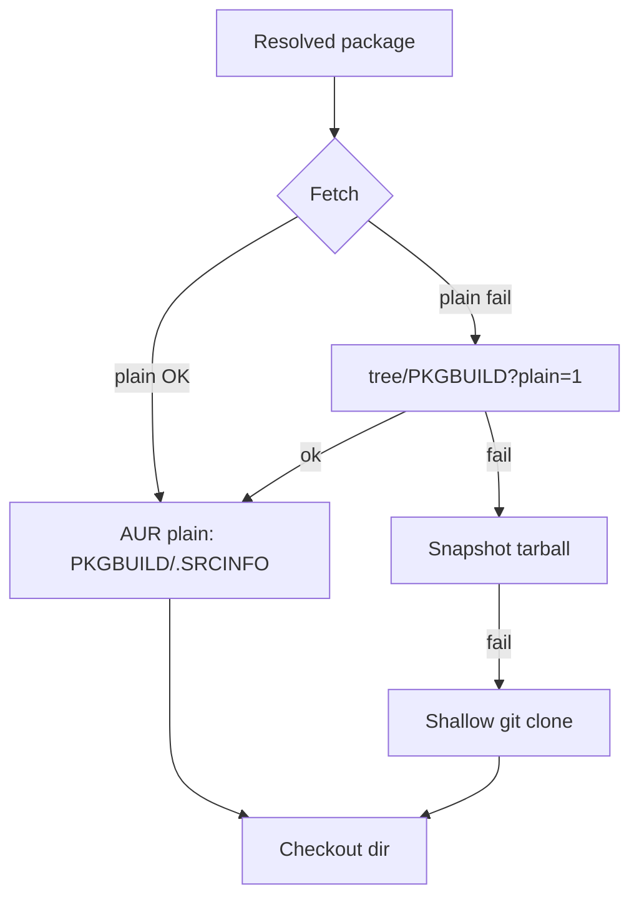
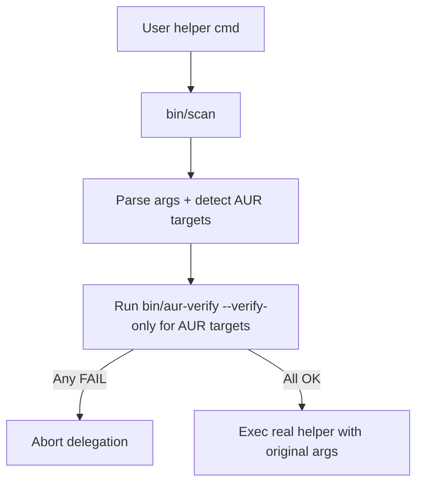
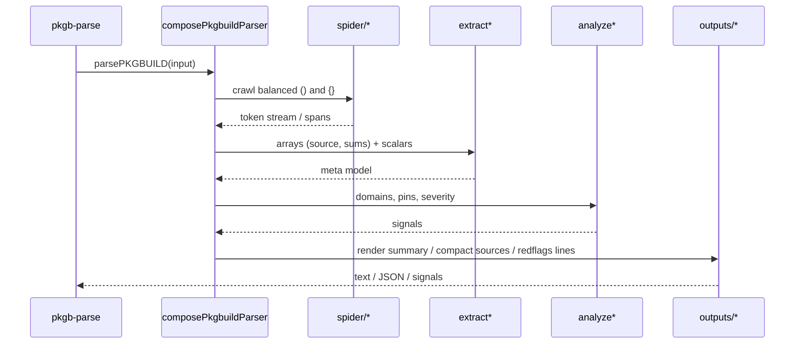

# Developer Notes (Internal)

This document captures implementation details, tuning knobs, and maintenance notes that are intentionally not surfaced in the main README. It is meant for contributors and maintainers.

Leer esto en [Español](https://github.com/LuigiD5555/aur_scanner/blob/development/docs/developer/README.dev.es.md)

---

Back to README: [English](Projects/Code/Personal_Projects/Scripts/AUR%20Verifier%20Project/aur_verification/README.md) | [Español](README.es.md)

---

## Overview Diagrams

<details>
<summary><strong>General Flow</strong></summary>

</details>

<details>
<summary><strong>Overview of the flow</strong></summary>

```mermaid
%%{init: {"theme": "forest", "handDrawn": true}}%%
sequenceDiagram
    participant User as User
    participant CLI as CLI bin/aur-verify
    participant GitHub as GitHub lib/github/derive_candidates_from_repo.sh
    participant Search as AUR Resolver lib/aur/search_and_resolve.sh
    participant Plain as AUR Plain/RPC lib/aur/fetch_plain_and_snapshot.sh
    participant Verify as Verifier lib/verify/aur_verification_orchestrator.sh
    participant Rules as Rules lib/verify/verification_rules_loader.sh
    participant PKGB as PKGB Utils lib/pkgb/aggregate_pkgb_helpers.sh
    participant Report as Report lib/report/render_summary.sh + lib/i18n/messages.sh
    participant Makepkg as makepkg
    participant Yay as yay

    User->>CLI: Run bin/aur-verify <input>

    %% Input detection
    rect rgba(200, 200, 255, 0.35)
    CLI->>CLI: Detect input type
    alt AUR URL
        CLI->>Plain: Extract name and query RPC v5
        Plain-->>CLI: pkg
    else GitHub URL
        CLI->>GitHub: Derive candidates title/README
        GitHub-->>CLI: Candidate list
        CLI->>Search: Validate on AUR name-strict
        Search-->>CLI: pkg
    else PackageName
        CLI->>Plain: RPC v5 info exact match
        alt Exact match
            Plain-->>CLI: pkg
        else No exact match
            CLI->>Search: Strict search yay -Ss AUR only
            Search-->>CLI: pkg
        end
    end
    end

    %% Fetch PKGBUILD
    rect rgba(200, 255, 200, 0.35)
    CLI->>Verify: verify_pkgbuild pkg
    Verify->>Plain: Download snapshot/plain PKGBUILD and .SRCINFO
    alt Plain OK
        Plain-->>Verify: Temp path with PKGBUILD
    else Fallback to git
        Verify->>Plain: Plain snapshot failed
        Verify->>CLI: git clone from AUR
        CLI-->>Verify: Cloned repo with PKGBUILD
    end
    Note over Verify: Show PREPARE/BUILD/PACKAGE summaries (Verbose or SHOW_FUNCS)
    end

    %% Static verification atomic rules
    rect rgba(255, 255, 200, 0.35)
    Verify->>Rules: rule_vcs_pinning PKGBUILD
    Rules->>PKGB: pkgb_check_vcs_pinning
    PKGB-->>Rules: Result
    Rules-->>Report: report_add item_vcs_pinning

    Verify->>Rules: rule_sources PKGBUILD
    Rules->>PKGB: list_sources + HTTPS and whitelist checks
    PKGB-->>Rules: Result
    Rules-->>Report: report_add item_source_urls / item_allowed_domains
    Note over Rules,Report: Default → only offending lines; Verbose → show all sources and mark offenders

    Verify->>Rules: rule_checksums PKGBUILD checkout
    Rules->>PKGB: has_weak_or_skip / has_strong_sums
    opt Auto-fix allowed
        Rules->>Verify: rewrite_sums_to_sha256
    end
    Rules-->>Report: report_add item_checksums
    Note over Rules,Report: Default → only weak/SKIP lines; Verbose → show all checksum arrays and mark weak/SKIP

    Note over Verify: In --verbose, JS prints red-flag lines (diagnostic only)
    end

    %% Deep verification optional
    rect rgba(255, 220, 200, 0.35)
    alt VERIFY-ONLY without DEEP
        Verify->>Rules: rule_verifysource mode verify-only
        Rules-->>Report: SKIP verify-only
    else FAST
        Verify->>Rules: rule_verifysource mode fast
        Rules-->>Report: SKIP --fast
    else FULL
        Verify->>Makepkg: makepkg --verifysource no build
        Makepkg-->>Verify: OK / FAIL
        Verify->>Rules: rule_verifysource mode full
        Rules-->>Report: PASS / WARN / FAIL
    end
    end

    %% Report and install
    rect rgba(230, 200, 255, 0.35)
    Verify->>Report: report_print mode
    alt OVERALL OK or OK with warnings and not verify-only
        CLI->>Yay: yay -S pkg
        Yay-->>CLI: Installation completed
    else OVERALL FAIL or verify-only
        CLI-->>User: Do not install / Verification only
    end
    Note over CLI,Report: Quiet → suppress info/warn logs; summary remains visible
    end
```
</details>

---

## Project Structure

### Architecture Overview

- Bash entrypoint: `bin/aur-verify`
- Verify orchestrator: `lib/verify/aur_verification_orchestrator.sh` orchestrates the end-to-end flow and installation handoff
- Atomic rules: `lib/verify/verification_rules_loader.sh` aggregates `lib/verify/rules/*.sh`
  - `vcs_pinning_rule.sh`, `sources_rule.sh`, `checksums_rule.sh`, `verifysource_rule.sh` (and `redflags_rule.sh` available; see note below)
- AUR fetchers and RPC helpers: `lib/aur/fetch_plain_and_snapshot.sh`
- AUR search/resolve utilities: `lib/aur/search_and_resolve.sh`
- GitHub wrapper derivation: `lib/github/derive_candidates_from_repo.sh`
- PKGBUILD helpers: `lib/pkgb/aggregate_pkgb_helpers.sh` aggregates:
  - `sources_and_domains.sh`, `checksums_policy.sh`, `redflags_scan.sh`, `functions_summary.sh`
- Report + i18n: `lib/report/render_summary.sh`, `lib/i18n/messages.sh`
- Optional Node parser: `bin/pkgb-parse` with `lib/pkgb/parser/{analysis,utils,outputs,patterns,terminalColors}.js`

### Detailed Structure

#### Top-level scripts

- `bin/aur-verify`: Main CLI. Parses args/env, orchestrates resolver → checkout → rules → report → optional install.
- `bin/scan`: Wrapper to pre-check AUR packages before delegating to `yay/paru/pikaur/trizen/pamac`.
- `bin/scan-shim`: Lightweight front installed as helper names (yay/paru/pikaur/trizen/pamac); routes to `bin/scan` when wrapper-only flags are present and otherwise delegates straight to the real helper.
- `bin/pkgb-parse`: Optional Node CLI to parse PKGBUILD for diagnostics/compact outputs.
- `scripts/install-scanner.sh`: Installs symlinks for scan into user/system PATH.
- `scripts/uninstall-scanner.sh`: Removes scan helper symlinks (user/system).
- `scripts/run-tests.sh`: Runs bats + Node parser tests (requires `bats` and Node ≥ 18).
- `scripts/validate-sources.sh`: Checks that `source "..."` imports are valid after refactors.

#### Core libs

- `lib/core/shell_safety.sh`: Strict bash settings, `have_cmd`, `require_tools`, trap setup.
- `lib/utils/logging.sh`: Uniform `[INFO]`, `[WARN]`, `[ERROR]`, `die`, color helpers.

#### AUR + resolver

- `lib/aur/search_and_resolve.sh`: `resolve_pkg`, name-strict search via AUR RPC v5 and `yay -Ss` (AUR-only), GitHub URL candidates.
- `lib/aur/fetch_plain_and_snapshot.sh`: Fetch `PKGBUILD`/`.SRCINFO` via AUR plain/snapshot; fallback to shallow git clone; TTL cache for plain.
- `lib/github/derive_candidates_from_repo.sh`: Parse GitHub URL, read README/title, derive candidate AUR wrapper names.

<details>
<summary><strong>Sequence — Input Resolution</strong></summary>

</details>

#### Verification rules

- `lib/verify/rules/*.sh`: Atomic rules
  - `vcs_pinning_rule.sh`: Enforce `git+…` pinned via `#commit=`/`#tag=`.
  - `sources_rule.sh`: Enforce HTTPS + allowed domains.
  - `checksums_rule.sh`: Enforce strong sums; optional auto-rewrite to sha256 (non-strict/non-fast).
  - `verifysource_rule.sh`: Run `makepkg --verifysource` depending on mode; interpret result (skipped automatically if earlier rules already failed to avoid unnecessary downloads).
  - `redflags_rule.sh`: Available; off by default in summary (diagnostics still available).
- `lib/verify/verification_rules_loader.sh`: Aggregator that exposes `rule_*` calls.
- `lib/verify/aur_verification_orchestrator.sh`: `verify_pkgbuild`, `install_or_verify`, `aur_checkout_to` and overall orchestration.

<details>
<summary><strong>Sequence — Rules & Reporting</strong></summary>

</details>

#### PKGBUILD helpers

- `lib/pkgb/sources_and_domains.sh`: `list_sources`, HTTPS enforcement, domain allowlist checks.
- `lib/pkgb/checksums_policy.sh`: `has_strong_sums`, `has_weak_or_skip`, `rewrite_sums_to_sha256` (uses `makepkg -g`).
- `lib/pkgb/redflags_scan.sh`: `scan_red_flags` using `lib/rules/redflags.list` (diagnostic lines with numbers).
- `lib/pkgb/functions_summary.sh`: `print_func_summaries` for `prepare()/build()/package()`.
- `lib/pkgb/aggregate_pkgb_helpers.sh`: Facade that composes helpers and `pkgb_check_vcs_pinning`.

<details>
<summary><strong>Sequence — Sources & Checksums</strong></summary>

</details>

#### Internationalization (i18n) + reporting

- `lib/i18n/messages.sh`: Message catalog (en/es) for report keys.
- `lib/report/render_summary.sh`: Compose and print the localized final summary.

#### Guard wrapper

- `lib/guard/helpers.list`: Declares known helper names and types (pacman/pamac helpers) for `bin/scan`.
- `lib/rules/redflags.list`: Shared patterns for risky code (used by Bash + Node parser).

<details>
<summary><strong>Sequence — scan Delegation</strong></summary>

</details>

#### Node PKGB parser (optional)

- `lib/pkgb/parser/analysis.js`: Facade for parser; entry for CLI.
- `lib/pkgb/parser/parser/*.js`: Core parsing pipeline
  - `composePkgbuildParser.js`: Composes passes; exports `parsePKGBUILD`.
  - `spider/*`: Balanced scans for parentheses/braces.
  - `extract*`: Extract arrays and scalars (`source`, checksums, metadata) → meta model.
  - `analyze*`: Domain checks, pin detection; compute signals/severity.
- `lib/pkgb/parser/outputs/modules/*.js`: Renderers for summary, detailed analysis, signals, red-flag lines, compact sources.
- `lib/pkgb/parser/patterns/*`: Regex composition and loader for shared patterns.
- `lib/pkgb/parser/utils/modules/*`: Network fetch, stdin read, shell-style tokenization.

#### Purpose by file (quick map)

- `bin/aur-verify`: CLI args → call `install_or_verify` → inside: `resolve_pkg` → `aur_checkout_to` → rules → summary → maybe install.
- `lib/verify/aur_verification_orchestrator.sh`: Implements the sequence above, provides temp workdir and mode handling.
- `lib/verify/rules/*.sh`: Single-responsibility checks (status + message key + optional fix).
- `lib/pkgb/*.sh`: Pure helpers; no network except checksum rewrite via `makepkg -g`.
- `lib/aur/*.sh`: Only place that touches network (AUR plain/snapshot/git).
- `bin/scan`: Fronts helpers; calls `bin/aur-verify --verify-only` for AUR targets; delegates unchanged.

#### Key invariants (for auditing)

- No build occurs during verification; deep checks use `makepkg --verifysource` only.
- Network access limited to AUR endpoints and declared sources (for deep verification); strict mode further constrains allowed domains.
- Automatic checksum rewrite happens only in non-strict and non-fast modes and re-verifies afterward.
- If any rule fails, installation is not attempted.

---

## Wrapper integration (scan): behavior & variables

**Purpose:** `bin/scan` intercepts AUR helper commands and runs a pre-check with `bin/aur-verify --verify-only` before delegating to the real helper.

### Flow

1. Parse helper + args (yay/paru/pikaur/trizen/pamac).
2. Detect AUR targets.
3. Run verification: explicit targets call `bin/aur-verify --verify-only` once; full-upgrade sweeps (`-Syu` with no explicit pkgs) call the helper with `-Qum`, verify each AUR upgrade individually, and accumulate failures into `SCAN_IGNORE_PKGS`.
4. If any explicit target fails → abort; during sweeps the failing upgrades are appended to `--ignore` before delegating so the rest proceed.

### Transparency

- For `pamac`, pre-checks only in `pamac build` (no change to `pamac install|upgrade`).
- The wrapper still delegates to the real helper; the only mutation is adding `--ignore <pkg1,pkg2>` during upgrade sweeps so problematic AUR updates are skipped automatically.
- Helper symlinks point to `scan-shim`; it inspects argv and, when wrapper-only flags are present, execs `bin/scan`, otherwise it falls back immediately to the real helper binary.
- Wrapper-only flags (`--verify-only`, `--strict`, `--fast`, `--metadata`, etc.) are intercepted before delegation. To expose them via the canonical helper name, install a shim in `$PATH` (e.g. `ln -sf …/scan ~/.local/bin/yay`) or use a shell alias/function so that any `yay …` call hits the wrapper first.
- `FAST=1 --verify-only` (or env equivalents) keeps the run in parser/heuristic mode and returns before triggering `makepkg --verifysource` or downloading large artifacts.
- Quick check: `command -v yay` + `readlink -f "$(command -v yay)"`. If both resolve to the wrapper path you’re safe to document examples as `yay -Syu pkg --verify-only`; otherwise note the explicit form `scan yay -Syu --verify-only pkg`.

### Environment knobs

- `SCAN_BYPASS=1` — Skip pre-check once (not recommended).
- `SCAN_REAL_YAY=/usr/bin/yay` — Force real binary path (analogous for `paru`, `pamac`, etc.).
- `STRICT=1 | FAST=1 | VERBOSE=1 | QUIET=1` — Passed to the verifier and influence the gate.

### Convenience flags (are stripped before delegating)

- `--strict` (= `STRICT=1`)
- `--fast` (= `FAST=1`)
- `--verify-only`
- `--verbose` / `--quiet`
- `--metadata` (= `SHOW_METADATA=1`)

**Helper catalog:** Extend `lib/guard/helpers.list` to add helpers or tweak kinds. Upgrade sweeps rely on `lib/guard/upgrades.sh` (currently wired for yay/paru/pikaur/trizen via `-Qum`).

### Helper compatibility (scan)

| Helper | AUR pre-check path | Notes |
| --- | --- | --- |
| yay | `aur-verify --verify-only` | Default; override with `YAY_BIN`. |
| paru | `aur-verify --verify-only` | Same flags passthrough as yay. |
| pikaur | `aur-verify --verify-only` |  |
| trizen | `aur-verify --verify-only` |  |
| pamac | `aur-verify --verify-only` | Only on `pamac build` (AUR flow). |
| pacman | delegated | No AUR; wrapper delegates transparently |

---

## Runtime requirements & local overrides

### Minimum toolchain

- Arch/derivative with AUR access
- `git`, `curl`, `makepkg`
- AUR helper (`yay` default)

### Overrides

- `YAY_BIN=/absolute/path/to/yay` — Use a non-default helper binary.
- `AUR_FORCE_IPV4=1` — Force IPv4 for all AUR calls (network edge cases).

### Runtime versions

- Bash ≥ 4.4 (arrays and `set -o pipefail` semantics).
- Node.js ≥ 18 (optional; enables `pkgb-parse` and JS diagnostics).
- `makepkg` from pacman (Arch/derivatives).

---

## Flags ↔ environment cheatsheet (canonical)

| Mode/Log | Flag | Env var |
| --- | --- | --- |
| Verify only | `--verify-only` | `VERIFY_ONLY=1` |
| Deep in verify | `--deep` | `DEEP=1` |
| Fast (metadata) | `--fast` | `FAST=1` |
| Strict policies | `--strict` | `STRICT=1` |
| Verbose | `--verbose` | `VERBOSE=1` |
| Quiet | `--quiet` | `QUIET=1` |
| Show metadata | `--metadata` | `SHOW_METADATA=1` |
| Show func heads | *(implicit in verbose)* | `SHOW_FUNCS=1` |

> **Precedence** — `FAST=1` disables deep verification even if `--deep` / `DEEP=1`.

---

## i18n (reporting)

- Auto-locale via `LANG`/`LC_*` (Spanish when starting with `es`).
- Force language: `REPORT_LANG=en` | `REPORT_LANG=es`.
- `SHOW_FUNCS=1` — prints `prepare()/build()/package()` summaries (implied by `--verbose`).
- `SHOW_METADATA=1` — adds `yay -Si` in verify-only (also implied by `--metadata` or `--verbose`).
- `QUIET=1` — reduces output to errors + final summary.

---

## Verification Depth and Precedence

- `--verify-only`: static checks only (no install). With `DEEP=1` it also runs `makepkg --verifysource`.
- `--fast`: metadata-only; skips deep verification even if `DEEP=1` is set (FAST wins over DEEP).
- `--strict`: tightens policies (HTTPS-only, domain allowlist, strong checksums, VCS pinning) and may elevate WARN to FAIL.

---

## Exit codes

- `0` — Verification passed (and, if not `--verify-only`, install completed).
- `1` — Verification failed (blocking issue).
- `2` — Input/resolve error (AUR package not found, invalid GitHub mapping).
- `3` — Network/checkout failure (AUR plain/tree/snapshot/git unavailable).
- `4` — Tooling/runtime missing (e.g., `git`, `curl`, `makepkg`).
- `5` — Internal error (unexpected).

---

## Security notes (dev-oriented)

- **No build during verification.** Deep checks use `makepkg --verifysource` (integrity/PGP) without compiling.
- **`--fast` is superficial.** Use only for triage/preview.
- **Checksums**
  - Normal: if `sha1`/`SKIP`, rewrite to `sha256` and re-verify.
  - Strict: **forbidden**; results in FAIL (no auto-rewrite).
- **Domains allowlist** and **VCS pinning** (`#commit=`/`#tag=`) are strict in `STRICT=1`.
- **Red flags.** Diagnostic (JS when Node present); escalate under strict policy for high-risk patterns.

---

## Threat model (concise)

### Goals

- Catch unsafe PKGBUILD patterns early.
- Enforce reproducibility on VCS sources.
- Validate integrity/PGP with `makepkg --verifysource`.
- Keep a fast triage path with explicit trade-offs.

### Non-goals

- Full sandbox/malware detection.
- Replacing distro trust or packager review.
- Building packages during verification.
- Trusting non-AUR domains by default in strict mode.

### Implications

- Red-flags are diagnostic by default; in `STRICT=1` some escalate to FAIL.
- `--fast` trades depth for speed.

---

## Logging Modes

- `--verbose` (or `VERBOSE=1`):
  - Implies `SHOW_FUNCS=1`
  - Prints compact sources list from JS parser, summary line, and red flags lines (diagnostics only).
- `--quiet` (or `QUIET=1`):
  - Suppresses info/warn logs globally; summary and errors remain.
  - Overrides `--verbose` and disables `SHOW_FUNCS`/metadata.
- Function summaries can also be shown explicitly with `SHOW_FUNCS=1` regardless of `--verbose`.

---

## Performance Tweaks (Internal)

- JS parser single-shot: `rule_js_signals` invokes the Node parser once and exports counts; `rule_red_flags` reuses them and only renders lines in `--verbose` (no extra Node launches).
- Fetch plain first: always try AUR `plain/PKGBUILD?h=<pkg>`, then fallback to `tree/PKGBUILD?plain=1`, finally snapshot or shallow git clone.
- Robust network path: curl helpers try default stack and fallback to IPv4 automatically; honor `AUR_FORCE_IPV4=1` to force IPv4.
- Plain availability check: even if checkout falls back to snapshot/git, `aur_plain_exists` uses HEAD to mark availability accurately in the report.
- Skip heavy downloads in verify-only: checksum auto-rewrite via `makepkg -g` is disabled when `VERIFY_ONLY=1` (still enabled in full mode unless `FAST=1`).
- `.SRCINFO` is fetched only in VERBOSE or STRICT.
- Plain PKGBUILD caching via `/tmp` with TTL (env: `AUR_CACHE_DIR`, `AUR_CACHE_TTL_SEC`).

> `?plain=1`: This is a query parameter that is added to the end of the GitHub URL (https://github.com/user/project/blob/main/file.sh?plain=1)

### Plain PKGBUILD cache

- Directory: `${AUR_CACHE_DIR:-/tmp}/aur-plain-cache/`
- Files: `<pkg>.PKGBUILD` (+ metadata)
- TTL: `AUR_CACHE_TTL_SEC` (default in code; bump for CI if needed)
- Purge one: `rm -f /tmp/aur-plain-cache/<pkg>.PKGBUILD`
- Purge all: `rm -rf /tmp/aur-plain-cache/`

---

## Troubleshooting (canonical messages)

- **“Package may not exist”** → confirm name or AUR existence.
- **“sha256 verification failed after regeneration”** → upstream changed or risk; do not install until understood.
- **“source domain not allowed” (STRICT)** → extend allowlist or use normal mode consciously.
- **“Plain PKGBUILD unavailable while FAST=1”** → rerun without `--fast` to enable snapshot/git fallback.
- **“PKGBUILD not found at ‘…/PKGBUILD’ (mode=…, pkg=…)”** → disable `--fast`; if it persists, open an issue with the shown path.

---

## CLI synopsis (quick reference)

```bash
bin/aur-verify [--verify-only] [--deep] [--fast] [--verbose|--quiet] [--metadata] <AUR_NAME|AUR_URL|GITHUB_URL>

Environment:
  STRICT=1           Tighten policies (allowlist, pinning, strong sums, PGP).
  REPORT_LANG=en|es  Force report language.
  SHOW_FUNCS=1       Print prepare/build/package summaries (implied by --verbose).
  SHOW_METADATA=1    Print yay -Si metadata in verify-only (implied by --verbose).
  YAY_BIN=/path/yay  Override yay binary path.
  AUR_FORCE_IPV4=1   Force IPv4 for AUR endpoints.
```

---

## Red Flags Handling

- The atomic rule `rule_red_flags()` prefers the Node parser when present. It uses the exported JS count to avoid an extra parse, and prints detailed lines only in `--verbose`.
- Policy treats the arch-selection `eval` pattern as low risk (WARN normal / FAIL strict); other patterns WARN/FAIL accordingly.

### Red-flags policy (alignment)

- **Normal**: “suspicious but explainable” (e.g., `eval` for arch-specific variable indirection) → **WARN**, not blocking.
- **STRICT**: self-executing downloads, privilege tweaks, opaque decoding, etc. → **FAIL** (appears in summary).
- With `--verbose` and Node present, print red-flag **lines**; outside STRICT they remain diagnostic.

---

## Node Parser Integration (`bin/pkgb-parse`)

- Optional: used opportunistically when Node is present; otherwise safe stubs are loaded.
- Provided outputs used by the Bash CLI:
  - `--summary`, `--sources-compact`, and `--redflags-lines` (diagnostics only)
- ESM modules live under `lib/pkgb/parser`; parsing and formatting concerns are separated.

### Node CLI quick reference

```bash
# From local file
node bin/pkgb-parse --file ./PKGBUILD --summary
node bin/pkgb-parse --file ./PKGBUILD --json

# From AUR plain URL
node bin/pkgb-parse --url "https://aur.archlinux.org/cgit/aur.git/plain/PKGBUILD?h=zotero"

# Diagnostics for devs
node bin/pkgb-parse --file ./PKGBUILD --signals
node bin/pkgb-parse --file ./PKGBUILD --redflags-lines
node bin/pkgb-parse --file ./PKGBUILD --sources-compact --limit 10
```

> **Notes:**
>
> - Prefer as a **diagnostic** auxiliary; enforcement remains in Bash.
> - If URL is not `…/plain/PKGBUILD?h=<pkg>`, CLI suggests the proper form.

---

## Adding/Adjusting Rules

- Prefer small, composable functions in `lib/verify/rules/*.sh` that:
  - Log only snippets (full context in VERBOSE)
  - Update the report via `report_add <item> <STATUS> <message_key>`
  - Return non-zero only when the rule should contribute to failure
- Add user-facing messages in `lib/i18n/messages.sh` (both EN and ES).

---

## Tests and Local Tips

- Run tests (requires bats + Node ≥ 18):
  - `scripts/run-tests.sh`
  - Or directly: `bats tests` + `node --test tests/js`
- Quick loop on a target package:
  - `STRICT=1 sh ./bin/aur-verify <pkg> --verify-only --verbose`
  - `FAST=1 sh ./bin/aur-verify <pkg> --verify-only`
  - `DEEP=1 sh ./bin/aur-verify <pkg> --verify-only`
- Pre-check before install (scan):
  - Explicit: `bin/scan yay -S <pkg>` (likewise `paru/pikaur/trizen`, `pamac build <pkg>`)
  - Drop-in: `scripts/install-scanner.sh` links `scan` for direct use and installs helper shims (`scan-shim`) that auto-detect wrapper flags before delegating.
- Clear cache to re-fetch a PKGBUILD:
  - `rm -f /tmp/aur-plain-cache/<pkg>.PKGBUILD`

---

## CI recipes (GitHub Actions)

```yaml
name: aur-scanner-ci

on: [push, pull_request]

jobs:
  verify:
    runs-on: ubuntu-latest
    container: archlinux:latest
    steps:
      - uses: actions/checkout@v4

      - name: Install deps
        run: |
          pacman -Sy --noconfirm --needed git base-devel curl nodejs npm
          # optional: yay if testing --metadata
          # pacman -S --noconfirm yay
      - name: Run tests
        run: bash scripts/run-tests.sh
      - name: Verify (strict, no install)
        env:
          VERIFY_ONLY: "1"
          STRICT: "1"
          VERBOSE: "1"
        run: bash bin/aur-verify <aur-package>
      - name: Deep verify (no build)
        env:
          VERIFY_ONLY: "1"
          DEEP: "1"
        run: bash bin/aur-verify <aur-package>
```

### CI expectations

- Use `VERIFY_ONLY=1` + `STRICT=1` as the PR gate.
- Treat non-zero **exit codes** (1..5) as failures.
- Use `QUIET=1` for short logs; re-run with `--verbose` when failing to capture context.

---

## Release/Docs Notes

- Keep README focused on usage and stable flags. Place internal tuning and rationale here.
- Do not link this file from README unless intentionally surfacing to users.

---

## DRY and Ownership of Rules

- Red flags list: `lib/rules/redflags.list`
  - Bash: `lib/pkgb/redflags_scan.sh` -> `scan_red_flags()` (`grep -E -f`)
  - JS: `lib/pkgb/parser/patterns/compileRegexPatterns.js` loads the same list
- Enforcement (PASS/WARN/FAIL) is in Bash rules. JS parser is diagnostics-only.

---

## Bash Layout (modular)

- Core: `lib/core/shell_safety.sh`
- Logging: `lib/utils/logging.sh`
- AUR fetchers: `lib/aur/fetch_plain_and_snapshot.sh`
- AUR search/resolve: `lib/aur/search_and_resolve.sh`
- GitHub candidates: `lib/github/derive_candidates_from_repo.sh`
  - Repo metadata (optional): pulled via `$YAY_BIN -Si` when helper is present
- PKGBUILD helpers: `lib/pkgb/{sources_and_domains,checksums_policy,redflags_scan,functions_summary}.sh` (aggregated by `aggregate_pkgb_helpers.sh`)
- Verify rules: `lib/verify/rules/*.sh` (aggregated by `lib/verify/verification_rules_loader.sh`)
- Verify orchestrator: `lib/verify/aur_verification_orchestrator.sh`
- i18n: `lib/i18n/messages.sh`
- Report: `lib/report/render_summary.sh`

### Import sanity check after refactors

Run `bash scripts/validate-sources.sh` to validate all `source "..."` references point to existing files.
Optionally, add a `.git/hooks/pre-commit` hook to invoke that script.

---

## Function Reference (concise)

<details>
<summary><strong>Verifier runner and rules</strong></summary>

- `verify_pkgbuild(pkg)`: Orchestrates checkout, rules, reporting, and optional install.
- `install_or_verify(pkg)`: Shows metadata in verify-only (when enabled) and calls `verify_pkgbuild`.
- `aur_checkout_to(pkg, workdir)`: Fetches PKGBUILD via AUR plain → snapshot → git fallback.
- `rule_vcs_pinning(pkgb, strict)`: Enforce pinning for `git+` sources (`#commit=`/`#tag=`).
- `rule_sources(pkgb, strict)`: Enforce HTTPS-only and allowed domains.
- `rule_checksums(pkgb, checkout, strict, fast)`: Enforce strong sums; auto-rewrite to sha256 unless strict/fast.
- `rule_verifysource(checkout, mode, strict)`: Run `makepkg --verifysource` depending on mode; WARN vs FAIL in strict.
- `rule_red_flags(pkgb, strict)`: Available rule; not currently included in the default runner summary.
</details>

---

## Execution Steps (end-to-end)

1) Input resolve: detect if token is AUR name, AUR URL or GitHub URL; resolve to AUR package name (strict name search).
2) Checkout: fetch `PKGBUILD` and optionally `.SRCINFO` from AUR plain; fallback to snapshot; last resort shallow git clone.
3) Static rules: VCS pinning → sources (HTTPS/domains) → checksums (and optional rewrite) → optional red-flags diagnostics.
4) Deep verification (conditional): run `makepkg --verifysource` depending on mode (`DEEP`, `FAST`, `verify-only`).
5) Reporting: produce localized human summary with itemized PASS/WARN/FAIL/SKIP and overall verdict.
6) Install decision: if overall OK and not verify-only, install via `yay -S` (or configured helper).

Mode switches and precedence

- `FAST=1` disables deep verification even if `DEEP=1` is set.
- `STRICT=1` upgrades certain WARN to FAIL and forbids weak checksums and disallowed domains.
- `--verify-only` avoids install; deep checks only if `DEEP=1` and not `FAST=1`.

---

## Auditing Checklist

- Inputs: confirm resolver maps only to existing AUR packages; GitHub URL mapping validated against `source/url`.
- Network: confirm only AUR endpoints and declared `source=()` are accessed; no arbitrary curl/wget execution.
- Checksums: confirm sha256 policy; in non-strict, confirm rewrite logs and re-verification.
- PGP: when `.sig` exists, confirm `makepkg --verifysource` result gates install.
- Domains: confirm HTTPS-only and allowlist enforcement in strict mode.
- VCS pinning: confirm all `git+` sources are pinned (strict FAIL otherwise).
- Logging: confirm summary accurately reflects rule statuses and modes.

## Optimization Opportunities

- Cache: tune `AUR_CACHE_TTL_SEC` for plain PKGBUILD reuse; persist across runs when appropriate.
- Parallelism: pre-compute compact sources via Node parser (if available) while fetching plain files.
- I/O: minimize repeated `yay -Si` by gating behind `--metadata` or caching.
- Red-flags: feed parser signals to guide which rules to expand in verbose mode.
- Resolution: bias name resolution based on context (`-bin`/`-appimage`) in fast mode to avoid deep downloads.

## Diagrams

<details>
<summary><strong>Overview of the flow (Mermaid)</strong></summary>
```mermaid
%%{init: {"theme": "forest", "handDrawn": true}}%%
sequenceDiagram
    participant User as User
    participant CLI as CLI bin/aur-verify
    participant GitHub as GitHub lib/github/derive_candidates_from_repo.sh
    participant Search as AUR Resolver lib/aur/search_and_resolve.sh
    participant Plain as AUR Plain/RPC lib/aur/fetch_plain_and_snapshot.sh
    participant Verify as Verifier lib/verify/aur_verification_orchestrator.sh
    participant Rules as Rules lib/verify/verification_rules_loader.sh
    participant PKGB as PKGB Utils lib/pkgb/aggregate_pkgb_helpers.sh
    participant Report as Report lib/report/render_summary.sh + lib/i18n/messages.sh
    participant Makepkg as makepkg
    participant Yay as yay

    User->>CLI: Run bin/aur-verify <input>

    %% Input detection
    rect rgba(200, 200, 255, 0.35)
    CLI->>CLI: Detect input type
    alt AUR URL
        CLI->>Plain: Extract name and query RPC v5
        Plain-->>CLI: pkg
    else GitHub URL
        CLI->>GitHub: Derive candidates from title/README
        GitHub-->>CLI: Candidate list
        CLI->>Search: Validate on AUR (name-strict)
        Search-->>CLI: pkg
    else PackageName
        CLI->>Plain: RPC v5 info exact match
        alt Exact match
            Plain-->>CLI: pkg
        else No exact match
            CLI->>Search: Strict search yay -Ss (AUR only)
            Search-->>CLI: pkg
        end
    end
    end

    %% Fetch PKGBUILD
    rect rgba(200, 255, 200, 0.35)
    CLI->>Verify: verify_pkgbuild pkg
    Verify->>Plain: Download AUR plain PKGBUILD and .SRCINFO
    alt Plain OK
        Plain-->>Verify: Temp path with PKGBUILD
    else Fallback to git
        Verify->>Plain: Plain snapshot failed
        Verify->>CLI: git clone from AUR
        CLI-->>Verify: Cloned repo with PKGBUILD
    end
    Note over Verify: Show PREPARE/BUILD/PACKAGE summaries (VERBOSE or SHOW_FUNCS)
    end

    %% Static verification atomic rules
    rect rgba(255, 255, 200, 0.35)
    Verify->>Rules: rule_vcs_pinning PKGBUILD
    Rules->>PKGB: pkgb_check_vcs_pinning
    PKGB-->>Rules: Result
    Rules-->>Report: report_add item_vcs_pinning

    Verify->>Rules: rule_sources PKGBUILD
    Rules->>PKGB: list_sources + HTTPS and allowlist checks
    PKGB-->>Rules: Result
    Rules-->>Report: report_add item_source_urls / item_allowed_domains
    Note over Rules,Report: Default → only offenders; VERBOSE → list all and mark offenders

    Verify->>Rules: rule_checksums PKGBUILD checkout
    Rules->>PKGB: has_weak_or_skip / has_strong_sums
    opt Auto-fix allowed
        Rules->>Verify: rewrite_sums_to_sha256
    end
    Rules-->>Report: report_add item_checksums
    Note over Rules,Report: Default → only weak/SKIP; VERBOSE → show all arrays and mark weak/SKIP

    Note over Verify: In --verbose, JS prints red-flag lines (diagnostic)
    end

    %% Deep verification optional
    rect rgba(255, 220, 200, 0.35)
    alt VERIFY-ONLY without DEEP
        Verify->>Rules: rule_verifysource mode verify-only
        Rules-->>Report: SKIP verify-only
    else FAST
        Verify->>Rules: rule_verifysource mode fast
        Rules-->>Report: SKIP --fast
    else FULL
        Verify->>Makepkg: makepkg --verifysource (no build)
        Makepkg-->>Verify: OK / FAIL
        Verify->>Rules: rule_verifysource mode full
        Rules-->>Report: PASS / WARN / FAIL
    end
    end

    %% Report and install
    rect rgba(230, 200, 255, 0.35)
    Verify->>Report: report_print mode
    alt OVERALL OK and not verify-only
        CLI->>Yay: yay -S pkg
        Yay-->>CLI: Installation completed
    else OVERALL FAIL or verify-only
        CLI-->>User: Do not install / Verification only
    end
    Note over CLI,Report: QUIET → suppress info/warn; summary stays visible
    end
```
</details>

<details>
<summary><strong>Autodetection and Fetch (Mermaid)</strong></summary>

</details>

<!-- Focused, navigable diagrams for each phase of the general flow -->

<details>
<summary><strong>Input detection — zoom-in</strong></summary>
```mermaid
flowchart TD
    IN[Input token] --> T{Type}
    T -->|AUR URL| A[Extract <name>]
    T -->|GitHub URL| G[Build AUR candidates]
    T -->|Name| N[Check AUR RPC exact]
    G --> V[Validate on AUR (strict name)]
    N -->|Hit| P[Package]
    N -->|Miss| S[Strict search yay -Ss AUR only]
    V --> P
    S --> P
```
</details>

<details>
<summary><strong>Fetch PKGBUILD — zoom-in</strong></summary>

</details>

<details>
<summary><strong>Static verification atomic rules — zoom-in</strong></summary>
```mermaid
flowchart TD
    Start[PKGBUILD path] --> VCS[VCS pinning rule]
    VCS --> SRC[Ssl/Domain rules]
    SRC --> SUMS[Checksums rule]
    SUMS --> DIAG[Red-flags diagnostics (optional)]
    DIAG --> RPT[Report items updated]
```
</details>

<details>
<summary><strong>Deep verification optional — zoom-in</strong></summary>
```mermaid
flowchart TD
    Mode{Mode} -->|FAST| Skip[SKIP verifysource]
    Mode -->|verify-only & !DEEP| Skip
    Mode -->|FULL or (verify-only & DEEP)| MK[makepkg --verifysource]
    MK --> OK[PASS/WARN/FAIL → report]
```
</details>

<details>
<summary><strong>Report and install — zoom-in</strong></summary>
```mermaid
flowchart TD
    Items[Rule items] --> Sum[Render summary (i18n)]
    Sum --> DEC{Overall}
    DEC -->|OK & not verify-only| Install[yay -S <pkg>]
    DEC -->|FAIL or verify-only| Exit[No install]
```
</details>

<details>
<summary><strong>AUR Guard — Interception</strong></summary>

</details>

<details>
<summary><strong>Node Parser — Pipeline</strong></summary>

</details>

<details>
<summary><strong>PKGBUILD helpers</strong></summary>
- `list_sources()`: Extract sources array (normalized, stripped).
- `sources_have_only_https()`: Test stream for HTTPS-only.
- `sources_domains_allowed()`: Test stream against allowlist.
- `has_strong_sums()`, `has_weak_or_skip()`: Detect checksum policy.
- `rewrite_sums_to_sha256(dir)`: Use `makepkg -g` and rewrite checksum arrays.
- `scan_red_flags(pkgb)`: Grep against `lib/rules/redflags.list` with line numbers.
- `print_func_summaries(pkgb)`: Extract prepare/build/package snippet bodies.
- `pkgb_check_vcs_pinning(pkgb)`: Check for unpinned VCS sources.
</details>

<details>
<summary><strong>AUR/GitHub and resolver</strong></summary>

- `aur_plain_fetch_plain_files`, `aur_plain_fetch_repo`: Fetch PKGBUILD/.SRCINFO or snapshot tarball.
- `aur_plain_rpc_info|search|exists`: RPC helpers and discovery.
- `resolve_pkg(input)`: Resolve an input token or GitHub URL to an AUR package name.
- `aur_search_name_strict_aur_only`, `prefer_fast_variant`: Name-strict search and fast-variant biasing.
- `is_github_url`, `build_candidates_from_github`, `github_default_branch`: Wrapper candidate derivation.
</details>

---

## 🤝 Contributing

Contributions of all kinds are very welcome—code, docs, tests, triaging issues, and testing on different Arch setups.

### **How to help quickly**

- 🪳 **Report bugs** with a minimal repro, your Arch variant, and the exact command you ran.
- 🧪 **Test** `STRICT=1`, `FAST=1`, and `DEEP=1` on different AUR packages and share results.
- 📝 **Improve docs** (clarify flags, add examples, Spanish/English parity).
- 🧩 **Suggest rules** (red flags, allowed domains, VCS pinning heuristics).

### **Development setup**

1. Fork + clone this repo.
2. Run locally without installing:

   ```bash
   sh ./bin/aur-verify --verify-only <aur-package>
   STRICT=1 DEEP=1 sh ./bin/aur-verify <aur-package>
   ```

3. Add tests or sample cases as needed (see `docs/developer/README.dev.md`).
4. Open a PR with:

   - Clear description (what/why/how).
   - Before/after behavior (include sample output).
   - Related issue(s), if any.

### **Project hygiene**

- Keep scripts POSIX-friendly when possible; Bash features are OK if justified.
- Prefer small PRs, focused commits, and descriptive messages.
- Follow the security model (never silently relax checks in `STRICT=1`).
- Be kind and constructive.

> Tip: Good first issues often include documentation tweaks, better error messages, or adding tests for edge cases.

---

## Versioning and Changelog

This project is delivered as scripts; we record notable changes here for contributors. Dates are UTC.

- 2025-09-04
  - JS parser integration performance: added `lib/pkgb/js_parser_bridge.sh` and `rule_js_signals` so the Node parser runs once per verification; `rule_red_flags` reuses exported counts and only renders lines in `--verbose`.
  - AUR fetch robustness: fetch flow is now `plain` → `tree?plain=1` → `snapshot` → `git` (last resort). `aur_plain_exists` uses HEAD and the summary marks plain availability correctly even after fallbacks.
  - Network resilience: IPv4 fallback added to AUR requests; env `AUR_FORCE_IPV4=1` forces IPv4 for all AUR calls.
  - Verify-only efficiency: checksum auto-rewrite via `makepkg -g` is skipped in `VERIFY_ONLY=1`; `.SRCINFO` fetched only in VERBOSE/STRICT.
  - Summary/report: added explicit PASS for “Plain PKGBUILD availability” when the URL responds even if checkout used snapshot/git.
  - File naming: renamed `lib/verify/runner.sh` → `lib/verify/aur_verification_orchestrator.sh`, `lib/verify/rules.sh` → `lib/verify/verification_rules_loader.sh`; docs renamed to `README.dev.md`, `README.dev.es.md`, `README.md`, `README.es.md`, and `docs/INDEX.md`.
  - Diagrams/docs updated to reflect new fetch step (`tree?plain=1`) and module names.

Versioning policy

- Breaking CLI flags or behavior will be called out explicitly in this section. Internal refactors that don’t change user-facing flags are grouped under performance/robustness.
