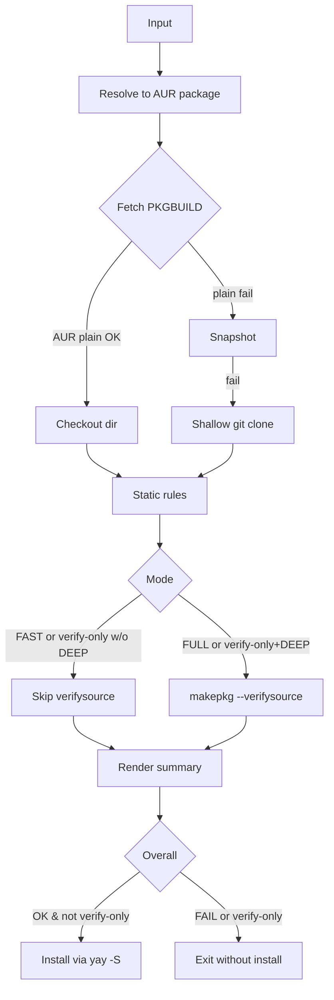
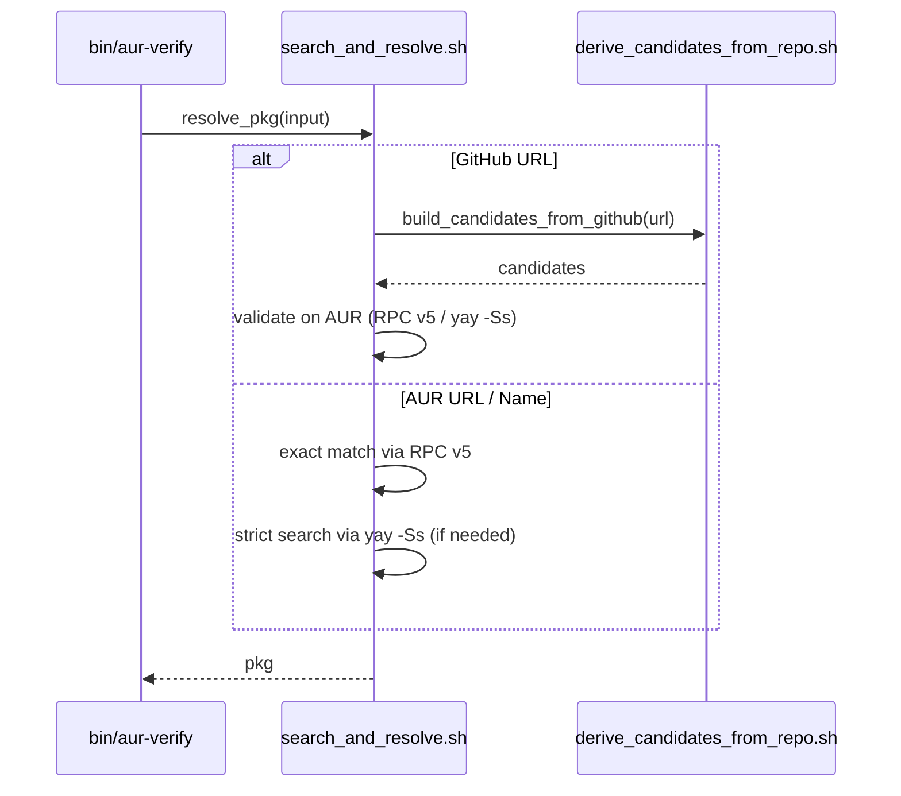
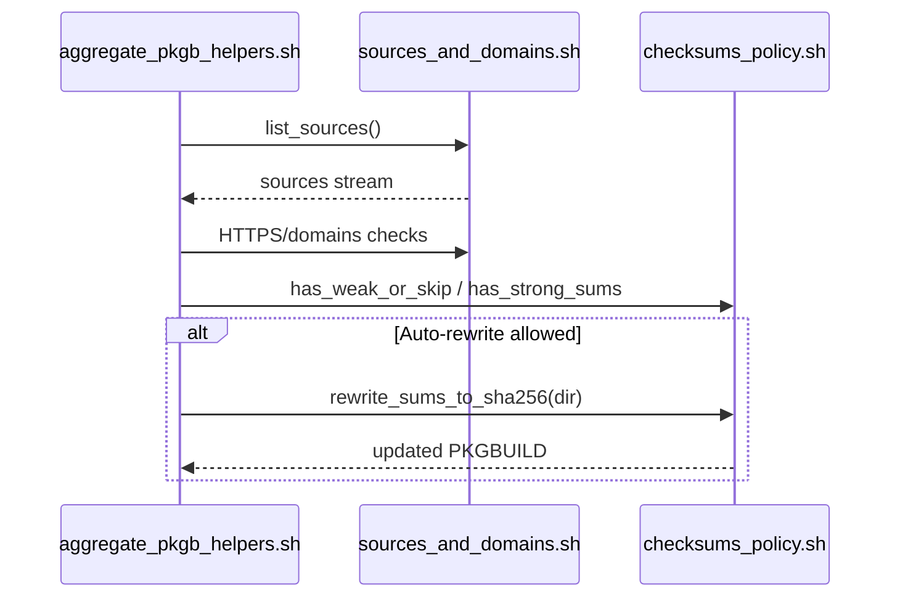
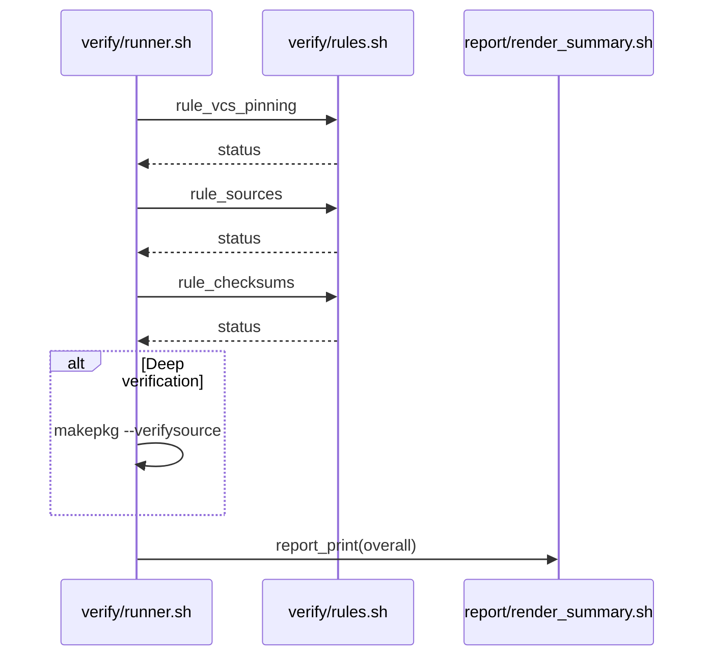
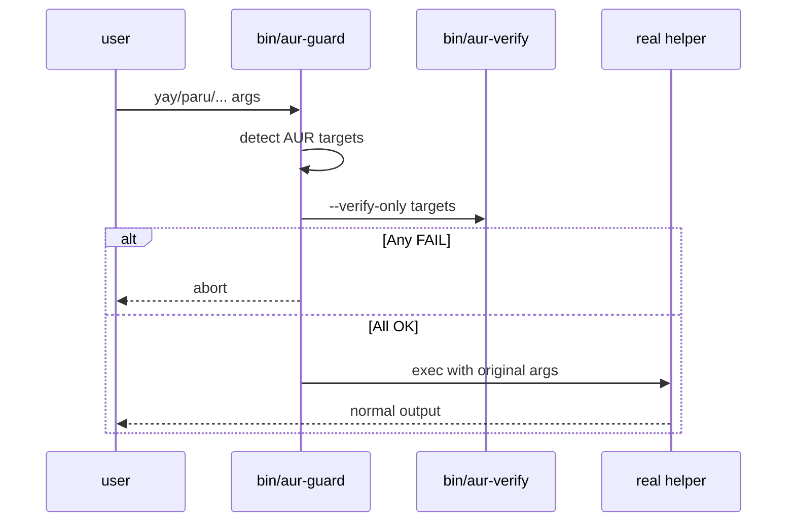
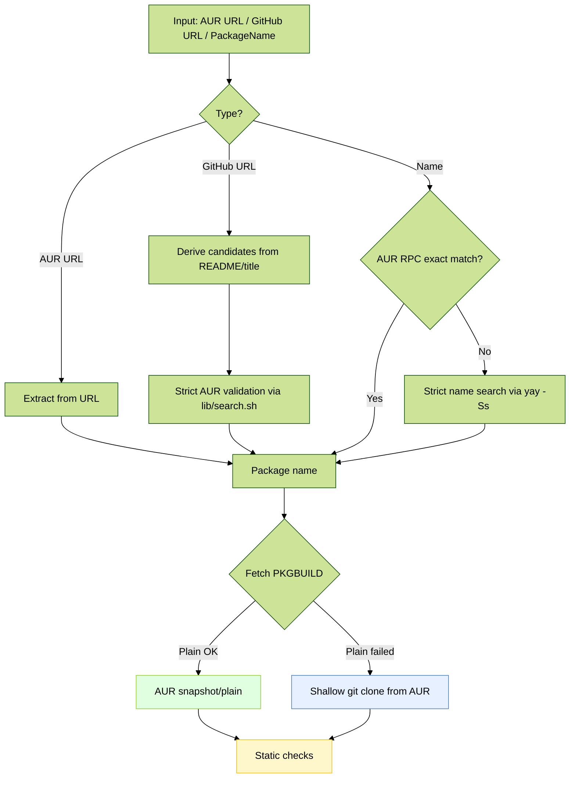
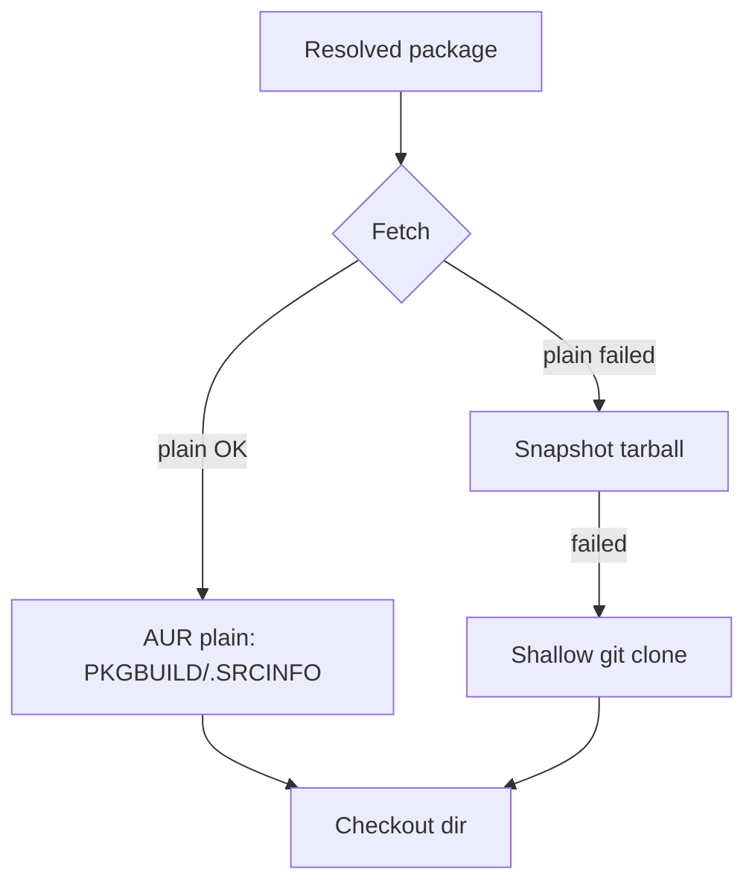
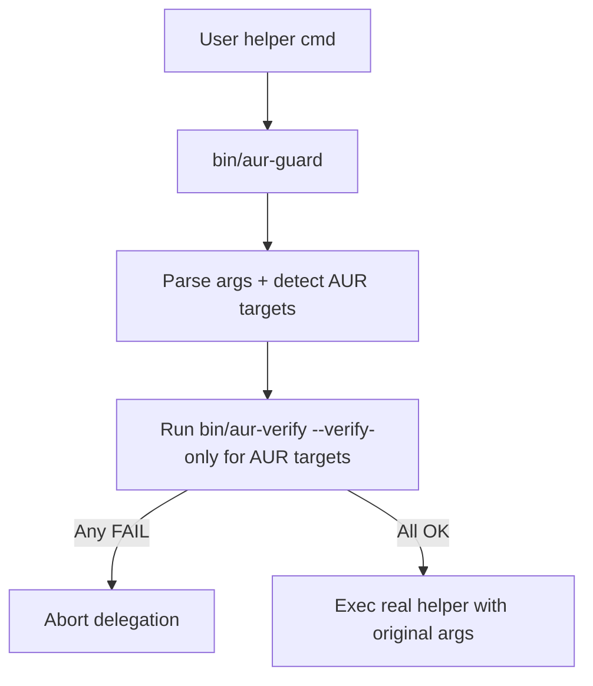
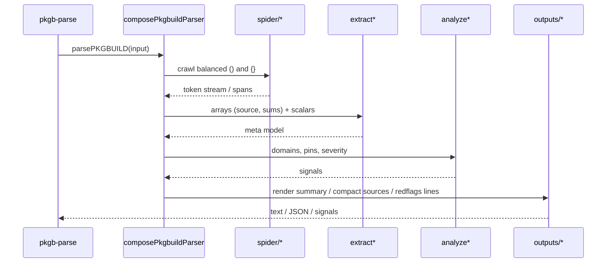

# Developer Notes (Internal)

Language: English | Español (`README.es.md`)

This document captures implementation details, tuning knobs, and maintenance notes that are intentionally not surfaced in the main README. It is meant for contributors and maintainers.

## Overview Diagrams

<details>
<summary><strong>General Flow (Mermaid)</strong></summary>



</details>

<details>
<summary><strong>Overview of the flow (Mermaid)</strong></summary>

```mermaid
%%{init: {"theme": "forest", "handDrawn": true}}%%
sequenceDiagram
    participant User as User
    participant CLI as CLI bin/aur-verify
    participant GitHub as GitHub lib/github/derive_candidates_from_repo.sh
    participant Search as AUR Resolver lib/aur/search_and_resolve.sh
    participant Plain as AUR Plain/RPC lib/aur/fetch_plain_and_snapshot.sh
    participant Verify as Verifier lib/verify/runner.sh
    participant Rules as Rules lib/verify/rules.sh
    participant PKGB as PKGB Utils lib/pkgb/aggregate_pkgb_helpers.sh
    participant Report as Report lib/report/render_summary.sh + lib/i18n/messages.sh
    participant Makepkg as makepkg
    participant Yay as yay

    User->>CLI: Run bin/aur-verify <input>

    %% Input detection
    rect rgba(200, 200, 255, 0.35)
    CLI->>CLI: Detect input type
    alt AUR URL
        CLI->>Plain: Extract name and query RPC v5
        Plain-->>CLI: pkg
    else GitHub URL
        CLI->>GitHub: Derive candidates title/README
        GitHub-->>CLI: Candidate list
        CLI->>Search: Validate on AUR name‑strict
        Search-->>CLI: pkg
    else PackageName
        CLI->>Plain: RPC v5 info exact match
        alt Exact match
            Plain-->>CLI: pkg
        else No exact match
            CLI->>Search: Strict search yay -Ss AUR only
            Search-->>CLI: pkg
        end
    end
    end

    %% Fetch PKGBUILD
    rect rgba(200, 255, 200, 0.35)
    CLI->>Verify: verify_pkgbuild pkg
    Verify->>Plain: Download snapshot/plain PKGBUILD and .SRCINFO
    alt Plain OK
        Plain-->>Verify: Temp path with PKGBUILD
    else Fallback to git
        Verify->>Plain: Plain snapshot failed
        Verify->>CLI: git clone from AUR
        CLI-->>Verify: Cloned repo with PKGBUILD
    end
    Note over Verify: Show PREPARE/BUILD/PACKAGE summaries (Verbose or SHOW_FUNCS)
    end

    %% Static verification atomic rules
    rect rgba(255, 255, 200, 0.35)
    Verify->>Rules: rule_vcs_pinning PKGBUILD
    Rules->>PKGB: pkgb_check_vcs_pinning
    PKGB-->>Rules: Result
    Rules-->>Report: report_add item_vcs_pinning

    Verify->>Rules: rule_sources PKGBUILD
    Rules->>PKGB: list_sources + HTTPS and whitelist checks
    PKGB-->>Rules: Result
    Rules-->>Report: report_add item_source_urls / item_allowed_domains
    Note over Rules,Report: Default → only offending lines; Verbose → show all sources and mark offenders

    Verify->>Rules: rule_checksums PKGBUILD checkout
    Rules->>PKGB: has_weak_or_skip / has_strong_sums
    opt Auto‑fix allowed
        Rules->>Verify: rewrite_sums_to_sha256
    end
    Rules-->>Report: report_add item_checksums
    Note over Rules,Report: Default → only weak/SKIP lines; Verbose → show all checksum arrays and mark weak/SKIP

    Note over Verify: In --verbose, JS prints red-flag lines (diagnostic only)
    end

    %% Deep verification optional
    rect rgba(255, 220, 200, 0.35)
    alt VERIFY-ONLY without DEEP
        Verify->>Rules: rule_verifysource mode verify-only
        Rules-->>Report: SKIP verify‑only
    else FAST
        Verify->>Rules: rule_verifysource mode fast
        Rules-->>Report: SKIP --fast
    else FULL
        Verify->>Makepkg: makepkg --verifysource no build
        Makepkg-->>Verify: OK / FAIL
        Verify->>Rules: rule_verifysource mode full
        Rules-->>Report: PASS / WARN / FAIL
    end
    end

    %% Report and install
    rect rgba(230, 200, 255, 0.35)
    Verify->>Report: report_print mode
    alt OVERALL OK or OK with warnings and not verify-only
        CLI->>Yay: yay -S pkg
        Yay-->>CLI: Installation completed
    else OVERALL FAIL or verify-only
        CLI-->>User: Do not install / Verification only
    end
    Note over CLI,Report: Quiet → suppress info/warn logs; summary remains visible
    end
```

</details>

## Architecture Overview

- Bash entrypoint: `bin/aur-verify`
- Verify runner: `lib/verify/runner.sh` orchestrates the end-to-end flow and installation handoff
- Atomic rules: `lib/verify/rules.sh` aggregates `lib/verify/rules/*.sh`
  - `vcs_pinning_rule.sh`, `sources_rule.sh`, `checksums_rule.sh`, `verifysource_rule.sh` (and `redflags_rule.sh` available; see note below)
- AUR fetchers and RPC helpers: `lib/aur/fetch_plain_and_snapshot.sh`
- AUR search/resolve utilities: `lib/aur/search_and_resolve.sh`
- GitHub wrapper derivation: `lib/github/derive_candidates_from_repo.sh`
- PKGBUILD helpers: `lib/pkgb/aggregate_pkgb_helpers.sh` aggregates:
  - `sources_and_domains.sh`, `checksums_policy.sh`, `redflags_scan.sh`, `functions_summary.sh`
- Report + i18n: `lib/report/render_summary.sh`, `lib/i18n/messages.sh`
- Optional Node parser: `bin/pkgb-parse` with `lib/pkgb/parser/{analysis,utils,outputs,patterns,terminalColors}.js`

## Project Structure (detailed)

Top-level

- `bin/aur-verify`: Main CLI. Parses args/env, orchestrates resolver → checkout → rules → report → optional install.
- `bin/aur-guard`: Wrapper to pre‑check AUR packages before delegating to `yay/paru/pikaur/trizen/pamac`.
- `bin/pkgb-parse`: Optional Node CLI to parse PKGBUILD for diagnostics/compact outputs.
- `scripts/install-aur-guard.sh`: Installs symlinks for aur‑guard into user/system PATH.
- `scripts/run-tests.sh`: Convenience to run tests (bats) and basic validations.
- `scripts/validate-sources.sh`: Checks that `source "..."` imports are valid after refactors.

Core libs

- `lib/core/shell_safety.sh`: Strict bash settings, `have_cmd`, `require_tools`, trap setup.
- `lib/utils/logging.sh`: Uniform `[INFO]`, `[WARN]`, `[ERROR]`, `die`, color helpers.

AUR + resolver

- `lib/aur/search_and_resolve.sh`: `resolve_pkg`, name‑strict search via AUR RPC v5 and `yay -Ss` (AUR‑only), GitHub URL candidates.
- `lib/aur/fetch_plain_and_snapshot.sh`: Fetch `PKGBUILD`/`.SRCINFO` via AUR plain/snapshot; fallback to shallow git clone; TTL cache for plain.
- `lib/github/derive_candidates_from_repo.sh`: Parse GitHub URL, read README/title, derive candidate AUR wrapper names.

<details>
<summary><strong>Sequence — Input Resolution</strong></summary>



</details>

PKGBUILD helpers

- `lib/pkgb/sources_and_domains.sh`: `list_sources`, HTTPS enforcement, domain allowlist checks.
- `lib/pkgb/checksums_policy.sh`: `has_strong_sums`, `has_weak_or_skip`, `rewrite_sums_to_sha256` (uses `makepkg -g`).
- `lib/pkgb/redflags_scan.sh`: `scan_red_flags` using `lib/rules/redflags.list` (diagnostic lines with numbers).
- `lib/pkgb/functions_summary.sh`: `print_func_summaries` for `prepare()/build()/package()`.
- `lib/pkgb/aggregate_pkgb_helpers.sh`: Facade that composes helpers and `pkgb_check_vcs_pinning`.

<details>
<summary><strong>Sequence — Sources & Checksums</strong></summary>



</details>

Verification

- `lib/verify/rules/*.sh`: Atomic rules
  - `vcs_pinning_rule.sh`: Enforce `git+…` pinned via `#commit=`/`#tag=`.
  - `sources_rule.sh`: Enforce HTTPS + allowed domains.
  - `checksums_rule.sh`: Enforce strong sums; optional auto‑rewrite to sha256 (non‑strict/non‑fast).
  - `verifysource_rule.sh`: Run `makepkg --verifysource` depending on mode; interpret result.
  - `redflags_rule.sh`: Available; off by default in summary (diagnostics still available).
- `lib/verify/rules.sh`: Aggregator that exposes `rule_*` calls.
- `lib/verify/runner.sh`: `verify_pkgbuild`, `install_or_verify`, `aur_checkout_to` and overall orchestration.

<details>
<summary><strong>Sequence — Rules & Reporting</strong></summary>



</details>

Internationalization + reporting

- `lib/i18n/messages.sh`: Message catalog (en/es) for report keys.
- `lib/report/render_summary.sh`: Compose and print the localized final summary.

Guard wrapper

- `lib/guard/helpers.list`: Declares known helper names and types (pacman/pamac helpers) for `bin/aur-guard`.
- `lib/rules/redflags.list`: Shared patterns for risky code (used by Bash + Node parser).

<details>
<summary><strong>Sequence — aur-guard Delegation</strong></summary>



</details>

Node PKGB parser (optional)

- `lib/pkgb/parser/analysis.js`: Facade for parser; entry for CLI.
- `lib/pkgb/parser/parser/*.js`: Core parsing pipeline
  - `composePkgbuildParser.js`: Composes passes; exports `parsePKGBUILD`.
  - `spider/*`: Balanced scans for parentheses/braces.
  - `extract*`: Extract arrays and scalars (`source`, checksums, metadata) → meta model.
  - `analyze*`: Domain checks, pin detection; compute signals/severity.
- `lib/pkgb/parser/outputs/modules/*.js`: Renderers for summary, detailed analysis, signals, red‑flag lines, compact sources.
- `lib/pkgb/parser/patterns/*`: Regex composition and loader for shared patterns.
- `lib/pkgb/parser/utils/modules/*`: Network fetch, stdin read, shell‑style tokenization.

Purpose by file (quick map)

- `bin/aur-verify`: CLI args → call `install_or_verify` → inside: `resolve_pkg` → `aur_checkout_to` → rules → summary → maybe install.
- `lib/verify/runner.sh`: Implements the sequence above, provides temp workdir and mode handling.
- `lib/verify/rules/*.sh`: Single‑responsibility checks (status + message key + optional fix).
- `lib/pkgb/*.sh`: Pure helpers; no network except checksum rewrite via `makepkg -g`.
- `lib/aur/*.sh`: Only place that touches network (AUR plain/snapshot/git).
- `bin/aur-guard`: Fronts helpers; calls `bin/aur-verify --verify-only` for AUR targets; delegates unchanged.

Key invariants (for auditing)

- No build occurs during verification; deep checks use `makepkg --verifysource` only.
- Network access limited to AUR endpoints and declared sources (for deep verification); strict mode further constrains allowed domains.
- Automatic checksum rewrite happens only in non‑strict and non‑fast modes and re‑verifies afterward.
- If any rule fails, installation is not attempted.

## Verification Depth and Precedence

- `--verify-only`: static checks only (no install). With `DEEP=1` it also runs `makepkg --verifysource`.
- `--fast`: metadata-only; skips deep verification even if `DEEP=1` is set (FAST wins over DEEP).
- `STRICT=1`: tightens policies (HTTPS-only, domain allowlist, strong checksums, VCS pinning) and may elevate WARN to FAIL.

## Logging Modes

- `--verbose` (or `VERBOSE=1`):
  - Implies `SHOW_FUNCS=1`
  - Prints compact sources list from JS parser, summary line, and red flags lines (diagnostics only).
- `--quiet` (or `QUIET=1`):
  - Suppresses info/warn logs globally; summary and errors remain.
  - Overrides `--verbose` and disables `SHOW_FUNCS`/metadata.
- Function summaries can also be shown explicitly with `SHOW_FUNCS=1` regardless of `--verbose`.

## Performance Tweaks (Internal)

- AUR RPC exact-name check is attempted first to avoid slow searches (`aur_plain_rpc_info`).
- `lib/aur/fetch_plain_and_snapshot.sh` implements plain PKGBUILD caching:
  - Env vars: `AUR_CACHE_DIR` (default `/tmp/aur-plain-cache`), `AUR_CACHE_TTL_SEC` (default `3600`).
  - `.SRCINFO` is fetched only in VERBOSE or STRICT.
  - `curl` uses compression, small timeouts and follows redirects.
- Checksum rewrite is skipped when `FAST=1`; otherwise `rewrite_sums_to_sha256` attempts to upgrade to sha256sums.

## Red Flags Handling (current behavior)

- The atomic rule exists: `rule_red_flags()` (Bash) and JS diagnostics are available, but the runner does not currently add a red-flags item to the summary report.
- In `--verbose`, JS red flags lines are printed as diagnostics if the Node parser is available.
- Policy in `redflags_rule.sh` (when invoked) treats the architecture-selection eval pattern as low risk (WARN normal / FAIL strict); other patterns WARN/FAIL accordingly.

## Node Parser Integration (`bin/pkgb-parse`)

- Optional: used opportunistically when Node is present; otherwise safe stubs are loaded.
- Provided outputs used by the Bash CLI:
  - `--summary`, `--sources-compact`, and `--redflags-lines` (diagnostics only)
- ESM modules live under `lib/pkgb/parser`; parsing and formatting concerns are separated.

## Adding/Adjusting Rules

- Prefer small, composable functions in `lib/verify/rules/*.sh` that:
  - Log only snippets (full context in VERBOSE)
  - Update the report via `report_add <item> <STATUS> <message_key>`
  - Return non-zero only when the rule should contribute to failure
- Add user-facing messages in `lib/i18n/messages.sh` (both EN and ES).

## Tests and Local Tips

- Run tests (requires bats):
  - `scripts/run-tests.sh`
  - Or directly: `bats tests`

- Quick loop on a target package:
  - `STRICT=1 sh ./bin/aur-verify <pkg> --verify-only --verbose`
  - `FAST=1 sh ./bin/aur-verify <pkg> --verify-only`
  - `DEEP=1 sh ./bin/aur-verify <pkg> --verify-only`
- Quick pre-check before install (aur-guard):
  - Explicit: `bin/aur-guard yay -S <pkg>` (likewise for paru/pikaur/trizen, `pamac build <pkg>`)
  - Drop-in: symlink `bin/aur-guard` to `~/.local/bin/{yay,paru,pikaur,trizen,pamac}`
- Clear cache to re-fetch a PKGBUILD:
  - `rm -f /tmp/aur-plain-cache/<pkg>.PKGBUILD`

## Release/Docs Notes

- Keep README focused on usage and stable flags. Place internal tuning and rationale here.
- Do not link this file from README unless intentionally surfacing to users.

## DRY and Ownership of Rules

- Red flags list: `lib/rules/redflags.list`
  - Bash: `lib/pkgb/redflags_scan.sh` -> `scan_red_flags()` (`grep -E -f`)
  - JS: `lib/pkgb/parser/patterns/compileRegexPatterns.js` loads the same list
- Enforcement (PASS/WARN/FAIL) is in Bash rules. JS parser is diagnostics-only.

## Bash Layout (modular)

- Core: `lib/core/shell_safety.sh`
- Logging: `lib/utils/logging.sh`
- AUR fetchers: `lib/aur/fetch_plain_and_snapshot.sh`
- AUR search/resolve: `lib/aur/search_and_resolve.sh`
- GitHub candidates: `lib/github/derive_candidates_from_repo.sh`
  - Repo metadata (optional): pulled via `$YAY_BIN -Si` when helper is present
- PKGBUILD helpers: `lib/pkgb/{sources_and_domains,checksums_policy,redflags_scan,functions_summary}.sh` (aggregated by `aggregate_pkgb_helpers.sh`)
- Verify rules: `lib/verify/rules/*.sh` (aggregated by `lib/verify/rules.sh`)
- Verify runner: `lib/verify/runner.sh`
- i18n: `lib/i18n/messages.sh`
- Report: `lib/report/render_summary.sh`

### Import sanity check after refactors

Run `bash scripts/validate-sources.sh` to validate all `source "..."` references point to existing files.
Optionally, add a `.git/hooks/pre-commit` hook to invoke that script.

The script resolves `$SCRIPT_DIR`/`$LIB_DIR` heuristically and validates module existence. Handy after renames/moves.

## Function Reference (concise)

<details>
<summary><strong>Verifier runner and rules</strong></summary>

- `verify_pkgbuild(pkg)`: Orchestrates checkout, rules, reporting, and optional install.
- `install_or_verify(pkg)`: Shows metadata in verify-only (when enabled) and calls `verify_pkgbuild`.
- `aur_checkout_to(pkg, workdir)`: Fetches PKGBUILD via AUR plain → snapshot → git fallback.

- `rule_vcs_pinning(pkgb, strict)`: Enforce pinning for `git+` sources (`#commit=`/`#tag=`).
- `rule_sources(pkgb, strict)`: Enforce HTTPS-only and allowed domains.
- `rule_checksums(pkgb, checkout, strict, fast)`: Enforce strong sums; auto-rewrite to sha256 unless strict/fast.
- `rule_verifysource(checkout, mode, strict)`: Run `makepkg --verifysource` depending on mode; WARN vs FAIL in strict.
- `rule_red_flags(pkgb, strict)`: Available rule; not currently included in the default runner summary.

</details>

## Execution Steps (end‑to‑end)

1) Input resolve: detect if token is AUR name, AUR URL or GitHub URL; resolve to AUR package name (strict name search).
2) Checkout: fetch `PKGBUILD` and optionally `.SRCINFO` from AUR plain; fallback to snapshot; last resort shallow git clone.
3) Static rules: VCS pinning → sources (HTTPS/domains) → checksums (and optional rewrite) → optional red‑flags diagnostics.
4) Deep verification (conditional): run `makepkg --verifysource` depending on mode (`DEEP`, `FAST`, `verify‑only`).
5) Reporting: produce localized human summary with itemized PASS/WARN/FAIL/SKIP and overall verdict.
6) Install decision: if overall OK and not verify‑only, install via `yay -S` (or configured helper).

Mode switches and precedence

- `FAST=1` disables deep verification even if `DEEP=1` is set.
- `STRICT=1` upgrades certain WARN to FAIL and forbids weak checksums and disallowed domains.
- `--verify-only` avoids install; deep checks only if `DEEP=1` and not `FAST=1`.

## Auditing Checklist

- Inputs: confirm resolver maps only to existing AUR packages; GitHub URL mapping validated against `source/url`.
- Network: confirm only AUR endpoints and declared `source=()` are accessed; no arbitrary curl/wget execution.
- Checksums: confirm sha256 policy; in non‑strict, confirm rewrite logs and re‑verification.
- PGP: when `.sig` exists, confirm `makepkg --verifysource` result gates install.
- Domains: confirm HTTPS‑only and allowlist enforcement in strict mode.
- VCS pinning: confirm all `git+` sources are pinned (strict FAIL otherwise).
- Logging: confirm summary accurately reflects rule statuses and modes.

## Optimization Opportunities

- Cache: tune `AUR_CACHE_TTL_SEC` for plain PKGBUILD reuse; persist across runs when appropriate.
- Parallelism: pre‑compute compact sources via Node parser (if available) while fetching plain files.
- I/O: minimize repeated `yay -Si` by gating behind `--metadata` or caching.
- Red‑flags: feed parser signals to guide which rules to expand in verbose mode.
- Resolution: bias name resolution based on context (`-bin`/`-appimage`) in fast mode to avoid deep downloads.

## Diagrams

<details>
<summary><strong>Overview of the flow (Mermaid)</strong></summary>

```mermaid
%%{init: {"theme": "forest", "handDrawn": true}}%%
sequenceDiagram
    participant User as User
    participant CLI as CLI bin/aur-verify
    participant GitHub as GitHub lib/github/derive_candidates_from_repo.sh
    participant Search as AUR Resolver lib/aur/search_and_resolve.sh
    participant Plain as AUR Plain/RPC lib/aur/fetch_plain_and_snapshot.sh
    participant Verify as Verifier lib/verify/runner.sh
    participant Rules as Rules lib/verify/rules.sh
    participant PKGB as PKGB Utils lib/pkgb/aggregate_pkgb_helpers.sh
    participant Report as Report lib/report/render_summary.sh + lib/i18n/messages.sh
    participant Makepkg as makepkg
    participant Yay as yay

    User->>CLI: Run bin/aur-verify <input>

    %% Input detection
    rect rgba(200, 200, 255, 0.35)
    CLI->>CLI: Detect input type
    alt AUR URL
        CLI->>Plain: Extract name and query RPC v5
        Plain-->>CLI: pkg
    else GitHub URL
        CLI->>GitHub: Derive candidates from title/README
        GitHub-->>CLI: Candidate list
        CLI->>Search: Validate on AUR (name‑strict)
        Search-->>CLI: pkg
    else PackageName
        CLI->>Plain: RPC v5 info exact match
        alt Exact match
            Plain-->>CLI: pkg
        else No exact match
            CLI->>Search: Strict search yay -Ss (AUR only)
            Search-->>CLI: pkg
        end
    end
    end

    %% Fetch PKGBUILD
    rect rgba(200, 255, 200, 0.35)
    CLI->>Verify: verify_pkgbuild pkg
    Verify->>Plain: Download AUR plain PKGBUILD and .SRCINFO
    alt Plain OK
        Plain-->>Verify: Temp path with PKGBUILD
    else Fallback to git
        Verify->>Plain: Plain snapshot failed
        Verify->>CLI: git clone from AUR
        CLI-->>Verify: Cloned repo with PKGBUILD
    end
    Note over Verify: Show PREPARE/BUILD/PACKAGE summaries (VERBOSE or SHOW_FUNCS)
    end

    %% Static verification atomic rules
    rect rgba(255, 255, 200, 0.35)
    Verify->>Rules: rule_vcs_pinning PKGBUILD
    Rules->>PKGB: pkgb_check_vcs_pinning
    PKGB-->>Rules: Result
    Rules-->>Report: report_add item_vcs_pinning

    Verify->>Rules: rule_sources PKGBUILD
    Rules->>PKGB: list_sources + HTTPS and allowlist checks
    PKGB-->>Rules: Result
    Rules-->>Report: report_add item_source_urls / item_allowed_domains
    Note over Rules,Report: Default → only offenders; VERBOSE → list all and mark offenders

    Verify->>Rules: rule_checksums PKGBUILD checkout
    Rules->>PKGB: has_weak_or_skip / has_strong_sums
    opt Auto‑fix allowed
        Rules->>Verify: rewrite_sums_to_sha256
    end
    Rules-->>Report: report_add item_checksums
    Note over Rules,Report: Default → only weak/SKIP; VERBOSE → show all arrays and mark weak/SKIP

    Note over Verify: In --verbose, JS prints red‑flag lines (diagnostic)
    end

    %% Deep verification optional
    rect rgba(255, 220, 200, 0.35)
    alt VERIFY‑ONLY without DEEP
        Verify->>Rules: rule_verifysource mode verify‑only
        Rules-->>Report: SKIP verify‑only
    else FAST
        Verify->>Rules: rule_verifysource mode fast
        Rules-->>Report: SKIP --fast
    else FULL
        Verify->>Makepkg: makepkg --verifysource (no build)
        Makepkg-->>Verify: OK / FAIL
        Verify->>Rules: rule_verifysource mode full
        Rules-->>Report: PASS / WARN / FAIL
    end
    end

    %% Report and install
    rect rgba(230, 200, 255, 0.35)
    Verify->>Report: report_print mode
    alt OVERALL OK and not verify‑only
        CLI->>Yay: yay -S pkg
        Yay-->>CLI: Installation completed
    else OVERALL FAIL or verify‑only
        CLI-->>User: Do not install / Verification only
    end
    Note over CLI,Report: QUIET → suppress info/warn; summary stays visible
    end
```

</details>

<details>
<summary><strong>Autodetection and Fetch (Mermaid)</strong></summary>



</details>

<!-- Focused, navigable diagrams for each phase of the general flow -->

<details>
<summary><strong>Input detection — zoom‑in</strong></summary>

```mermaid
flowchart TD
    IN[Input token] --> T{Type}
    T -->|AUR URL| A[Extract <name>]
    T -->|GitHub URL| G[Build AUR candidates]
    T -->|Name| N[Check AUR RPC exact]
    G --> V[Validate on AUR (strict name)]
    N -->|Hit| P[Package]
    N -->|Miss| S[Strict search yay -Ss AUR only]
    V --> P
    S --> P
```

</details>

<details>
<summary><strong>Fetch PKGBUILD — zoom‑in</strong></summary>



</details>

<details>
<summary><strong>Static verification atomic rules — zoom‑in</strong></summary>

```mermaid
flowchart TD
    Start[PKGBUILD path] --> VCS[VCS pinning rule]
    VCS --> SRC[Ssl/Domain rules]
    SRC --> SUMS[Checksums rule]
    SUMS --> DIAG[Red‑flags diagnostics (optional)]
    DIAG --> RPT[Report items updated]
```

</details>

<details>
<summary><strong>Deep verification optional — zoom‑in</strong></summary>

```mermaid
flowchart TD
    Mode{Mode} -->|FAST| Skip[SKIP verifysource]
    Mode -->|verify‑only & !DEEP| Skip
    Mode -->|FULL or (verify‑only & DEEP)| MK[makepkg --verifysource]
    MK --> OK[PASS/WARN/FAIL → report]
```

</details>

<details>
<summary><strong>Report and install — zoom‑in</strong></summary>

```mermaid
flowchart TD
    Items[Rule items] --> Sum[Render summary (i18n)]
    Sum --> DEC{Overall}
    DEC -->|OK & not verify‑only| Install[yay -S <pkg>]
    DEC -->|FAIL or verify‑only| Exit[No install]
```

</details>

<details>
<summary><strong>AUR Guard — Interception</strong></summary>



</details>

<details>
<summary><strong>Node Parser — Pipeline</strong></summary>



</details>

<details>
<summary><strong>PKGBUILD helpers</strong></summary>

- `list_sources()`: Extract sources array (normalized, stripped).
- `sources_have_only_https()`: Test stream for HTTPS-only.
- `sources_domains_allowed()`: Test stream against allowlist.
- `has_strong_sums()`, `has_weak_or_skip()`: Detect checksum policy.
- `rewrite_sums_to_sha256(dir)`: Use `makepkg -g` and rewrite checksum arrays.
- `scan_red_flags(pkgb)`: Grep against `lib/rules/redflags.list` with line numbers.
- `print_func_summaries(pkgb)`: Extract prepare/build/package snippet bodies.
- `pkgb_check_vcs_pinning(pkgb)`: Check for unpinned VCS sources.

</details>

<details>
<summary><strong>AUR/GitHub and resolver</strong></summary>

- `aur_plain_fetch_plain_files`, `aur_plain_fetch_repo`: Fetch PKGBUILD/.SRCINFO or snapshot tarball.
- `aur_plain_rpc_info|search|exists`: RPC helpers and discovery.
- `resolve_pkg(input)`: Resolve an input token or GitHub URL to an AUR package name.
- `aur_search_name_strict_aur_only`, `prefer_fast_variant`: Name-strict search and fast-variant biasing.
- `is_github_url`, `build_candidates_from_github`, `github_default_branch`: Wrapper candidate derivation.

</details>
