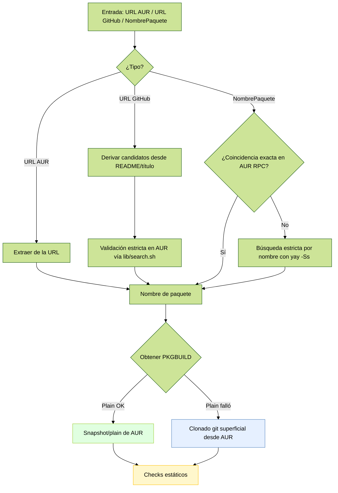

# Verificador AUR (Bash)

> **Verifica primero, instala después** — Verificador de seguridad para paquetes de AUR (y envolturas de GitHub) con instalación automática vía `yay` sólo si todo pasa.

[](https://www.gnu.org/software/bash/)
[](https://archlinux.org/)
[](https://aur.archlinux.org/)
[](https://wiki.archlinux.org/title/Makepkg)
[](https://gnupg.org/)
[](https://en.wikipedia.org/wiki/SHA-2)
[](https://github.com/Jguer/yay)

---

🌐 Read this in [English](../../README.md)

---

## 📚 Documentación

- Índice de docs: [Índice](../INDEX.md)
- Docs de desarrollo: [Español](https://github.com/LuigiD5555/aur_verification/blob/development/docs/developer/README.dev.es.md) | [English](https://github.com/LuigiD5555/aur_verification/blob/development/docs/developer/README.dev.md)

---

## 🧭 ¿Qué hace esta herramienta?

Esta herramienta en Bash toma un nombre de paquete AUR **o** una URL de GitHub y:

1) **Obtiene desde AUR** usando primero el endpoint “plain”. Si falla, reintenta con el alternativo (`tree?plain=1`) y solo como último recurso usa snapshot o `git clone` superficial.  
2) **Audita** el `PKGBUILD` con controles estáticos y un parser JavaScript rápido cuando hay Node.js (fallback Bash si no; se usa automáticamente).  
3) **Verifica** la integridad de las fuentes con `makepkg --verifysource`.  
4) **Corrige** sumas débiles (p. ej. `sha1sums`/`SKIP`) reemplazándolas por `sha256sums` (solo en modo normal; se omite en `--verify-only` y `--fast`).  
5) **(Opcional)** **Refuerza** la política en **modo estricto**: dominios permitidos, sin sumas débiles, y verificación PGP cuando hay `.sig`.  
6) Si todo está limpio, **instala** automáticamente con `yay -S` (salvo que uses `--verify-only`).

> Pensado para quienes no confían a ciegas en AUR: valida primero, instala después.

---

## Uso rápido

Ejecuta el punto de entrada modular (recomendado):

- `sh ./bin/aur-verify <paquete|URL_de_GitHub>`
- o `bash bin/aur-verify <paquete|URL_de_GitHub>`

Instalar tras verificar un paquete AUR:

```bash
sh ./bin/aur-verify oreo-nord-cursors-git
```

Sólo verificar (no instalar):

```bash
sh ./bin/aur-verify --verify-only oreo-nord-cursors-git
```

Modo estricto (políticas más duras):

```bash
STRICT=1 sh ./bin/aur-verify oreo-nord-cursors-git
```

Verificación rápida (metadatos, sin descargas de `makepkg`):

```bash
FAST=1 sh ./bin/aur-verify <paquete-AUR>
```

Detectar y verificar a partir de un repositorio GitHub (busca el envoltorio AUR):

```bash
sh ./bin/aur-verify https://github.com/OWNER/REPO
```

Pre‑check antes de instalar (aur-guard):

- Invocación explícita (sin cambiar el PATH):

```bash
bin/aur-guard yay -S oreo-nord-cursors-git
bin/aur-guard paru -Syu oreo-nord-cursors-git
bin/aur-guard pikaur -S oreo-nord-cursors-git
bin/aur-guard trizen -S oreo-nord-cursors-git
bin/aur-guard pamac build oreo-nord-cursors-git
# pacman no instala AUR; el wrapper solo delega
bin/aur-guard pacman -S neovim
```

- Drop‑in tras crear el symlink a `~/.local/bin/yay`:

```bash
yay -S oreo-nord-cursors-git
paru -Syu oreo-nord-cursors-git
pikaur -S oreo-nord-cursors-git
trizen -S oreo-nord-cursors-git
pamac build oreo-nord-cursors-git
```

### Configuración automática

Ejecuta el instalador para crear los symlinks automáticamente y asegurar el orden en PATH:

```bash
bash scripts/install-aur-guard.sh            # modo usuario (recomendado)
# o
sudo bash scripts/install-aur-guard.sh --system  # a nivel sistema en /usr/local/bin
```

---

## Wrapper de interceptación (aur-guard)

Si quieres forzar la verificación antes de usar tus helpers habituales (yay/paru/pamac), añade el wrapper universal y ponlo al principio del `PATH`:

```bash
# Opciones de instalación (elige una):
# 1) Invocación explícita
aur-guard yay -S <pkg1> <pkg2>

# 2) Symlinks en ~/.local/bin (recomendado)
mkdir -p ~/.local/bin
ln -sf "$(pwd)/bin/aur-guard" ~/.local/bin/yay
ln -sf "$(pwd)/bin/aur-guard" ~/.local/bin/paru
ln -sf "$(pwd)/bin/aur-guard" ~/.local/bin/pikaur
ln -sf "$(pwd)/bin/aur-guard" ~/.local/bin/trizen
ln -sf "$(pwd)/bin/aur-guard" ~/.local/bin/pamac
export PATH="$HOME/.local/bin:$PATH"

# Ahora usa tus comandos como siempre
yay -S <paquete-aur>
paru -S <paquete-aur>
pamac build <paquete-aur>
 
```

Cómo funciona

- Detecta los objetivos a instalar y verifica con `bin/aur-verify --verify-only` únicamente los que están en AUR (consulta RPC v5).
- Si alguna verificación falla, aborta y no ejecuta el helper real.
- Si todo pasa, delega al binario original con los mismos argumentos.
- Respeta variables como `STRICT=1`, `FAST=1`, `VERBOSE=1`, `QUIET=1` que afectan a `bin/aur-verify`.
- Para forzar ruta del binario real, define `AUR_GUARD_REAL_YAY=/usr/bin/yay` (análogamente para `PARU`, `PAMAC`, etc.).
- Para saltarse el wrapper puntualmente, usa `AUR_GUARD_BYPASS=1`.

Comportamiento por helper (transparente)

- El wrapper no cambia el comportamiento del helper; sólo hace pre-checks y delega con los mismos argumentos.
- pamac: se pre‑verifica únicamente con `pamac build` (AUR). `pamac install|upgrade` no se tocan.
- yay/paru/pikaur/trizen: pre‑check y delegación normal (estos tools manejan repos y AUR).

Flags de conveniencia (opcionales)

- Puedes pasar flags del verificador junto a los helpers; el wrapper los usa para el pre-check y los elimina antes de delegar:
  - `--strict` (equivalente a `STRICT=1`)
  - `--fast` (equivalente a `FAST=1`)
  - `--verbose` / `--quiet` (equivalente a `VERBOSE=1` / `QUIET=1`)
  - `--metadata` (equivalente a `SHOW_METADATA=1`)
  - `--verify-only` (ejecuta sólo el pre-check; no instala con el helper)

Nota para desarrolladores: lista de helpers

- Extiende `lib/guard/helpers.list` para añadir nuevos helpers o ajustar su tipo (`pacman` vs `pamac`).

Notas

- Puedes forzar la ruta del binario real con `AUR_GUARD_REAL_<HELPER>=/ruta/al/binario`.
- Para saltarse el wrapper puntualmente: `AUR_GUARD_BYPASS=1`.

---

## Requisitos

- Arch Linux o derivado con acceso a AUR.
- Herramientas: `git`, `curl`, `makepkg` (parte de `pacman`), y un ayudante AUR compatible: `yay` (por defecto).  
  - Puedes cambiar el binario de yay con `YAY_BIN=/ruta/a/yay`.

```bash
# No requiere instalación; invoca directo con sh o bash
```

---

## Opciones y variables

**Flags**:

- `--verify-only` — Ejecuta verificaciones estáticas y sale sin instalar (**sin descargas**).
- `--deep` — En verify-only, también ejecuta `makepkg --verifysource` (descarga fuentes y verifica checksums/PGP).
- `--fast` — Verificaciones **sólo de metadatos** (omite `makepkg --verifysource`). ⚠️ En `STRICT=1` reduce garantías.
- `--verbose` — Muestra todos los detalles para usuarios avanzados (incluye resúmenes de funciones, metadatos del repositorio y más contexto en incidencias).
- `--quiet` — Logs mínimos (solo errores y el resumen final de verificación). Sobrescribe `--metadata`.
- `--metadata` — Muestra metadatos del repositorio (`yay -Si`) incluso en verify-only (oculto por defecto para mantenerlo veloz).
- `-h`/`--help` — Ayuda.

**Variables de entorno**:

- `STRICT=1` — Activa **modo estricto**:
  - **Prohíbe** `sha1`, `SKIP` o ausencia de sumas fuertes.
  - **Lista blanca de dominios** (por defecto): `github.com`, `codeload.github.com`, `objects.githubusercontent.com`, `gitlab.com`.
  - Si hay archivos `.sig` en `source=()`, **debe** pasar `makepkg --verifysource` (PGP).
  - Muestra un **resumen** de funciones `prepare()`, `build()`, `package()`.
- `YAY_BIN=/ruta/yay` — Cambia el binario de yay.
- `AUR_FORCE_IPV4=1` — Fuerza IPv4 en todas las solicitudes a AUR (útil si IPv6 es inestable o lento).

Reporte e idioma:

- El resumen final se imprime en el idioma de tu terminal (inglés por defecto; español si `LANG`/`LC_*` comienza con `es`).
- Puedes forzar el idioma con `REPORT_LANG=es` o `REPORT_LANG=en`.
 - `SHOW_FUNCS=1` — Mostrar resúmenes de `prepare()/build()/package()`; implícito con `--verbose`.
- `SHOW_METADATA=1` — Mostrar metadatos en verify-only; implícito con `--verbose` (o usa `--metadata`).
 - `QUIET=1` — Equivalente a `--quiet`.

---

## Modos de verificación y profundidad

Ajusta qué tan profunda es la verificación y cuánta salida se muestra:

- `--verify-only`: Por defecto solo checks estáticos (sin descargas ni instalación).  
  - Añade `DEEP=1` para ejecutar también `makepkg --verifysource` (descarga fuentes y verifica checksums/PGP).  
  - Útil para CI o cuando quieres verificar integridad sin instalar.
- `--fast`: Solo metadatos; omite `makepkg --verifysource` y cualquier descarga.  
  - Tiene precedencia sobre `DEEP=1` (si `FAST=1`, no habrá verificación profunda).
- `STRICT=1`: Endurece políticas (solo HTTPS, dominios permitidos, sumas fuertes, pinning) y convierte algunos WARN en FAIL.  
- `--verbose` / `--quiet`: Aumenta detalles (contexto completo, resúmenes de funciones) o minimiza logs (solo errores + resumen final).

Cuándo usar cada uno

- Triage rápido (sin descargas): `sh ./bin/aur-verify <paquete> --verify-only --fast`
- Integridad sin instalar: `DEEP=1 sh ./bin/aur-verify <paquete> --verify-only`
- Filtro estricto para sistemas sensibles: `STRICT=1 DEEP=1 sh ./bin/aur-verify <paquete> --verify-only`
- Auditoría detallada: `STRICT=1 sh ./bin/aur-verify <paquete> --verify-only --verbose`
- Mínimo ruido: `sh ./bin/aur-verify <paquete> --verify-only --quiet`

Notas

- La verificación profunda (`DEEP=1`) requiere red para bajar fuentes; se omite si se establece `--fast`.
- En `--verify-only` no se intenta reescribir checksums (no se ejecuta `makepkg -g`).
- La instalación depende del veredicto final; si es FAIL y no estás en verify‑only, se aborta la instalación.

---

## CLI Node: pkgb-parse (opcional)

El proyecto incluye un CLI modular en Node.js para parsear PKGBUILD con rapidez y aportar señales adicionales al reporte en Bash. Es opcional: si no hay Node, Bash usa heurísticas con grep/awk.

- Punto de entrada: `bin/pkgb-parse`
 

Ejemplos:

```bash
# Parsear desde archivo
node bin/pkgb-parse --file ./PKGBUILD --summary

# Parsear directo desde la URL plain de AUR
node bin/pkgb-parse --url "https://aur.archlinux.org/cgit/aur.git/plain/PKGBUILD?h=zotero"

# JSON para integraciones
node bin/pkgb-parse --file ./PKGBUILD --json
```

<details>
<summary><strong>Opciones del CLI (detalles)</strong></summary>

- `--file PATH`: Parsear PKGBUILD desde archivo local
- `--url URL`: Descargar y parsear PKGBUILD desde URL
- `--summary`: Resumen en una línea (nombre, versión, conteos)
- `--json`: Salida JSON estructurada
- `--signals`: Pares clave=valor para Bash
- `--redflags-lines`: Banderas rojas como `linea<TAB>contenido`
- `--sources-compact [--limit N]`: Lista compacta de fuentes, opcionalmente limitada

Tip: Si pasas un enlace de AUR que no es el endpoint “plain”, el CLI sugerirá la forma correcta `.../plain/PKGBUILD?h=<pkg>` y mostrará “Fetching from AUR (respectfully)...”.

</details>

---

## Qué comprueba

### 1) Banderas rojas en `PKGBUILD` (diagnóstico)

Busca patrones peligrosos o poco confiables, por ejemplo:

- **Descargas autoejecutadas**: `curl|wget ... (sh|bash)`
- **Sockets TCP en shell**: `/dev/tcp`
- **Ejecución dinámica**: `eval`, `$(...)`, `` `...` ``, `exec(`
- **Decodificación/descifrado** en línea: `base64 -d`, `openssl enc -d`
- **Privilegios/permiso sospechoso**: `chmod +s`, `setcap`, escritura sobre `/etc`
- **Trampas en rutas**: uso indebido de `pkgdir` apuntando a `/etc`
- **(STRICT)** one-liners con `python -c`, `perl -e`, `ruby -e`, `node -e`

Diagnóstico en `--verbose` (cuando hay Node): imprime líneas marcadas por el parser JS. Nota: el runner actual no añade un ítem de banderas rojas al resumen; la regla atómica `rule_red_flags` existe y puede invocarse de forma independiente.

<details>
<summary><strong>Severidad y patrones benignos comunes</strong></summary>

- En modo normal, las banderas rojas generan ADVERTENCIA; con `STRICT=1` pueden escalar a FALLA.
- Un caso frecuente de bajo riesgo es usar `eval` para resolver una variable según la arquitectura, por ejemplo:

  `python -m installer --destdir="$pkgdir" $(eval echo "\${_anki_whl_$CARCH}")`

  Esto resuelve una variable como `_anki_whl_x86_64`. Se mantiene como ADVERTENCIA en modo normal; en modo estricto sigue siendo FALLA.

- La verificación profunda (`DEEP=1`) no es necesaria para este caso; puede aumentar la confianza validando checksums/PGP vía `makepkg --verifysource`.

</details>

### 2) Dominios permitidos para `source=()`

- Acepta (por defecto): `github.com`, `codeload.github.com`, `objects.githubusercontent.com`, `gitlab.com`.
- En `STRICT=1`, **rechaza** cualquier otro dominio.

### 3) Políticas de checksums

- **Modo normal**: si hay `sha1sums` o `SKIP`, el script **descarga las fuentes**, calcula `sha256` y **reescribe** a `sha256sums` → vuelve a verificar.
- **STRICT=1**: **prohíbe** sumas débiles; no aplica autocorrección → **falla**.

### 4) Verificación PGP (si hay `.sig`)

- Si el `PKGBUILD` declara firmas `.sig`, **debe** pasar `makepkg --verifysource`.
- Si **no** hay `.sig`, se advierte (no se bloquea) — en `STRICT=1` el aviso es explícito.

### 5) `makepkg --verifysource`

- Se ejecuta **sin construir** (sólo integra/PGP).  
- Se omite cuando usas `--verify-only` (verificación estática), salvo que definas `DEEP=1`.  
- En `--fast`, se omite deliberadamente (revisión superficial con metadatos de `yay -Si`).

### 6) Resumen de `prepare()/build()/package()` (STRICT)

- Muestra las **primeras líneas** de cada función para visibilidad rápida antes de instalar.

### 7) Fijación de VCS (fuentes git+)

- Advierte cuando una fuente `git+https://…` no incluye `#commit=` o `#tag=`. En `STRICT=1`, esto hace que falle. Refuerza la reproducibilidad en paquetes VCS.

### 8) Resumen final (amigable para no expertos)

- Imprime un resumen claro (OK/ADVERTENCIA/FALLA/OMITIDO) con veredicto final y acción tomada.
- Localizado a español/inglés según la terminal.

<details>
<summary><strong>Campos del reporte y significado</strong></summary>

- Origen del PKGBUILD: de dónde se obtuvo (AUR snapshot/plain vs clon git de respaldo)
- Fijación de VCS: si las fuentes `git+…` están fijadas a `#commit=` o `#tag=`
- URLs de origen: valida que todas las fuentes usen HTTPS
- Dominios permitidos: valida contra una lista blanca
- Checksums: aplica y/o corrige política de sumas (sha256)
- Banderas rojas (diagnóstico): patrones sospechosos (solo VERBOSE/JS)
- makepkg --verifysource: verificación de integridad/PGP (omitido en verify‑only salvo `DEEP=1`)

Estados:

- OK: correcto
- ADVERTENCIA: potencial riesgo o práctica mejorable (no bloquea)
- FALLA: problema bloqueante; se aborta la instalación
- OMITIDO: omitido a propósito por el modo (verify‑only/fast)

Idioma:

- Auto: usa `LANG`/`LC_*` (español si comienza con `es`)
- Forzado: `REPORT_LANG=es` o `REPORT_LANG=en`

</details>

<details>
<summary><strong>Autodetección y obtención (Mermaid)</strong></summary>



</details>

---

## 🧩 Cómo decide instalar

- **Entrada = nombre de paquete AUR**  

  Obtiene `PKGBUILD` desde snapshot/plain de AUR (sin clonar), corre las verificaciones y, si todo pasa, instala con:

  ```bash
  yay -S --noconfirm <pkg>
  ```

- **Entrada = URL de GitHub (`https://github.com/OWNER/REPO`)**  

  Intenta mapear a un envoltorio AUR típico:
  - `owner-repo`
  - `owner-repo-bin`
  - `owner-repo-git`
  - y variantes detectadas

  Sólo acepta si el `PKGBUILD` realmente **apunta a ese repo** (comprobación del `source`/`url`).

- **`--fast`**  

  Afecta la profundidad de verificación (omite `makepkg --verifysource`) y sesga la resolución de nombre para preferir candidatos `-bin`/`-appimage` cuando aplique. No cambia el comando de instalación más allá de eso.

---

## Detección de entrada (autodetección)

- **URL de paquete AUR** (`https://aur.archlinux.org/packages/<nombre>`): extrae `<nombre>` y obtiene desde snapshot/plain de AUR.
- **URL de GitHub**: deriva posibles envoltorios AUR (título del repo + nombre del repo, además de `-git`/`-bin`/`-appimage`) y valida contra AUR.
- **Nombre pelado**: consulta primero el AUR RPC v5 oficial para coincidencia exacta; si no existe, recurre a una búsqueda estricta por nombre en `yay -Ss` limitada a resultados de AUR.

Este enfoque minimiza la confianza en heurísticas locales y usa endpoints oficiales de AUR siempre que sea posible.

## Ejemplos

Verificar e instalar un cursor desde AUR (si existe):

```bash
sh ./bin/aur-verify oreo-nord-cursors-git
```

Sólo verificar sin instalar:

```bash
sh ./bin/aur-verify --verify-only oreo-nord-cursors-git
```

Verificar un envoltorio AUR partiendo de GitHub:

```bash
sh ./bin/aur-verify https://github.com/OWNER/REPO
```

Forzar modo estricto:

```bash
STRICT=1 sh ./bin/aur-verify <paquete>
```

Verificación superficial (sin descargas de `makepkg`):

```bash
FAST=1 sh ./bin/aur-verify <paquete>
```

---

## Arquitectura

La documentación para desarrolladores está en `../../README.dev.es.md`. Consulta ese archivo para estructura de código, módulos, detalles internos y diagramas.

---
## Notas de seguridad

- Este script **no construye** el paquete durante la verificación (usa `makepkg --verifysource`).  
- **No** elude las políticas de AUR: simplemente automatiza controles habituales (y añade reglas más estrictas si lo pides).
- `--fast` está pensado para **revisión superficial**; úsalo sólo si confías en el paquete/maintainer.
- La lista blanca de dominios y las banderas rojas son **opinadas**; puedes ajustarlas en el script si lo necesitas.

---

## Solución de problemas

- **“AUR clone failed (package may not exist)”**  

  Revisa el nombre del paquete o si realmente existe en AUR.
- **“sha256 verification failed after regeneration”**  

  El upstream cambió o hay un vector de ataque; no instales hasta entender la causa.
- **“source domain not allowed” (STRICT)**  

  Añade el dominio a la lista blanca en el script o instala en modo normal (bajo tu criterio).
- **“Plain PKGBUILD unavailable for '<pkg>' while FAST=1”**  
  
  El modo FAST deshabilita los fallbacks de snapshot/git. Ejecuta sin `--fast` para permitir snapshot/git, o prueba una variante `-bin`/`-appimage`.
\- **“PKGBUILD not found at '<path>/PKGBUILD' (mode=..., pkg=...)”**  
  Ejecuta sin `--fast` para permitir el fallback a snapshot/git. Si aún falla, abre un issue incluyendo la ruta mostrada.

---

## Comandos de ejemplo (copiar/pegar)

```bash
# Verificar e instalar (normal)
sh ./bin/aur-verify <paquete>

# Verificar solamente
sh ./bin/aur-verify --verify-only <paquete>

# Modo estricto (dominios whitelisted, sin sumas débiles, PGP cuando haya .sig)
STRICT=1 sh ./bin/aur-verify <paquete>

# Verificación rápida basada en metadatos
FAST=1 sh ./bin/aur-verify <paquete>

# Desde GitHub: localizar el envoltorio AUR y verificar/instalar
sh ./bin/aur-verify https://github.com/OWNER/REPO
```

---

## Licencia

Este proyecto está licenciado bajo la Licencia MIT. Ver [LICENSE](../../LICENSE).


---

### Créditos

Mantenido por las personas colaboradoras del proyecto. Consulta [AUTHORS](AUTHORS) para créditos y agradecimientos.

---
